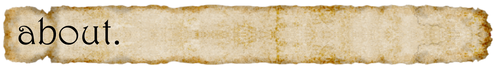
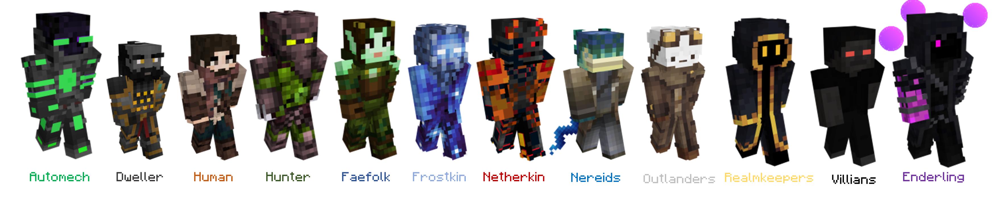

# 🧙‍♂️ Aon Chronicles Wiki

<figure><figcaption></figcaption></figure>

**Aon Chronicles**: Pre-Industrialized Nation Play in a <mark style="color:purple;">Dimensional</mark> <mark style="color:red;">Paradigm</mark>!&#x20;

It is a Town, Geo-Politic-Esque server with a focus on custom 'Pre-Industrialized' Town Creation and RPG Exploration with a multi-dimensional spin.&#x20;

It features <mark style="background-color:orange;">RPG Race Selection</mark> (Much like the popular Origins Mod), a fully-fledged <mark style="background-color:orange;">Town Creation System</mark> with Buildings and Resource Generating Structures, a unique stacked world design with <mark style="background-color:orange;">**14**</mark> <mark style="background-color:orange;"></mark><mark style="background-color:orange;">dimensions</mark> to explore with completely revamped vanilla, and hundreds of custom items, item sets and plenty of unique bosses and world dungeon structures.&#x20;

This Server is playable on both <mark style="color:green;">**1.20.1 Java Edition**</mark> and <mark style="color:green;">**1.20 Bedrock Edition**</mark> (It is optimized for Java, and there are some limitations with Bedrock).&#x20;

The Server was designed to be easy to join and play. This server departs significantly from the 'Vanilla' experience so if you have any questions let us know!

<figure><figcaption>
Species of Chronicles
</figcaption></figure>

<figure><figcaption>
The Cornucopia [From Chronicles v2]
</figcaption></figure>

