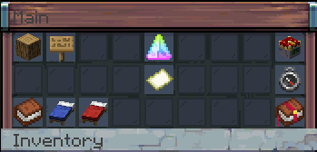

# 🏘️ Settling a Town


**Main command:** _/t\[own]_ OR Right Click with the 𝕿𝖔𝖜𝖓 𝕻𝖑𝖆𝖓𝖓𝖊𝖗 &#x20;


<figure><figcaption></figcaption></figure>

The main command opens up the Menu Screen for Planning, Managing and Expanding your Town.

* Manage Towns and Regions
* Buy Towns and Regions Blueprints
* Invite / Promote / Demote Members of your regions / towns
* Check the Leaderboard of towns.

The menu is divided into 4 categories.

* **Community**: Shows info and allows you to manage your towns.
* **Regions**: You can manage members and ranks of your region here.
* **Blueprints**: Will contain the purchased, but unplaced Town Items (Regions) you have.
* **Shop**: Here you can buy most of the available items depending on your Town Level. Towns, Houses, Factories, Farms etc.

## Town Building 101

The first thing you will do, regardless if you are creating a Town, joining one, or just need a safe space to store some items is create a **Shelter** . Everything inside the Area of the Shelter is protected from: Fire, Explosion, Griefing, etc.&#x20;

1. /t\[own] OR Right Click with the 𝕿𝖔𝖜𝖓 𝕻𝖑𝖆𝖓𝖓𝖊𝖗 &#x20;
2. **Shop.**
3. **Starter.**
4. **Shelter** -> **Buy** -> **Confirm.**
5. **Blueprints** -> Move the **Shelter**  Chest into your Inventory.
6. Place the chest in a free-unclaimed piece of land.
7. A Wagon Shelter will spawn alongside a Chest

You may notice the in-game Tutorial rewards you for placing this, it may also provide you with some items. These Items assist in demonstrating another core principle of the Town System, Region Upkeep and Resource Production.

Right Clicking on the Shelter with the 𝕿𝖔𝖜𝖓 𝕻𝖑𝖆𝖓𝖓𝖊𝖗  (or finding it under Regions in the Menu) will display the following screen. This page differs from region to region, but tends to follow a similar pattern.

* It will advise of the Building Requirements (Blocks Placed within a Radius of a Region Chest to be considered valid)
* The protections provided by the region.
*   The valid Inputs, these can be items, resources, tools and other consumables.

<figure><figcaption></figcaption></figure>

<figure><figcaption></figcaption></figure>

When I place the blocks I need for Lumberjack Hut, I can simply place the custom chest near the building to claim it as KKa Civs Region.

<figure><figcaption></figcaption></figure>

