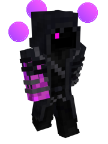

# 🟣 Enderling

### Current Abilities

**Scattertune -** By channeling End energy through their bodies, they can displace themselves in another location. Holding down shift creates an enderling teleportation item in an empty offhand. Right clicking with the item will teleport you up to 30 blocks. Using the teleportation will put it on cooldown for several seconds

**Chorus Choir -** Enderlings live without the corruption of Ruination in their bodies, allowing them to freely control their own abilities. One result of this is a massively increased teleport distance after eating a chorus fruit.

**Aquatic Disruption -** The destructive frequencies of End entities are negated by the protective presence of water. As such, Enderlings receive the wither effect while in water as the wave function of the indeterminate particles in their body slowly collapse into a determinate state.

### Lore

Enderlings are the cornicopia's strongest willed warriors, and masters of controlling End energy. Unlike their Endermen cousins, Enderlings have a full control of free will and independence, in a similar sense to independent Automechs. However, unlike Automechs, to be an Enderling requires even more strength and willpower. As such Enderlings are some of the most mentally-resilient and capable mortal-type beings in the Cornucopia. After all, the End is more than just a place, it is also a state of mind.

#### Appearance

Enderlings share some similarities to their Endermen counterparts. They sport longer than average limbs, with a skinny violet body. Their mouths are otherwise kept closed, as when they speak it is through telepathically to hide their large unhinged jaw similar to the other end creatures. Their eyes glow a soft purplish magenta, which radiate a foggy glow in the night.

Despite many similarities, because Enderlings have a keen control over The End, their appearances can vary drastically from Endermen. Often their radius and ulna bones extend out to a large cuff at the hand, their fingers more akin to a dull claw than regular human bones. Their legs twist and contort to make fascinating combinations of muscle bone and skin tissue, often resulting in raptor-like hind legs which they use to reorient themselves onto the dimensional frequencies while teleporting. Enderlings also sport three, medium-sized glowing orbs behind their heads that form a triangular pattern of end energy, which works as the filter, or, in a sense, the kidney for detoxifying the End's mental corruption. As to fish are to Dolphin, the Endermen are to Enderling. Both are well adapted to their environment, but while Endermen are enveloped by the End inside and out, Enderling retain who they are at the core.

#### Culture

The culture of Enderlings is the most mysterious parts of Enderlings. Enderlings are one of the most feared races in all of The Cornucopia. However, because many Mods censer any and all knowledge about the End from their subjects, most do not fully understand why. Constant hiding and isolation are somethings Enderlings must partake in order to survive on certain worlds. Using synchronized efforts to their advantage, entire villages of their kind can blink in and out of tight spots in an instant if enough Enderlings are nearby.

Enderlings often practice group meditation to help them control their energies in a stable fashion. Without these meetings, it is possible for an Enderling to fall back into the clutches of The Ruination's hands. It is possible for an Enderling to become an Endermen, but not the other way around. Once one is lost to the Ruination, there is no going back. As such great care is taken to make sure a great fall does not bestow upon the Enderling people. Mandatory mediation sessions, endtech devices built to resist Ruination energy, and consumption of other foods aside from chorus plants are a staple in maintaining proper balance.

Astronomy is a popular occupation in an Enderling society. Studies of Glacium, Overworld, Faewilds, and even Sanctum star patterns are quite common in Enderling towns. The exact reason is unknown, but some believe Enderlings are looking for something beyond the dimensions and the void between them. This fascination results in large expansive observatories and end-pointed telescopes and bases to be constructed in an average Enderling city.

Enderling societies are also very closely knit. Due to their essential reliance on community support, almost no conflict happens in between each village. In fact, most Enderling societies often interact with one another, creating a closely knit interconnected spiderweb of Enderling connections. When one Enderling village suffers, there are often other cities that teleport in close proximity to help assist it and bring it back to health. They are so interconnected, that if a race would declare war on the Enderlings, every town, city, and village would connect together to make one massive Enderling hub.

#### Architecture

Due to their inherent control of The End, Enderlings are able to build gargantuan floating cities of verticle proportions, mimicking the looks of chorus plants on larger settlements. Despite their similar appearance to End cities, Enderlings have engineered their homes to be much more advanced and evolved from the ancient cities currently occupying The End. Great towers and glass domes filled with constructs, technologies, and mysterious forms of end matter sciences. Enderlings also engineer massive floating airship fleets held up by gravity-defying end technologies.

Much of Enderling technology is unknown. The only known recorded instances of a race getting ahold of such technologies are kept in _The Enigma Collection and Preservation Foundation_ by Enigma Analysts who managed to infiltrate an Enderling society. Because of the lack of Ruination influence corrupting the energy, the Analysts who collected the tech said it allowed them more of a free canvas of the world than even Omnitech could. An attempt was had at trying to graft this technology onto Omnitech, however, without the presence of an Enderling nearby, the tech quickly met ruin shortly thereafter.

Due to all of this, it is rumored that Enderlings have even surpassed the Omnidrome in certain aspects. However, this is only hearsay. Most people will not even live to see a single Enderling, let alone an entire city.

#### Masters of The End

Enderlings powers are close to something akin to a psuedo-telekinesis. Using the gravity defying capabilities granted to them by the corruptionless energy, they are able to manipulate objects, push entities, and in some rare cases with veteran Enderlings, even transfuse matter.

These talented Enderlings have such powerful, they were able to develop their own new form of matter: Endrian matter. Endrian matter is used in a variety of different purposes. Most commonly, the matter is used to create end constructs, with assist in building projects, defense, science, or recreation. Endrian users usually get the toughest jobs, or relegated to the engineers of Enderling societies.

Leaders of the Enderling villages often live directly on large airships that allow them to oversee the entire town, and where special enderspecs that grant them vision of chaotic and unstable energy. This allows the societies to quickly correct faults, leading to very few mistakes.

#### Mortality and Reproduction

When an Enderling dies, their body finalizes into one of two final states. Either all of the particles in their body dissipate outwardly in a bright shower of sparks and light, or violently implode into a vacuum of nothingness. The physical explanation for the all-or-nothing fate of an Enderling's body is unknown.

Reproduction is done by combining different end energies of the mother and father. During reproduction the orbs of the mother and orbs of the father combine and spin together, almost like a dance of spherical proportions. After reproduction is complete, a small orb holding a flame of an Enderling is born. Slowly this orb's shell disappears and in its place a small Enderling child is born.&#x20;
