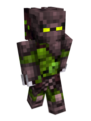

# 🌷 Hunter

### Current Abilities

<mark style="color:green;">+10%</mark> Melee Damage Dealt

<mark style="color:green;">+12%</mark> Increased Entity Drops

<mark style="color:green;">Extra Saturation Bonus from consuming different Food Types</mark>

<mark style="color:red;">-1</mark> Max Health

<mark style="color:red;">-8%</mark> Fire Damage Vulnerability

**Insatiable Hunger -** As a race coming from the hungering plant dimension, you too have an insaitable hunger that never ends. As such you <mark style="color:red;">permanently have the hunger effect</mark>

**Morph -** Hunters splice DNA with their own eaten foods to gain adaptive advantages and turn them into the ultimate killing machines. When you eat a raw piece of food, you can a variety of <mark style="color:green;">debuffs/buffs</mark> before the next set of food is consumed. In addition, you also receieve a small amount of poison damage, and receive hunger 2 while morphed. To demorph, drink milk, or honey. A full list of effects can be found [here.](hunter-morph-trait.md)

### Lore

The Ravenous apex predators of Panacea, Hunters are a ruthless race filled with murderers, bounty hunters, and survivors. They are often hired by royals or governments for kill bounties, as they are extremely adept at what they do. Much like Panacea, Hunters have an insatiable hunger that can only be satiated by killing and consuming living creatures. They often hunt in packs, however the more advanced the stage in evolution a Hunter is, the more likely it is to break away from the pack and become a powerful, independent killer. If a Hunter begins to track you, you can be sure that you won't have much time left in the world, especially if it is a highly evolved one.\

#### Appearance

Hunters are an extremely diverse race, as their features are mostly chosen by the Hunter itself at the early stages of its life. Hunters' skin is usually a shade of green or brown. Other colors are possible, but less usual, normally determined by the environment around them, as they are evasive creatures that use their own body to camouflage.

The texture of their skin is usually soft and plant-like; but that can also change depending on the Hunter individually, as many factors can affect the texture, such as age, gender, and environment where they live.

Instead of hair or fur, Most Hunters present plant leaves, not only on their heads, but very usually in patches on their limbs and backs as well. These leaves can be of different shapes and sizes depending on the Individual, just like different trees.

Hunters are almost always provided with big, strong fangs and claws, which help them hunt. As every Hunter is made from pure Biomatter, fibers made of this material can be seen going across or even hanging outside their skin, mainly acting as muscles or sinews.

Some Hunters evolve big, mammal-like ears at the sides of their heads, something that has become a signature trait for hunters for many of the other mortal Species.

Hunters' Bones usually present holes, that in a fully developed stage, are always filled with Biomatter and genetic material to facilitate Morphing.\

#### Physiology

**Leaves**

The leaves Hunters have can change over the course of the year. During Spring and Summer, Hunters present longer, bushier leaves; while during Fall and Winter their leaves are shorter and less frequent.

**Morphing**

Hunters have the ability to assimilate the DNA of the living preys they eat, which allows the Hunter to morph parts of their own body to be similar to the eaten creature in particular, providing them with abilities that they normally wouldn't have; like gliding (when eating birds) or breathing underwater (when eating fish).

To perform the task of morphing, Hunters purposely burn parts of their own biologic material, and then replacing it with Hormones previously reassigned to have the DNA of the eaten living being.

**Permanent Changes**

During the early stages of a Hunter's life, what they eat is crucial for how the Hunter will develop. Each time a Hunter eats fresh meat, they can choose between Morphing (and therefore using up the genetic material of their prey to temporarily assimilate it), or saving up the energy the food provides. Whenever they choose to do the latter (which is the most common thing to happen), the genetic material gets partially left behind inside of the Hunter's organism; which, on the long run, will affect the features a Hunter develops towards adulthood.

Eating a specific species of animal consistently across a long period of time results in the Hunter developing genetic features very specific to said species; such as horns, ears or tails. However, that is not exactly easy to pull off for a Hunter, as they usually eat all kinds of different animals during teenage hood, not just one, which results in the genetic material getting mixed up and resulting in general looking, hybrid like features. As an example, the large ears many Hunters present are a result from eating various species of mammals without committing to one specific animal.

#### Psychology

Hunters are wild creatures, mostly uncivilized and under the chaotic influence of Panacea. If a certain Hunter falls behind in evolutionary progress, that Hunter will not be recognized, and often completely left in the dust to fend for themselves. Hunters are the race equivalent of "survival of the fittest".

If they require to wield a weapon, they prefer daggers or knives over anything, but they usually prefer to fight or hunt using their own claws and fangs. When using clothes, Hunters prefer something light, comfortable and simple, like animal hide cloths to cover them.

Even though they generally tend to be wild and aggressive; in very rare occasions, if a Hunter stays long enough out of Panacea, after a few years they end up losing that incontrolable wilderness, and eventually act almost as civilized as other mortal species. Some Hunters even become so fascinated about the technology and complexity of other dimensions that they choose to stay out of Panacea to keep their "civilized" selves. These "domesticated" Hunters are usually treated as pariah by other members of the race, and they are disowned by the Provider.

#### Reproduction

Not all Hunters have a gender. In fact, as they are, technically, very advanced plants, many of them don't even reproduce sexually. Even if they do, the immense majority of Hunters use spores or stamens. Very few variants of Hunters end up developing a mammal-like reproductive way, and they usually don't find a partner that also has it.

Eventually, at an old age, the hunters that reproduce normally will entrap themselves inside a chrysalis in the shape of a rock crystal. That crystal releases spores that grow other hunters nearby. The Hunters that are born near the hunter crystal usually refer to it as "Parent Chrysalis", as it provides the adolescent Hunters with protection and vitality. When the newly-born Hunters grow old enough, they will leave the crystal, and it will lose all energy, which in turn becomes the end of life for the Hunter parent.
