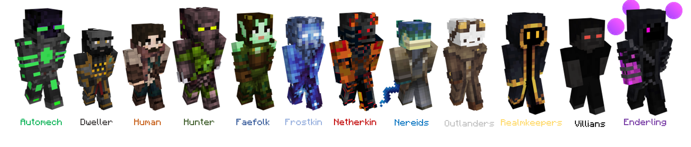

# 🏰 A Lone Settler

_`How did I end up here?`_

_`Where did I come from?`_

_`What should I do?`_

The Player Character can answer these questions differently to create a backstory of your own. There are many systems in place to solidify these questions into your character, with space to expand on the lore and develop something unique.

This Wiki Group will go over the different species of the world - and the ones you will be able to pick when you first Join with some brief outline on style aspects you may wish to follow.

#### Species

* [Automech](automechs.md)&#x20;
* [Dwellers](dwellers.md)
* [Enderling](enderling.md)
* [Faefolk](faefolk.md)
* [Frostkin](frostkin.md)
* [Humans](humans.md)
* [Hunters](hunter/)
* [Nereids](nereids.md)
* [Netherkin](netherkin.md)
* [Outlanders](outlanders.md)
* [Realmkeepers](realmkeepers.md)
* [Villians](villians.md)

<figure><figcaption>
Species to Select
</figcaption></figure>

 Automech  Dweller  Human  Hunter  Faefolk  Frostkin  Netherkin  Nereid  Outlander  Realmkeeper  Villian  Enderling
