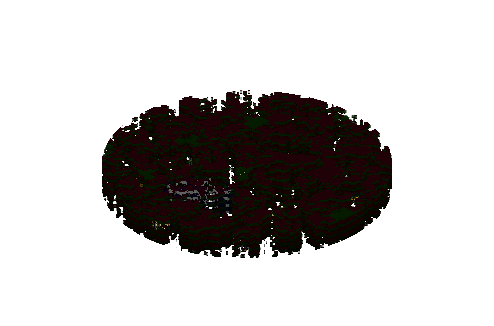

# Omnidrome

The Omnidrome is a cyberspace themed dimension, hence the falling enchantment particle effects and green-synthwave inspired biomes.

Quickness is granted to any user who runs within this dimension, and pressing shift while in this dimension allows any user to fly, even in survival. Saturation is also granted to any Automech that resides in this dimension. Nether bricks and stained glass cover much of the landscape. Falling into the "void" teleports the player to the top of the skybox, preventing a swift and untimely death if the player falls too low.

To enter, you must run by an end crystal within the nether, and exiting the dimension requires another end crystal as well.

### Lore

A hub for inventors and builders wishing to create without restriction, the Omnidrome is a dimension in which the laws of physics obey its inhabitants. A sentient race of machines called the Automechs also occupy the realm, and treasure information like a coveted resource.
