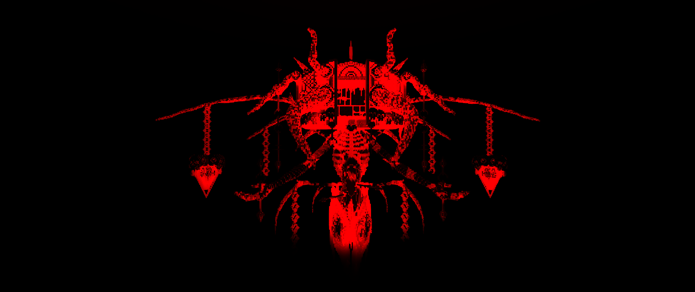

# The Tyrant

The Tyrant rules the Nether and actively seeks conflict and battle. Was originally more useful to the pantheon before the founding of the Cornucopia keeping away the Void-Beasts and maintaining order. Now he seeks conflict between the realms to stay relevant. Every 4096 years he becomes mortal - embodying his favorite creation - The Wither - and initiates an enormous inter-dimensional event, called The Invasion - in which his best warriors are sent forth to gauge resistance and spread the influence of The Tyrant throughout all the realms.&#x20;

His target often changes - but one thing is certain, the gears of war within the Nether have been turning. Preparing for inevitable conflict once again. Perhaps this time, it will be different.

\[This is otherwise the current conflict the player now finds themselves in]

<figure><figcaption>
What Mortal minds perceive to be The Tyrant in its Mod form.
</figcaption></figure>
