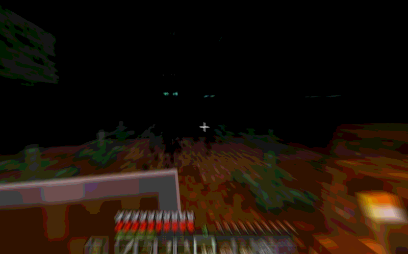

# The Dark Swarm

> _"Only fire and light can protect you._&#x20;
>
> _Do not go out in the dark, or act like a hero."_

Ancient non-corporeal beings from the darkest Void of the Cornucopia can manifest - often referred to as Darkness - rarely, in Paralon when the Void Dimension is at its closest every 43rd Night. They are neutral when alone and isolated, but extremely hostile in large groups.

When the event starts during the sunset, you will instantly know it. The air starts pulsing and fills with dust. Some animals get anxious. You feel the tension in the air. You still have a small amount of time to prepare for the worst, fortify your Citizens and run to safety. Then, suddenly, as the Dark Night covers the entire Overworld, putting Darkness effect on every player. The monsters emerge.

They are extremely fast in the dark. You will not outrun them for long. You need to stay in lit places to remain safe. They also break torches upon contact with them. So you might have to place them strategically or use better (more expensive) sources of lighting.

The Darkness are non-material beings that thrive in the dark. They are immune to normal attacks. They can only be killed by fire, light or flame-imbued items (e.g. torches, lanterns, bows with Flame, weapons with Fire Aspect). Be careful, as provoking The Darkness can cause them to coalesce into the Consuming Darkness - a 'boss' that sucks in and devours all nearby light sources.

#### Tips to survive the Dark Swarm

* Stay in well-lit places. The Light is your ally, protect it as it protects you.
* Cover nearby areas with Torches, especially Homes of Villagers and Animal Pens as they too are target to the swarm.
* Do not go out in the dark.&#x20;

<figure><figcaption>
Souls of the Void form a Swarm as they seep into our realm.
</figcaption></figure>
