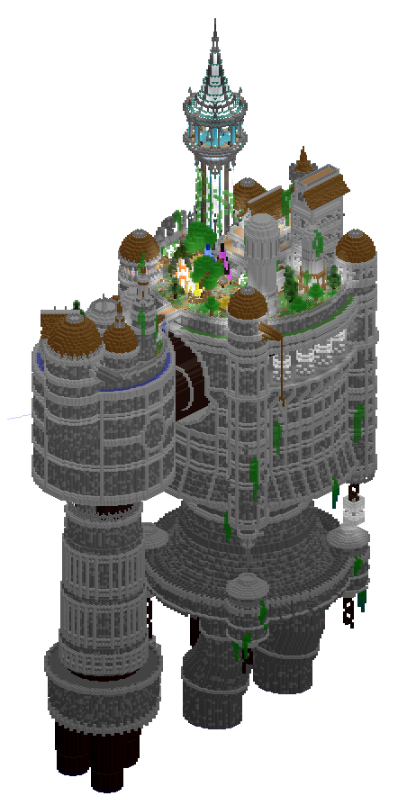

# From Nomad to Settler

<figure><figcaption></figcaption></figure>

<figure><figcaption>
The Camp
</figcaption></figure>

Starting out on Chronicles is not the same as starting in your standard Survival Minecraft Server, nor your standard Towny Server for that matter. When you join you will find yourself in the Hall of Arbitrium, this is where you will create your 'Character'.

You will make a unique in-game name (if you wish) and fill out any flavour details on your card. This card can be viewed by other players when they interact with you. You will also, more importantly, decide upon a race. Each race has different perks, downsides and unique abilities, however once chosen you <mark style="color:red;">**CANNOT\***</mark> undo the decision. (For the best experience you may want to frame your character, builds etc. around your selected race!)&#x20;

\*(there is an item found in [Pax](../lore-of-the-lands/dimensional-cornucopia/pax.md) that allows you to change it once)

