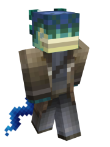

# Nereids

### Current Abilities

**Delight of the Aquatic** **-** Nereids are a race of the water, their various physiological features specifically adapt at navigating the underwater world. Nereids naturally have night vision, water breathing, and dolphin's grace. Haste is also granted in water as well

**Dried-up Land Fish -** Nereid's bodies can live outside of water, however most interal functions are slowed to a halt, and the Nereid becomes dried up. This gives them the effect of permanent slowness on land

**Power of The Camaraderie -** When near a conduit, Nereids also gain regeneration, an effect of the deep touch The Camaraderie has on the race. Nereids truly feel they are at home near a conduit, reminding them of The Brine.

### Lore

Nereids are an aquatic-dwelling race of creatures primarily living in the Brine dimension. Earning a reputation for being reclusive but empathetic in nature, Nereids are beyond-a-doubt one of the most fascinating species to encounter.

#### Appearance/Physiology

Nereids have dark, rubbery skin and eyes capable of perceiving low-light environments. Nereids have webbed fingers and a long, snake-like tail and flipper that affords excellent water mobility and limited terrestrial mobility. Nereids are typically well-built and feature high amounts of muscle mass. Nereid hair is very dense, heavy, and oily, usually tinted dark blue or green in color. It is common place for a Nereid to adorn their hair with kelp, shells, pearls, and other flashy items. Like lungfish, Nereids have both lungs and gills, and are able to spend extended periods of time on land if kept moist.

#### Culture/Society

Nereid culture is majorly agrarian in nature, and has not yet achieved an industrial revolution. Their order of government is a clan based system, in which large extended families follow the direction offered by a local matriarch. For the whole of Nereid culture, the importance of family and of putting the needs of others before your own, is of foremost importance within their honor-based society.

#### Aquatic Architecture

A common trend found among Brine architecture is that it often incorporates living organisms such as giant sponges or corals within its structure. It is commonly believed that having a living home benefits all of those dwelling inside of it both physically and emotionally. Nereids typically look with distain upon the "dead" buildings of wood and metal constructed by other peoples, sometimes going as far as refusing to enter them.

#### Realmkeeper Occupation

At the time of writing this, most of the Brine's surface islands have already been occupied by Realmkeeper colonization. Although violent confrontations are infrequent, with most Nereids progressively vying to migrate to deeper waters, bitter resentment is very prevalent between both cultures, with Realmkeepers being frustrated at Nereids for their lack of compliance, and Nereids taking deep offence to the callous changes Realmkeepers force upon them.

#### Affinity for Empathy

Nereids have earned the reputation of being shy, introverted, and even xenophobic toward other races. However, those fortunate enough to have formed a lasting friendship with a Nereid may argue the opposite, stating that they belong to one of the kindest, most compassionate, and selfless cultures one can encounter. Having an incredibly sensitive perception of what constitutes as selfish or unselfish person, Nereids are often afraid of forming new relationships with people but are fiercely loyal to maintaining old ones. Survival within a Nereid clan has long depended on the willingness of its individuals to freely share their possessions with others. As such, individuals who hoard their possessions from the clan are typically shunned and ostracized.
