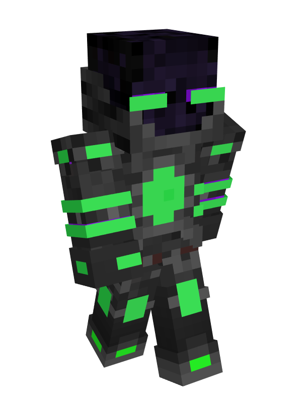

# Automechs

### Current Abilities

**Nixchrome Plating -** Automechs durable Omnidrome metal alloys makes them extrememly durable. They have permanent resistance x2.

**Hydrophobic Processing -** Automechs amount of carried technology and knowledge weighs them down a bit, meaning a permanent slowness x1 effect. This effect worsens in water increasing to slowness x5 at the head.

**Recharge -** Automechs harvest energies from active redstone blocks, granting them saturation.

### Lore

The Automechs are a race of extremely intelligent, knowledge-seeking, reality-bending, interdimensional robots created in the Omnidrome. As tools of The Ascended Council, there mission is to spread to all corners of the known Cornucopia, and seek out as much knowledge as possible. Many Automechs find themselves in a hive-mind state under the authority of the council, but some lucky few born with a strong enough will to be come their own, free from the influence of the council. Automechs, as the most technically advanced race in the entirety of the Cornucopia, encompass reality-bending technology that puts them far above many of the other races power-wise. In some cultures, are even feared due to their technology.

#### Physiology (mechanics)

Automech's physiology is primarly composed of pure circuitry and machinery, that of complex wiring and cybernetics far beyond that of even Outlanders. Their "skin" is made of a hard dark metal originating from the Omnidrome called Nixchrome. This extremely durable material allows them to sustain much damage without fatal error or shutdown, making them signficantly harder to properly kill without the right equipment. Inside of a Automechs mainframe are processing servers that send signals to the other parts of the Automech's body to "simulate" emotion to some degree. These servers are adaptable, however an Automech usually doesn't not have any time for emotions, so many of the Automechs under the control of the Omnidrome masters use these servers as data storage for gained knowledge. These servers often turn on at the time that certain Automechs choose to become Independents, more on that later.

Automechs have a variety of parts for various tasks. Many of its features depend on the job the Automech was born with. Some have extra capacity for grafting technology onto their systems, others have larger servers for data knowledge. Some are even blessed with modern intelligence and understanding, which often go out into the world and discover emotions and experiences for collection and understanding. In general, Automechs _can_ consume food, although physical material is less effecient for them. Charging via redstone or some other energy source is the best way they accomplish nutrition, as their circuits need proper stimulation of energy. These parts also do not work well with water, as proccesses seem to slow to a halt in contact with large amounts of liquid once the water reaches the head.

Automech circuit boards are said to be so complicated, some even find themselves split in multiple dimensions due to its reality-altering attributes. As this tech is unbelievably complicated, Omnidrome technology, even the ones in Automechs, is highly sought after. Tech also has a green hue with the glow, lights, and glass, as black and green have cultural significance in Automech society.

Automechs are the only race in the known Cornucopia to not have a specific gender or types of race. Instead, Automechs usually indentify with the submind they originate from, be it Council Subordinates, Devastation Complex, Intermediates, or even some Independets. A few Independents who have lived in the other societies long enough sometimes do take up a gender, generally speaking male, although Automechs do not have any reproduction organs to properly differeniate between.

#### Culture

As many Automechs are under a hive-mind state, the culture is less refined than many of the other races. Automechs live in a variety of tech-themed homes, such as Omnidrome space ships, dome-societies, or even live in the vast knowledge libraries that can be found all throughout the Omnidrome. These houses often have the bare minimum necessities and instead focus on incorperating tech that helps them do their job better.

Automechs often work together in teams that consist of a well balanced crowd. There are usually knowledge seekers, warriors, data collectors, code snappers(automech wizards), end integators(automech glitchtech specialists), and more. These teams go out to perform a variety of different daily tasks, quests, and jobs all from the command of The Ascended Council. Teams can live together in dome towns or one giant interdimensional floating ship where they can travel cross-dimensions with ease. Some teams work together to accomplish essentially the same task. Automech life and society is all about maximum effeciency and speed in collecting necessary information from the various worlds.

**Subminds**

There are many subminds within the walls of the Omnidrome. Some of these work in a hive-mind state to create almost a hive-like system of operations for the Automechs, whose only existence is to serve their masters. Subminds can vary from place to place, however in the Omnidrome, Automechs are usually unified under the council

**Council Subordinates**

Council Subordinates are the largest submind of the Omnidrome, as they encompass the many Automechs under The Ascended Council's influence. Many of these Automechs sole purpose in their existance is to ever serve the council in whatever they tell them to do. Much of the time of Council Subordinates is spent collecting knowledge to store in vast libraries controlled by the council. Council Subordinates have zero free will, and are the most difficult to properly become Independents. Clothing worn by Council Subordinates seems to be religious in nature, wearing scifi priest robes or garments, almost as if the Council and knowledge are their Gods.

**Devastation Protocol**

Devastation Protocol is the submind of Automechs under the control of The End after frequent abuse of Glitchtech. Much like Council Subordinates, they lack any kind of free will, only this time they are not of The Council's control anymore. Instead, they are hive-minded by The End, whose sole purpose is to spread chaos across The Omnidrome. These Automechs are immensely powerful and are out-of-control, attacking anything in sight. Devastation Protocol Automechs appear warped by the end, their full body glitching in and out, a purple glow encompassing their body. Devastation Protocols can freely teleport and tear reality to shreads through a purified form of Glitchtech. Devastastions do not wear any clothing, however their arms appear abnormally long as the glitchtech stretches them out. They are more dangerous than even Endermen themselves. Stay away from Devastation Protocols.

**Intermediates**

Intermediates are Automechs with a little more free will, but still live under The Omnidrome and under the influence of The Ascended Council. The Council offers Intermediates great rewards for helping them out, and they often engage in assassinations or the dirtier jobs that the council gives them. It is said that a secret assassin organization is run by intermediates as a place where secret agents and hitmen go to get jobs from the higher ups. Some kinder Intermediates also have attempted to share their knowledge with others, with heavy eyes of The Council watching over them. If they say too much, The Council will order their immediate annihilation.

**Enigma Analysts**

Enigma Analysts are highly intelligent, curious Automechs who work in a foundation under The Ascended Council. The foundations main purpose is to collect anamolies and mysteries that the Omnidrome has still yet to explain over all the Cornucopia. They both work for The Ascended Council as well as themselves, and as such carry an intelligent level of free will and understanding about the world around them. Enigma Analysts are very dedicated to their work in the collection of strange entities, occurrances, or objects all found throughout all universes. Their Void knowledge is extensive as well, being the first submind to crack the mystery of the amnesiac effect of The Void, which they keep a tight kept-secret, highest security. Emigma Analysts wear high tech lab coats with a variety of uses, like the swiss army knife of clothing for any occasion, or unforeseen accident.

**Independents**

Independents are less of a submind, and more of a break off from any of the factions in Automech society. As their name suggests, Independents are Automechs who have enough strong will and preserverence to resist the touch of either The End or The Ascended Council. They live freely away from The Omnidrome in the other dimensions, trying their best to make connections with other races as much as possible when possible. The oldest known Independents have adapted into society so well that they are renown citizens in cities in The Underdark, Overworld, and even The Faewilds. Independents usually wear fancy sci fi clothing, similar to techwear, but infused with Omnitech. The fashion of Independents is said to be the best out of all Automech subminds, as many try to make themselves flashy for self-expression.

There are many more subminds, however these encompass over 85% of all Automech subminds, and are the main factions most people know about

#### Technology

The technology of Automechs is some of the most advanced, complex tech in all of The Cornucopia. Automechs and The Ascended Council have spent eons perfecting their attempts at being able to alter the very fabrics of dimensional reality, and the fruit of their labor has created two distinct categories of technology they have grown infamous for. One for destruction, the other for creation and manipulation, and perhaps a little bit of destruction mixed in too.

**Omnitech**

Omnitech is the most common form of Omnidrome technology that Automechs utilize. Many Automechs are crafted from this tech themselves, and it allows them to control the fabrics of space-time like code in a program. This tech functions even more efficiently whilst in the Omnidrome, and is the reason flight is possible and fall damage is completely negated. Omnitech works as using the Omnidrome as a catalyst program for streaming in reality-altering code, which it then funnels through the multi-dimensional machinery and circuitry, which allows it to bend the laws of physics to a limited degree outside of The Omnidrome. Automechs who use this tech can create structures, bend spaces further or closer, push the laws of the worlds to their limits, and so much more. Omnitech acts as sort of a pseudo demi-creative mode for Automechs, who are able to move from place to place or defend themselves with ease.

**Glitchtech**

Glitchtech is a heavily modified version of Omnitech that produces much more destructive and terrifying results from its predecessor technology. Created from intelligently augmenting Omnitech with the combined forces of voidtech and end magics, Glitchtech is the final product that came from the numerous tests conducted in The Living Palace. Glitchtech allows the user to more aggressively manipulate reality, "glitching" parts of the dimensions in strange ways impossible to do otherwise. This glitch tears the very strings that hold dimensions together apart and is a very painful tech to be on the receiving end of, as the tears in reality affect all bones, skin, and veins in the victim from every "glitch" effect that hits them from the weaponry. However, as is the case whenever The End is involved, this technology is extremely corrosive and corrupting. The technology can slowly turn the user insane, and under the command of The End, no more than the mind of an Endermen. However, due to the explosive nature of the voidtech reacting with the end magic, glitchtech can make the user extremely violent, seeking destruction wherever they go. As such, it is often only used on a single part of an Automech body, such as an arm or a leg, and never the head, where the corruption can weave its way the worst. Glitchtech is something to be feared, and taboo by many other Independent Automechs or other races.

#### Mortality and "Reproduction"

Automechs live a very long lifespan of thousands of years due to the pristine nature of Omnitech. However, despite this Automechs can die at the hands of outside forces such as war, or other creatures. When an Automech dies, the servers in their body shut down, and their body and information dissapates into code back to the Omnidrome, where their live and knowledge is stored by The Ascended Council for inspection of the info they almost lost. It is hypothetically possible to revive a dead Automech via taking this stored code into an empty Automech vessel, however the Automech will not remember anything from their previous life, all memories and experiences lost.

Automechs do not reproduce, as they are spontaneously "sparked" into existence in The Omnidrome. These "sparks" have been described as "fireworks of code" pulling at each other into a solid form, and are a spectacle to witness.
