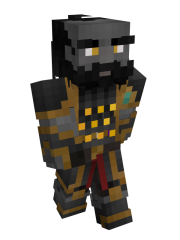

# Dwellers

### Current Abilities

**Ethereal Bellies -** Dwellers have insides made of an ethereal force. This force does not appear to have a limit as to how much food can be intaken. This leads to Dwellers having the hunger effect when their food bar is full.

**Miner's Affinity -** Dwellers are well-built and designed for a love and efficiency of mining, granting them permanent haste and night vision.

### Lore

Dwellers are a race of mineralized dwarves who live in The Underdark as a mining and trading race. They live in complex societies built from wood and stone, and have huge trading center markets where most races can sell and purchase items from their respective dimensions. Dwellers are a friendly race who have good relations with most races, especially the Faefolk.

#### Appearance

Dwellers have a mineralized outer surface of skin, called Dallacite. This material, despite very hard to the touch similar to regular stone, is flexible enough to support proper movement and speech similar to regular skin. Because of the stone-like material that is Dallacite, crystals grow on Dweller's bodies in place of hair. Dwellers often fashion these crystals around their body in certain styles, and even chisel the crystals similar to a haircut, due to the heightened crystal-formation acceleration properties of Dallacite. These crystals often take after common ores, and usually influence the personality and job-occupations of Dwellers.

#### Architecture and Culture

The architecture of ancient Dwellers, before the invasion of silverfish in The Underdark, was once made of chiseled stone. However, after an invasive infestation of several thousands of silverfish, Dwellers had to resort to wooden constructions with some stone parts added as decoration. Dweller cities and markets often add in giant floating crystals made of a special type of composition that scares away silverfish, allowing them to do a bit more creative work in the larger urban societies of Dweller folk. However, due to the rarity of this material, and due to the large cost it is to manufacture a crystal of its size, many poorer societies or mines have to resort to regular wooden construction, often the stone floors of some poverty-striken buildings infested with silverfish.

The culture, despite a small social pyramid, is quite friendly. Dwellers love trade with most races, often creating large cities and markets exclusively manufactured and orchestrated towards commerce. Dwellers love to commune with each other as well, as many villages eat together at large dining halls, where the spirit of others is high, and the music, often influenced by special musical crystals, is magnificent. Food is very important in Dweller society, and Dwellers, as tradesmen, often share in a wide buffet of different race foods. Their favorites are floating, enchanted cakes from Faewild, and cookies in the overworld made from Humans.

Their culture is also highly influenced by Faefolks as well, who have the best relations with the Dwellers, despite each living conditions of their dimensions and their appearance being distinctly different. Because of the close relationship of The Entertainer and The Forger, Dwellers and Faefolk have lived in peace for many generations, and always have a place to trade in each Dweller trading market. Dwellers and Faefolk had such great relations, that with their combined efforts together, ended up creating the Human race in the overworld, although this is tightly kept knowledge.\

#### Physiology

Much of the interior of Dallacite is made up of a special type of geode crystal, called Gallenth. Gallenth exclusively exists inside of Dweller. It works as the emitter of Dweller viscera, which is ethreal and has a fog-like appearance. A soft glow emits from the crystals and ethereal insides often reflects the ore and crystals growing on an average Dweller person. When Dallacite is broken, this essence bleeds out of the body as fog would a small crevasse, Dweller's version of "bleeding" despite the lack of visibly bodily fluids like blood. Hypothetically, if you were to brake off a hand or other body part of a Dweller and have that piece grow elsewhere in the correct enviroment, you could have Dweller insides at multiple places at once. Most of the time, due to the air and conditions around, this would be extremely difficult to do.

Despite their physiology being mostly comprised of crystalline and rock-based structure, Dwellers enjoy a wide variety of foods as omnivores.

Because of the ethereal nature of Dweller visera, the stomachs and organs of Dweller's work in a much more efficient matter, especially for mining. This, in turn, increases the average haste of a Dweller person, but also means Dwellers rarely ever feel satisfied with a meal, and often crave more with the heightened metabolism. This leads to Dwellers often sharing mutiple meals a day, such as "3rd dinner" or "2nd breakfast".\

#### Ore-Based Personalities

* Dwellers live in different communities based on ores and gemstones. Their personalities are influenced by their ore type.
  * **The Redstone Community** is full of great redstone engineers that use redstone tunnel bores and other contraptions to help them mine. They are friendly but prefer to be at their workshops than to be with others.
  * **The Gold Community** is a flashy, fashion-forward community focused more on aesthetics than functionality. They fund a lot of the projects in the Underdark and especially invested in the Underdark trading market. They are confident, assertive, and _filthy rich_.
  * **The Diamond Community** is a kind but strict community that strives to follow rules and ensure that rules are followed. Lots of Dwellers look up to this community and this community is almost viewed as a governing community.
  * **The Netherite Community** is controversial among the Dwellers species, but are respected because of the treasures they bring to the Underdark. They carry part of the nether’s aura with them and it is off-putting to some. They are more of a lonely, dauntless community, constantly adventuring into other realms in search of new treasures and gems. They also have a much better relationship with The Netherkin instead of The Faefolk because of this.
  * **The Emerald Community** is the merchant community. They are commonly found in the Underdark trading place, either trying to get bargains or sell bargains. They are very business oriented.
  * **The Iron Community** is the architect community. They design all the new buildings and structures within the Underdark and locate the best places to mine. They are cold, and calculating.
  * **The Copper Community** is the builder community that carries out the Iron Communities’ designs and they also function as scouts. They feign ignorance and inferiority, but secretly they are the only dwellers who know how to get to Varkspace.
  * **The Lapis Community** is the most magically attuned community of the dwellers. They often travel to the faewild to enchant dweller tools and weapons. They are calm, mysterious creatures.
  * **The Amethyst Community** is primarily composed of Dwellers who wish to understand and work on the intricacies of craftsmanship. Usually they work on the jewelry, rocks, weapon and tool designs, and are some of the most hard-working, diligent artists of The Underdark. It is said that a necklace crafted by an amethyst Dweller is a token of prestige and fortune. Many gold dwellers commission amethysts for fashion.
  * **The Coal Community** is a agricultural community that specializes in turning plants into fuel, providing the necessary energy needed refine material and power the Underdark. The are gentle, but can be overprotective at times

#### Reproduction and Mortality

Dwellers, despite being responsible for the human race, do not experience reproduction the traditional way. Rather, females at a certain age, can create small birth geodes from combining dust and materials in their air from their hands at will. In a similar fashion, male Dwellers create small, glowing birth stones they can insert into the egg geode. Over time, the egg geode will slowly transform from the rounded stone into a small Dweller child. The birth stones from males can also enter pass through females of other races by simply slipping through the skin, passing through like a ghost, to where ever said race has their eggs.

Death in Dweller society, in done in natural terms, is not as solemnly looked down upon as opposed to other races. When a Dweller dies from old age, or a disease, the Dweller finds a place to lay or sit, and slowly transforms completely to pure stone, cementing their place in the ground where ever they die. As such, their body leaves behind a permanment statue unless the stone is broken open. Because of this, despite death still being a somber experience, death is more shared as a beautiful concept in a similar fashion to The Day of the Dead in Mexico. Deaths are often accompied by a great party, in which the experience is often set up near the dead Dweller. Despite the concept being rather morbid to other races, Dwellers do not find celebrating death as a strange occurance. However, if a Dweller dies by a creature or weapon, the Dallacite will shatter, which results in a much more lugubrious funeral instead.
