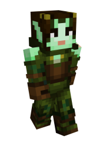

# Faefolk

### Current Abilities

**Otherworldly Agility -** Faefolk are one of the most naturally agile races in all of the Cornucopia. Faefolk constantly have the jump boost effect, and speed when sprinting.

**Faemarks -** Faemarks are the magically imbued tattoos that cover their bodies at birth. This gives them a passive XP gain similar to the Faewilds, but in any dimension. However, as a downside, these tattoos make them weaker to wielding physical weaponry, giving them permanent weakness.

### Lore

Faefolk are a fairy-like race that reside in The Faewilds as adventurer and storyteller race. They reside in intricate treehouse villages and sky island stone temples. They are daredevils that love gossip, often risking their own lives to create exciting experiences and stories to tell others. They are a friendly race as they are always eager to learn new things, but they have an especially good relationship with Dwellers.

#### Appearance

Faefolk have jade green or light pink skin and bright green eyes, dark black hair, canines that poke out from their bottom lips, and shimmering magical tattoos that cover their bodies. These magical tattoos are unique to each Faefolk person and allow them to take in mana from their environment around them. These tattoos evolve as a Faefolk ages, gains more experience, or performs a spell displaying his or her life stories and achievements. The more complex a Faefolk’s tattoo is, the more experience, knowledge and mana capacity that Faefolk has.

#### Architecture and Culture

Ancient Faefolk used to reside in small wooden teepee villages on the ground as they didn’t stay in camp often. The creatures of the Faewild soon showed to be a problem. Creepers and spiders would invade and devastate towns, and many Faefolk barely escaped with their lives. Tired of constantly losing everything, they took to the treetops, keeping out of reach of the creatures. The most accomplished Faefolk live in fantastic sky island temples. Inside these temples their stories are recorded into vital Faefolk history that is passed on from generation to generation. This is the greatest honor a Faefolk can receive. Their culture is heavily based on the idea that since life is finite, one must be willing to enjoy as much of it as possible and share that enjoyment with others. Taking this motto into account, they take on daunting journeys with every successful expedition rewarding them with mana and tattoo evolution. The mana stored in their tattoos is required for spell-casting and Faefolk are particularly adept at it with most learning their first spell by 4 years old. Experienced Faefolk with especially complex tattoos can cast extremely powerful spells capable of shaking the world at its core. They do have to be careful when casting spells as it can be tough on their bodies and they need mana to survive. Some Faefolk, due to their close relationship with Dwellers, have committed to a life of trade, trading valuables in exchange for experience. Others become professional storytellers, putting on vibrant plays based on vital events in Fae history. It is said that you have not lived until you have seen a Faefolk play.

#### Mortality

When a Faefolk is about to die it’s tattoos begin to fade, limiting the amount of mana it can take in and store. Usually when this happens, a Faefolk will sit down to journal their adventures so they won’t be forgotten. When he or she passes, his or her book will be put in their town’s library or sky island temple depending on how extravagant their life was and he or she is buried in a town gravesite.
