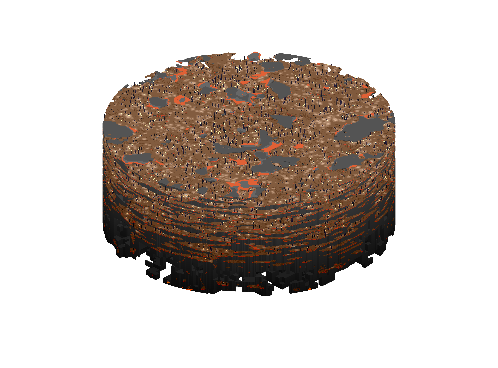

# Dormis

It has a very hostile environment, lava and bedrock covering the grounds, and resistance x10 once every ten seconds, making it very hard to die in this dimension. Also, every 100 blocks in this world is only a single block in the overworld. There are many shelf-like layers of Dormis, which increases difficulty in tranversing this dimension.

Currently, it houses The Solatium Thrall. Killing it drops a very powerful, but fragile golden helmet, as well as an the only way to get the Worm-toothed Burrower.

To leave Dormis, you must travel below y = -20 through the use of a Worm-toothed Burrower to break the bedrock. The through lever combinations in The Arc, the portal gate in Pax.

### Lore

Dormis is a dimension designed to be the ultimate prison by[ The Judge](../mods-and-gods/the-judge.md), the current mod of Dormis. It’s inhabitants include both prisoners and their descendants.

The most heinous criminals end up in Dormis, simply known as Villains. They are the dominant "species" of this realm and owe their ancestry to multiple peoples from other realms. Dormis is also the origin point of the Realmkeepers, who were once known as a completely different race that assisted in keeping the criminals and prisoners in line. Later the race was soon adopted as the Realmkeepers when The Protector (mod of Pax) converted them to combat the spread of the Zombie Disease when [Innominatam](../mods-and-gods/the-traveler.md#innominatam-the-cosmic-tunneller), a celestial void worm, perished.

Pax's sun is so incredibly far away that it breeches the dimensional barriers despite being powerful enough to shine through them to bring light into Pax. In the center of Pax's sun is Dormis, which is why the only way to enter Dormis is through The Arc.
