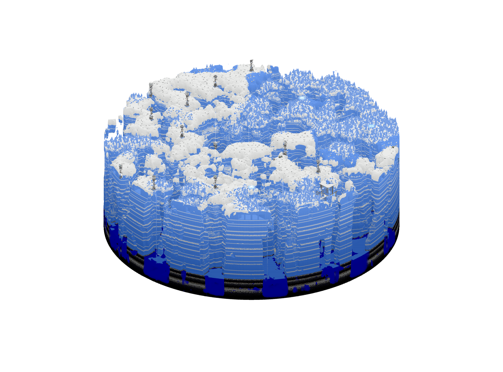
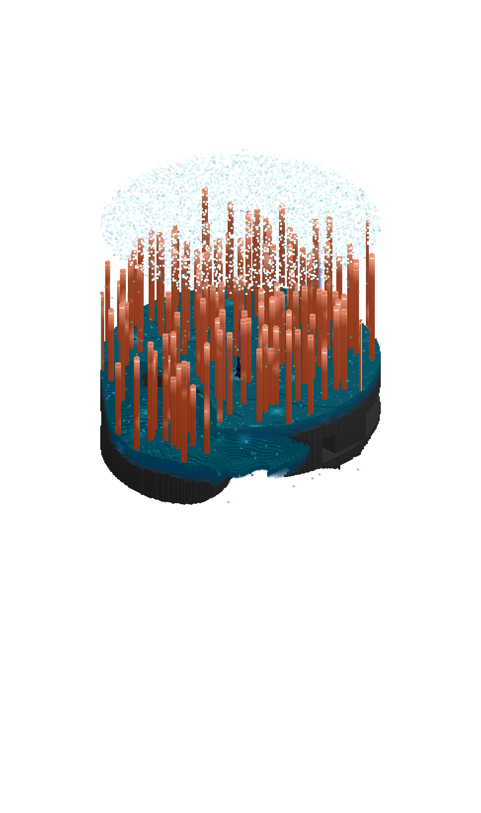

# Glacium, Panacea, The Brine, Varskspace

## Glacium

Glacium is the frigid cold ice dimension within The Bracken Pack. A dangerous place for those who do not come prepared. Strays, vexes, and snowmen prowl the surface of the icy wastelands, so it is recommended to be well equipped while traversing this dimension. Water is also so freezing cold that it will inflict wither on any player that touches it unless you are a part of the [Frostkin](https://thebrackenpack.fandom.com/wiki/Frostkin) race. There are also towers with activated beacons that exude mining fatigue if approached. At the top of those towers are chests guarded by armored skeletons (Middle Age Guards) filled with powerful, but fragile loot. This Dimension is protected by the Bygone Viceroy.&#x20;

To enter Glacium, you must stand on an activated beacon, as the same with exiting it. You can also find a beacon in the middle of a glacium tower, which you can use to return back if you do not have another one available.

### Lore

Glacium is a frozen realm that gets as cold as the nether is hot. It’s inhabitants include calcium-based life forms that resemble fur-covered trilobites. At one point in history, the stray empire once ruled over several dimensions, but has long since crumbled into obscurity. Their [descendants](https://thebrackenpack.fandom.com/wiki/Frostkin) can still be found in the nether and overworld.

## Panacea

Panacea is the primal jungle world of the Cornucopia.

Those entering this realm will experience an increase in health and vitality, at the cost of a constant hunger effect. Many dolphins also swim within the waters of Panacea, and some of the structures house honey blocks. Pieces of armor that permanently increase health as long as they are equipped are dropped by some of the hostile mobs in the dimension.

To enter this dimension, you must wear a creeper head while looking directly at a creeper in close proximity. To leave this dimension, shift click the creeper head and unequip it to travel directly back to the overworld. A defused creeper egg can also be sold by the wandering traders in a Fae village in the Hamlet biome in The Faewilds, if you are looking for a consistent way to enter Panacea without the danger of exploding creepers.

### Lore

Panacea is a primeval world, untainted by civilization. It’s wild influence enhances the presence of its native flora and fauna, which almost seem drawn to devouring any artificial structures. Those entering this realm will experience an increase in health and vitality, at the potential cost of losing sanity and civility given enough time.

[Hunters](https://thebrackenpack.fandom.com/wiki/Hunter) are a race of plant-like organisms residing in Panacea who live for the stalking and killing of any creatures it can to eat. They are often hired as assassins as they are very adapt at killing, and can harness the powers into their DNA for any creature they consume. They also often hunt and kill in packs, making them one of the most deadly and powerful races.

## The Brine

The Brine is an aquatic dimension and is home to many species including the [Nereids](https://thebrackenpack.fandom.com/wiki/Nereids). It is a brewing dimension, meaning potions instantly brew here as well as don't run out of fuel when looked at. Travelling past the tail end of the bottom of the water in The Brine leads you into [The Void](https://thebrackenpack.fandom.com/wiki/Void). Be wary of the many guardians swimming about in it's waters, as they spawn VERY frequently.

To enter the Brine, look at the top part of an activated conduit, as well as leaving it.

### Lore

The Brine is an aquatic dimension and is home to many species including the [Nereids](https://thebrackenpack.fandom.com/wiki/Nereids). Nereids are the sea-folk that inhabit the Brine, and swim frequently together in packs throughout the waters. Nereids tend to possess a strong affinity for exploration and adventure, and are very family oriented. [Realmkeepers](https://thebrackenpack.fandom.com/wiki/Realmkeepers) are also currently attempting to acquire brine territory.

## Varskspace

Every block in this dimension is 100 blocks in the overworld, great for escapes from enemies. In this dimension, you have an extreme quickness buff that makes you run at incredible speeds, which increases in speed slowly while running. To enter this dimension, you must get struck by lightning, and to exit, you have to run fast enough and get struck by multiple lightning bolts to leave.

### Lore

Varskspace is a dimension created by a being known as [the Traveler](../mods-and-gods/the-traveler.md). Although mostly featureless, the realm was designed to aid others in exploration.
