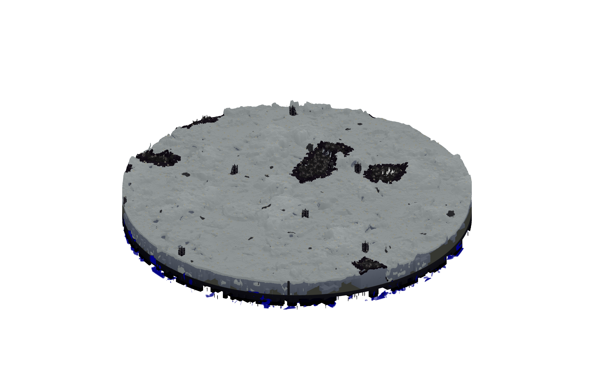

# The Sanctum

Sanctum is a quiet dimension; remnants of an advanced ancient civilization lie below the white landscapes covering the broken buildings of a once great people. Ruined treasure lies dormant within some of the ruins left by the civilization. Netherite is hidden in many of the old structures of Sanctum but buried deep within the machines and buildings.

Sanctum is also an anti-grief dimension, with TNT disappearing, lava evaporating into obsidian, and fire dissipating from the ground.

Sanctum is one of the 4 dimensions that contains its own unique boss.

Not to be confused with the Sanctum Boss Structure found in Paralon.

To access Sanctum, you must dig all the way down to the bottom of the nether near bedrock level.

### Lore

Sanctum is one of the oldest dimensions and was created to be a crowning gem among the other realms. However, due to the overambition of its inhabitants, and the destruction of their Mod the realm eventually became an unending wasteland. The Builder, the mod who was killed by his own people, created this dimension and governed a race of people there. Over the centuries however, they quickly advanced in power and knowledge until they reached the point in which they realized they could overpower the mod ruling them.

This ended up backfiring when the Builder died, because the land began rejecting its inhabitants. All of the plants perished, their sun cooled, reddened, and gave up on traveling its path across the sky. The atmosphere thinned and ash snowed endlessly from above. Those formerly living there were then forced to adopt a nomadic lifestyle, scattered throughout all of the other dimensions as wanderers. These people were then renamed as "Outlanders."

Despite it all, Sanctum still gets some attention from the occasional archaeologist and treasure hunter looking for valuable artefacts to plunder beneath the dunes. However, many avoid its surface, afraid of its cursed legacy and its relative position near The End.
