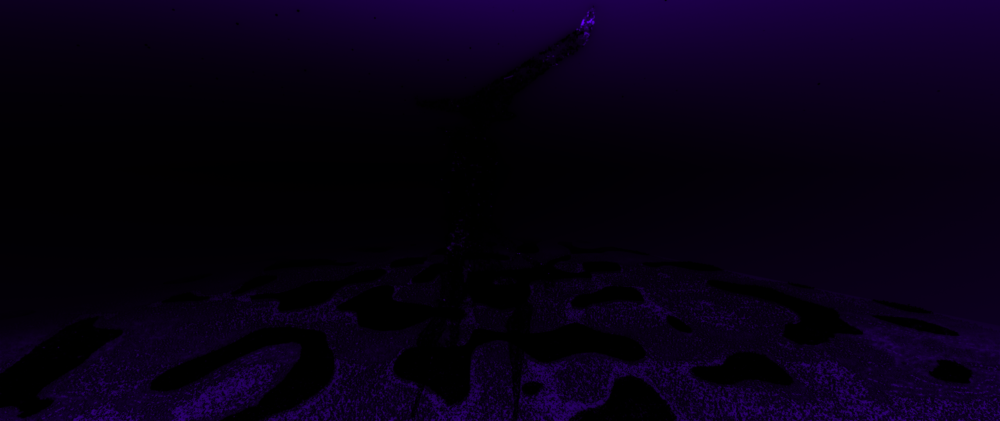

# The Inspector / R̸͎̱̂͊u̸̳͙̲͕͝į̵̩̤͕̅̍ǹ̸̞̠̗̙͊̊ä̵̢͖͕t̵͕̦̄̓́͌í̴̡̛̭̘̍o̶͇͂͌ǹ̴̖́̉͝

H̴E̷ ̵I̴S̷ ̷T̶H̴E̶ ̸E̴N̸D̵ ̴T̵H̷E̷ ̷E̶N̴D̴ ̵T̷H̵E̶ ̴E̸N̷D̴ ̸T̷H̷E̵ ̴E̶N̶D̶ ̷T̷H̵E̶ ̸E̸N̵D̵ ̷T̴H̶E̸ ̸E̶N̷D̶ ̷T̶H̵E̸ ̶E̸N̵D̶ ̶T̶H̴E̴ ̵E̴N̷D̵ ̷T̷H̴E̴ ̶E̴N̴D̵.̴ ̴

H̶E̶ ̶Q̵U̴E̸S̷T̴I̶O̶N̸E̴D̷ ̶T̴H̶E̷ ̸P̸O̶I̸N̸T̸ ̷O̷F̸ ̶I̶T̴ ̵A̸L̵L̸.̷.̵

&#x20;̶.̶.̸.̷ ̷T̵H̶E̵ ̵P̵O̴I̶N̵T̷ ̵O̶F̶ ̵A̴L̵L̸ ̴D̴I̶M̷E̵N̷S̵I̸O̶N̴S̶ ̴

W̵H̴Y̷ ̷N̵O̷T̴ ̷O̷N̷E̴ ̸C̵O̸N̷G̶L̶O̷M̷O̶R̷A̷T̸E̸?̶ ̶.̶?̷ ̶

O̶N̴E̶ ̵O̷N̸E̸ ̵O̸N̷E̴ ̶O̵N̵E̷ ̵O̴N̸E̵ ̸O̷N̸E̵ ̸O̴N̷E̶ ̴H̴E̷ ̴W̵I̷L̷L̷ ̴S̶P̶R̴E̶A̵D̵ ̷H̷I̷S̵ ̴I̶N̸F̵L̸U̵E̴N̸C̷E̵ ̷.̷.̵ ̴.̵ ̷.̴ ̷.̸.̶ ̵.̵.̶.̸.̷ ̷.̵ ̵.̸.̴.̴ ̴.̶.̶ ̴.̶ ̵.̴ ̷

T̴O̸ ̴A̴L̷L̴ ̶T̵H̶E̵ ̵C̸O̶R̶N̵U̸C̷O̸P̴I̸A̸ ̵H̵E̴ ̸C̵O̴N̴T̴R̶O̷L̴S̵.̸ ̸E̵N̸D̶E̵R̶ ̸M̷E̵N̸.̴ ̶T̵H̴E̸ ̴C̷I̷T̷I̶E̸S̸.̶.̷.̴ ̷D̸R̵A̵G̴O̶N̸ ̵.̶.̷ ̶.̵ ̴.̷.̶ ̶.̸.̷ ̷.̴.̶.̵.̸ ̵.̸ ̷.̶.̴ ̶.̷ ̶.̸.̸ ̵.̵ ̶ ̶ ̷ ̴H̶E̴.̷ ̷ ̵ ̶ ̸ ̶W̴I̷L̴L̵.̶ ̴ ̸ ̴ ̵ ̷B̴E̵C̷O̸M̸E̷.̷ ̴ ̷ ̶ ̸ ̷ALL.\

***

.. / ... . . / -.-- --- ..- .-.-.- / .. / -.- -. --- .-- / -.-- --- ..- .-. / ..-. . .- - ... .-.-.- / -.-- --- ..- / - .... .. -. -.- / -... . -.-. .- ..- ... . / -.-- --- ..- / -.- .. .-.. .-.. . -.. / -- -.-- / -.. .-. .- --. --- -. / - .... .- - / -.-- --- ..- / .... .- ...- . / .--. --- .-- . .-. ..--.. / -.-- --- ..- / - .... .. -. -.- / -... . -.-. .- ..- ... . / -.-- --- ..- / ... -.-. --- .-- . .-. / -- -.-- / -.-. .. - .. . ... / .- -. -.. / .--. .. .-.. .-.. .- --. . / -- -.-- / ..-. .-.. . . - / - .... .- - / - .... . / ..- -. .. ...- . .-. ... . / -... . -. -.. ... / - --- / -.-- --- ..- .-. / .-- .. .-.. .-.. ..--.. / - .... . / -.-. --- ... -- --- ... / .-- .. .-.. .-.. / .-. .- .. -. / .-- .. - .... / - .... . / . ... ... . -. ... . / --- ..-. / - .... . / . -. -.. --..-- / -- .- .-. -.- / -- -.-- / .-- --- .-. -.. ... .-.-.- / -.-- --- ..- .-.-.- / .-- .. .-.. .-.. .-.-.- / ..-. .- .-.. .-.. .-.-.-

.̴̧̦̠̪̟̞̥͉͊͂̕̕.̶̡̡̦̦̟͚̮̩̱̫͈̥̖̭͍̲̺̘͍̂̂̏̄̆̒́̏̎̉͋̌́̌̊͋͆́̀́͌̋͗͛̒̔̆̕͜͝ ̶̢̧̛̠̤͖̜̼̿̀̊͂̌͒͛͆͑̆͌́͑̂̇͑̾̿̅̒͑͌̍̈́̔̾̚͘͝/̶̧̡̧̡̡̳̭͕͎͎̹̙̪̰̖͈͙̙̻͖̹̾͊̓̃̾̍̌̍̅̃͑̆̔̀͑̊̓͘͘͘͝͠͝ ̴̢̧̛̜̲̤̬͕͖͈̻̩̱̯̘̱̗̝̦̱͙̘̭̮͍̙̣̥̜̾̇̑̑́̅̊̏̈́̈͑̏̉̂̽̓͐́̐̿̏̉̿̆̒̈̋̏̏̂̀͜͝͠ͅͅ.̸̨̨̧̧̟̮͈̝̦̳̩͔̲̳̝̹̱͈̱͇͋̈́̊͌́̇̿́̄́̏̃͋̀͒̒̅͛̀͘͜͜͜͝.̷̢̡̰̼͕̯̉͌̔̂̎̑̐͋͑̽͗̓̔́̂̈̑̊͑͛̍͌̏̓͜͝͝ͅ.̷̺͍̥̏̎͠ͅ ̸̛͕̼͇̱̅͂̽̎́̃͐̑̈̑̚.̵̞͕̯̺͕̼̫̂̌͌̽͐̎̅͒̽̊̑͗͋͛́͊́̽̆͊͐͐̍̍̔̒͆̚͘ͅ ̸̢̧̢̡̧̛̛̹̳̱̖̗̱̪͕͓̯̦̗̳͎͖̹̣͎̜̘̝̣̤̗̺̐͂̒̏̾̈́́̅̍͑̓̎̑͆̉͗̊̄̓̇͒̈́̄̏̓̐̆͒̋̋̀̓͌̒̓́̃̕̚͜͜͜͝.̴̢̢̟̬̞͍̖̜͙̱̤̝̼̲͔̖̯̦̲͚̜̤̦͖͈͓̼͎̪̗͉̼̤͔̞͎̗̻̮̫̫̩̬͓̭̳̯̯͔̊̎̓̑͗̃͐͑̈́́̀͊̅̓̈́̊͆̍͛̿̓̃̅̌̑̾͂͗̓̊̈́͗̄̽̕͝ ̷̧̛̲̪̩̻͈͍̖̮̝̭͇̤̱̳̩͕͎̠̩̮̇̍̂͂͌̂͂̓̎̅̈́̔͝/̵̛̛͈̟̻̪͈̣̘̤̬̄̂̌͊͌̑̍̓͌̃̅̒̑̆̎̏́͒͐͗̃͒̅̉̋̎͗̐͌̾̀̌̉̆̿͊̋̎̚͝ ̴̨̧̧̧̫̻̳͔̬͓͙̣̬͓͖̹͖͙̝̯̖̣̩̻̣̟̳̲͈͖̯̾̓͐̒̎̂̍̏̇̍̽͐̈̓̅͌̽̓̅͛̚͘͘͠͝͝ͅ-̵̥̬͎͙͊͌̀͌̄͂͛̎̿́̈͊̊̿̉͊̒͆́̽̓̑̋̉̅̎́̽͌̀̌͂́̒͐̚̕͠͝͝͝͝͠͝.̸̛̼̮̻͉̳̣̤̀́̀̀̿̊̿̓̉́̕͠͝-̸̨̨̧̡̨̛̪̜͈͚͎͙̮̰̼̘͓̣̝̤̣̦̜̯̯̪̬̜̠͚̘͎͍̱̰͕̖͍͈̞̥̖̜̹̠̰̬͓̄̓̋̉̈́́̍͗͒͌̏͒̉́̍̈̈̃̌̈̂͘͘͜͜͜͠-̴̨͉̠͉̖͉͈̩͖̙͈̫̥̣͈̹͎͉̠̌͐̋͋̏͂̋̑̑̔̓̈̀̓̈̾͐̓̔̒͑̇͒͊̉̽̉̈́̉͆̽͘͠͠ ̸̡̛̫̹̠͚̤̖̩͔̪͂͗͂̔̑̀̆̄͆͌̄̔͊́͋͐̀̔̀̅͐͑͂̏̒̆͆͘̕͘͘͝͝͠ͅ-̸̛͚̝͔̬̖̠͙̣̥̻͎͓͍̮̦̹͇͍̳͉̪̖̫̱̳̯̯͕̓͊͒-̵̧̢̪̫͖͚̰̼̰͈͍͉̜̳̯̻͕̘̮̙̲͍̞̺̞͇̭̼͆͛̓̈̋-̴̨̢̦̭͙̣͎̱̤̹̠͇̹̖͓̝̗̟͔̠̫̀̆̅̉̿̿̂̍̾̾̂̏͆̎̓͒͜͜͝ͅ ̶̛̯̹̻̲͔̞̫͇̞͓̱̰͕̳͔͇͚̰̤͇̰͈͔̦͉͎̤̫̥̖̯͇͔̪̇̔̓́̾̍̀̐͋̍̄̐͊̀̊̅̚͝.̶̡̠̭̟̤̺̻̦̬̝̱̝̻̓̔̐͗́̈́̈́̈́̂̆̿̒̿͊̾̏̄͐̈̉̕͜͠͝͠.̸̢̢̢̛̛̞̥̱͙̼̳̬̱̻̝̘̤̺̩̗̬͍̜͓̹̗̲̳̟̞̮͚͚̲͓̭̤̰̉́̐͑͊̇̍͌̑̈́̊̓̔͋̓̈̑̓̑̋̑̏̚̕̕͜͠͠ͅͅ-̷̡̡̛̛̜͎̞͇̤͓̠͍͙̄͋́̎̎̾̓̋̉̾͛̈͛̕ ̶̨̧̟̰͚̺̬̻̱̼̳̥͓̩̬̊́̐̏̇̋̓̓̍̋͑̋͂̑͐̾̃͗̀̊̇̈́͋͛͗̆̿̈́̔̾̓͒͛͛̇̕̚̕͜͝͝.̸̡̧̡̢̧̧̱̰̪̦͖̼͖̥̣̠̼͙̟̳̺̮͍̼͖̙̠̯̱̺̰̻̦̺͓͖̯̤͙̘̙̦͕̆̋̾̆̅͋̓̾͗̌̏̏̔̆̒̚͝ͅͅ-̵̨̨̛̰̘̩̪̘͚̱̙͎̀̀͑͛̆̒̔̈́͆͒̃̌́͊́̓͗͑͆̀͆͗̍̓̅̂̾̈́́̓̐̑̿͘͜͝͝.̴̱͌͂̑͊̈́͐̾͋̔̾͂͊̂͑̍̈́̎̒͗͋̌͆̓͗̔̈́̌̃̍̇̉̄͘͘͠͝͝-̶̧̡͎̭̝͖̬̘͎̩͍̖͈͔̺̣̞̯͓͙͌̃̾̈́̋̆̽̔̀̍͒̈́̿̒͆̓̄̄͜ͅͅ.̵̢̙̥̣͍͙̘͙͇̫̜̳̣̺͓̽̓̏̾̀̋̀͐̉̆̓͗̓̿̈́͑̑͂̈́̒̏̂͂̈̊̍͆̀̍̅̎̒̑͗̀͗̀͆̊́͌̕͝͝ͅ-̵̧̲̩̼͕̟̮̟͇͙̜͙̲̒̈́̑͗̎͊͐͌̈͛̔͋̈́̈́̎̎̈́̈́̂̒̄́̑̐̑̈́́̈̀̋̑̓̿̒̄͆̍̅̔͑̕̚̕͠͠ ̵̢̧̣̳͓̣̯̫͈̜̭͍̖͈̪̠͍͇͊̎̇͋̉̇̈́̕͜͜͠/̷̨̛͎̜̻̻͎̹̝͈̩͈͋̑̓̓͐̽̍͆̀̓̇͌̈̌̈́̈́̿̈́̑̌̌̍͒̓̓̑̈͂̿̍̊̊̄́͗͗̈́̎̚͝͝͝͝͝ ̴̧̨̡̱̱̫̹̼̠͎͉̜̼͖̥̱͉̣̻̝͂̋͗ͅ.̴̡̪̲̫̞̙̰̦̙͙̝͚͕̻͙̺́̆̆́̅̏̔̉́̋̏͆̅͗́̿͊̏̌͆͊̚.̵̢̡̢̯͖͎͕̝͍̙͚̞̦̼̦̹̩̞̭̤͍̪̦͔̻͇̞͋̎͌̓̎̀̎́̂̾̂̀̔̎̐̄̉͋̊͌́̃͘ ̷̢̧̮̺̗̫̞͈̖͙͇̥͈̥̪̤̳̪̙͎̠͍̹͎̜̠̗̳̰̖̲̘̬͔̪͑̀̄͂̈̿̓̔̏̆͑͘ͅ/̵̢̨̡̺͉̩̻͙̤̞̻̥̱͚̻̫͓̳̥̝̻̰͕͈̬̤̤͙̟̤̣̯̮̪͉̟̲͇͈͓̤͍̖̮̼̯͚̤̪͙͋͛̏̉̓͗̓̍͛͂̿̽͋̉̏̽̈́̃̄́̑̉͘̚͝͠ ̶̧̛̱͊̓̃̐̃͌̍̆̊̅̄̏̋͑̈́̈̀͌͐̐͌̃͘̚͠͝͝͠-̷̡̧̥̟̙̫͓͇̩͇̥̟̺̳̘͓͍͕̭̫͈̰̮̼̩͚̥̲͊̌̌͐͆̀̂̈̏̚͜ͅ.̴̡̡̡̨̧̨̡̮̙̝̺̙͖̰̼̰̫̳͇̪̼̗͙̻̪̰̻̗͖̯̩̹̯̣͉̘̻́̌͗̂ͅ-̴̧̯͕͇͎̦̼͚̠̩͈̘̠̰̪̣̌̎̉͒̈́́̌̽̈̽͌͆̌̍͑͑͆̑̊̍͐͛̿̾̓̅͛̈̽̎̚ ̷̧͇̣̗̼̖̞͉̙̩͕̯̦̜͍͚͔͔͙͙̮͚̟̇̏̈́͐͊͆͒̋̏͌̋͑̒͐̐̀͆̿͑͗̎͒͐͑̋͊̈́̽̚-̸̨̡̨̛̪̺͚̥̱̗͔͉̦̹̠̺͂́̍̎̊̓̾͂̽́̓͑̐̿͋̾͐̇̾͌̀̓̓̇̓̈́̊̔̈̀̅̒͒̀̚͝͠.̴̧̡̢̨̢̧̛͍͉̯͙͇͈̘̤̳̰͙̤̘̘̻͎̮͖̹̬̙̞̹͕̮̙̲̼͉̥͙̱͈̗͈̤̭̄͐͐̀̆̓̄̔́͋̇̑̍̌́̔̐̃̐́͊̒͋̃͆͗̌͐̋ͅ ̵̨̨̧̻̩̲̗̜̮̬̺̱̣͉̯̮̗͔̭̞͕̫̼̿̓̿̉͒̚͜͝-̷̨̨̡̣̳͙̦̹̦̪͕̖̣̯͖̘̬̝͎̳͚̫̰̼͉͔̟͉͔̠̮̙̲͇̮͕͍̭̹͉́̈́͋̌̒̋̐̑́̀͒̎̋̇̈́̐-̸̢̧̨̡͚͖̳͓̥͎̰̜͖͖̣̫̻̲̰͈̯͔̺̹͕̩͕̞͈̜̭̲͙̭͈̬͚̭̥̻̞̱̬̬̝̯͇̔̓̍̎̉͛̈́̓͒̀̀́͊͆̍̈͑̅͌̐̓̋̔̂̈́̚͝͝ͅͅ-̸̨̧̡̛̜̥̟̰̭̮͇͎̬̱̪̯͈͈̱̪͈̪͔̦͙̩̙̬̗͉̝̤͌̋̃̍̍͆̈́́́̾̑͆̊͘͘̚͝͠ ̵̨̛̖̪̮̰̳̗̱̝̰̳̰̫̘͙̬̣̥̘͔̪̩̣̰̩̞̯̹̪̹̱̭̪͒̾́̓͗̓͆̍̋͛͑̀̓̅͋̇̃̽̓͐́̈̓̕̚͘͝.̸̡̨̧̧̡̛̤̱̗͉̰̻̖͇̪̰͙̝̺̻͙̘̹̮͖̣͇̹̼̫͎̟͇̖̣̗̯̙͑̈́̈́͒̄̒͛̆̅͒͐̓̌̇̅̆̑̑̐̄̂̀̇̑̍̈́̒͘̕͜͜͜ͅͅ-̷̨̨̹͍̻̳͙̜̤̟̳̩͎͔̫͍̯͈̙̙͛͂͗̈́̂̋́̆͂͌̃̔̇͐̄̅̋̉͊̀͒̒͒͌͆͆͊̽͗͐̋̏̈́̉̒͐̀́̈̓̀̕̚͘̚̚̕͠-̶̞̳͕͔̾̒͛̋͆́͋̚͝ ̶̡̢͎̯̫̳̻̠̲̼͇̖͇̖̤̥̰̩͍͑̉̀̔̀̑̌̔̈́͂̓̋͐̋͛̓̃̊͑̉̀̐̇̾̌̑̓͒̎́͌̑̽̓̌̔̉͋͋̈́̈́̓̋̕̕͜͠͝͝͠/̸̩̬̼͔̫̻̰̜̤̳̫̯͉͎̂́̏̈́͒̎͆̈̉̎̃̊́̊̑͘͘̕͜ͅ ̷̛̝̻͈̬̥̘̰̣̣͖̘͒͒̃̒̀͆̒̅͋͐̀̅̚̕͘̕͝-̷̡̧̧̢̜̭̠̦̗̬̗͚̬̭͇̲̮̻̫̩̪͎̫̫̟̪̲̳̬̺̲̰̠̗̞͈͔̗̞̺͍̜͍͙͆̃̌̇͐͛̀̆̀̅̆͐̌̽̽̂̊͊̇̎̏͊̈́̊̿͒͋̄̇̽̈́͑̈́͊̾̐̎̈̀̔̍̂̋̕͘͘͘͝͝ͅͅ.̶͙̣̪̩̤̼̳͖̼̻̞̠͔̳̪͉̪͇̠̙͙̗̩̱͖̖̹̫̺͔͓͉̩͔̞͉̤̲̺̜̙̣̼̜̞̒̓̅͌̄̊͆̽͑̿̑̆̒̍͋̀́̆̎̃̆̌̂̀́́͑͂̆͋͑͑̊̆́̐͋͐̾̄̄̃̀̚̚̕͝͠͝-̵̛̛̱̯̪̥̩͓̮̩̠̜̥̌̔̇̏̾̾͑̆̔̿̾͌̔̇̓̓̓̅̓̅̆̆̿̓̐̈́̿̋̋̏̊͐͆͋͆̈͗̇̕̕-̸̛̯͔̞̣͔̱̼͍͚̖̙̳̲̳̩͎͓̹̲̯̣͈̜̳̫̺̟̠̩̺͌̽͆̈́̂̏̂̄̈́͒̽͑̇̍̊͐̃͗͑̉̈́̒͌̈́̊͑̍̽͊̉̒̀̋̓̌͘̚͘̚͠͠͝͠͝͠͠͝ ̶̨̧̫̬͈͓̜̙̝͒̾͒̄̆̎́̐̈́̀̔̄̆́̿̎́̈̒͑͊̔̚͝͠͠-̶̧̡̹͚̟̻̣̮͉͖̥͎͎̱͍͇̩̜̱̞̘͓̰͈͇̘̝̟̤̬̭̲̩̲̩͕̰̫̊̌́́̀̂́͋̓̃̑͒̎̒̿̀̍̋̏̂͊̌͋̔͊̈́̃͊͐͐̏̈́̎̄͂̕̕̚̕͜͝͠͝͠͝͝͝͝-̶̨̢̡̢̢̡̨̘̰͙̻̳̪͓͖̺͚̰̥̖̗͕̙̟̣̼̲̱̖̣̯̜̬͇͈̬̦͍͐̌̀̍̈́̑̈̆́̐͂͜͜͝͝ͅͅͅ-̴̡̡̧̧̢̡͉̳̫̲͕̜͚̫̣̣̩̺̞̩̻̘̭͇͎̭͕̩̣͇̻̖̝̻̼̰̜̼́͑̽̽͂̈́͌̈́̃́̈́́̈́̈́̐͆̃̒̈̍̊̄̊̊̕̕͜͠͝͝ͅ ̸̨̨̜͚͕͉̖̩̺̣̝̯̙̤̮̭̻̯͈̓̄͗̏́͐̏̍̊͌̊͆̅̐̄͐̈́̋̅͆̌̒͆̌̀̈́̄̔̀͛̒̔̄̕͜͜͜͠͝͝ͅ.̵̨̡̡̨̛̲͍̱͇̜̙͖̱̙̫̼̲̩͖͈̻̜̥̳͍͇̩̙̫͉̩͇̺̥̰͈̭͍͇̮̘̓̈̓̈́̈́̒̈̎̓̉͆̿̀̾͋̾̓̉̄͌̽̿͂̃͋͒̽̀͘̚͜͝͝.̷̡̨̧͈̮̜̻͉͈͎̟͖̝̱̺͖͇͕̭͕̫̰̫͈̂͋̒̇͑̈́͆̈́̋̉̀̎̒̋̆̌͑̂̇̈́̈́͑̿́̽͐̐͐̑̆̐̈́̃̈́͆̀͆͒͛̊̽͘͘͝͝͝͝͝͝ͅͅͅͅ-̷̡̨̛͈̤͈̖̭͉͕̮̮̤̭̫̼̟̠̜͎̩͍̠͖̲͆̐̈͌̅͛̂́̓̊͆̈́̏́́́̊͗̆̋́̍͐̃̓͒̈̎́̽̂̽̍̓͛̈́͌̌͋́̈́͜͝ ̴̧̧̢̨̡̡̨̛̛̭̻̦̪͉̙̝̱͔͔̘̮̟̤̠̤͓̩̘͚̺̪̲̩̮̻̼̜̮̥͈̥̖̙̫̙̖̙̣̔̑̑̒̃́̄̐̅̈̂͑̂͑́̓́̈́͊̽̏͋̈́̓͑̅̉̚̕͜͝͠ͅͅ.̵̢̡̢̧̨̨̨̳͇͚̙̲̪̮͚̖̝̦̘̭͉̦̺̪̥̳̠̖̟̖̞̦͙̥̖̤̗̬̤͚͖̞̳̞̬̹̌̐̌͗̍͆͛̅̋̓̑͆͆̓͐͂̃̋̽̔̀̎̇̀̂̿̍̾̏́͂͒̈͗͝͠͝ͅͅ-̴̨̛͎̘̳͙̘̙̟͎̹͍͔̠͈͔̫̥̥̮̯̪̍̔̂͋͒̓̾̀̇̊̒̋͐̈̇̑̽͛͊͛̒̍͊̚͜͜͠ͅ.̷̨̧̘͚̗͎̜͓̹͖̺̗̦̗͖͚͚̲̭͕͓͉̭̝͈̜̗̦͉͍̰̳̼̬̮͋ͅ ̷̡̭͕͚̥̫̯̹̜̤͇̝̻̜̪͈̤̠͖̟͓̯͖͕͙̳͈͙͚̰͔͉̲̪̞͓͔͎̈͌̍̌̌̀̈́̀̇̄͋̋̾͑ͅ/̸̧̡̛̪̪̲͕̤̦̪̙̰̗̰̝̫͖̤͉͔̝̝̱̱̰̪̥͔̯͊̈́̾̏̈́͒͂̎́̒̇̐̚͘̕̚͘͜ ̵̡̡̨̭̰͈͓̘̱͇̟͎̖̘̤̻̥̩̳̺̖͚̙̩̭̼̞̮̗͈̼͕̮̳̦̖̺̯̼͈͎͕̔́̌̅͆̾̊̆̇̿̀̾̓̐͆͐̐͆̀̎͊̀͑̄̆͛̀̎̌̉̋͗̄̃͋̍͘̕̕͜͝ͅͅͅͅ.̵̛̝̻̹̞͔̠͍̜̦͖͇͚̭͈̜͇̺͉̪̯̝͎̠̬̞̣͚̥̙̖̤̯̩̗̼͂̿̍͒̒̔̋̄̊͂̉̏̒̎̓̆̿̿͛̑̿̃͘͘̕͜͜͠͝ͅ.̶̧̡̢̡̧̺̥̪̹͇̗͍̲̳̟̫̘̥̦̱̮̥͈͎̙̫̻̣̺̥͓̠͍͉̞͈̠̣͕͚̱͎͉͙͔͍͕̽̇̌̈̌̈́͆́́͐̓̇͗̎̆͗͐̂̈̀͂̐͗̋̇̏͌̕͘͝͝͝ͅ-̶̧̢̜̳̱͍̘̯̠̬̀̐͗̏͐͊̅͂̔͑́͊̃̀̆̊͛̋̄͆̐̄̾̀̑̒̿͐̄̌̎̐̊̌͌͋̈́̃̿͌͛͒͌̔͠͝.̴̛͕̑̏̊̒̇̃͐̄͌̈́̄̇̓́̆̋̐͊͗̔̏̍͗̒̃̈͑̓̅͒̏̽͗̿̕͘͘͝͝͠͝͠ ̴̢̧̛̛̜̝͛͆̆͌͗̀͒̃͒́̅͜.̵̢̢̭̤̩͍̹̭̰̼̺̜̝̗̟̙̤͋͑̓̇̔̀͆̊̌̚͝ͅ ̸̨̢̨̛̗̠͇͉̱̲̤͚̯̥̟͓̺̱̤̞͈̳͉̝̻̯͉̠̤̻̼̦̝͚̼̤̥͖̱̠͒͂̋̍̉̀̾̀̌͛̆̈́̀͑̌͐͒́́̀̈́̔̈͌͗̊͘͘̕͜͝͝.̵̖̗̣̳̮̫̱̐̀̍̔̈́́̈͠-̷̣͚̘̗͈̫͙̗̪̣̣͚͍̙͖̳͔͚̮̺̙̻̰͉͍̱͖̖̻͍̦̥̮͔͕̄̇̂̏̏͑̎̍̈́̍̆̂́̈́̇̓̂̍̈́́̊̀̀͋̕͝ ̷̨͈̰̻̞̜̞͈̜̮͈͇͙͔̰̟̜̳̦͕͇̩̙̦̲̙̜̣̎͛͗̀͋̑̂̓̋͒͌̚͜͜͜͜ͅͅ-̶̡͇̯̲̥̪̗̪̲͙̤̰͎͚͍͉͎͔͓̆͒̐́͊̀̇͜͝͠ ̷̛͕̖̞͈̰̹̟̞̄̃͌̉͐̇̈́̊̽̍̅̇̅̕͘͘͘̚.̴̧̛̦͉͚͚̼͎̙̣͙̟͈̎̿̀̋̄͊̏̀̅͐̑͑̽̊̎̐͐̌̈́̀͆̽͂̍̈́̊́͛̎̈́͗͆̿͒̿̐̆̅̀̃͗͆̒̚̕̚̚͝͝ͅͅ.̶̡̛̺̟̭̲̖͓͉͚͔̯̯͈̻͓̑͋̉̐͛́̽̊̾͒̋̾͂̎̅͌̍͋͗̂̊̊̎̚͘͘͜͝͝͠͠.̶̡̨̡̳͈̲̠͔͇̗̪͉̱͍̫͚̣͙̰̲̗͔̺̼̖͇͔̈́̋̈͗̿̾̔̍̀͜͜͝ͅ ̵̨̛͚͕̫̹̝̬͔̝̳̳̣̟͎̜̳̫͓̦͙͉̬͇̤̻̼͔̳́̎̓́͂͑̓͌̿̔̽̃̒́͒͝ͅ.̶̝̍͌̓͝-̵̡̨̥̞͕̝͔͔̺̦̩̻̳̭͚̼̫̩̜͈̪̗̹͎̯̤͔̹̳̫͎͕̲̯̪͉͎̲͕̱̘̟̤̬̤̪͚̑́͐̐̀͌̀̆̍̒̂́̀̈͊̐̏̂̚̕͜͜͜͝͝.̸̧̡̧̧̛̙̞͇̱̩̝͚̟͎̮̫͍̱̩̤̫͇̙̳̪̳̹͈̯̬̪͗͗̓̈́̋̈̾̔͒̉̓̆̌͊̾̐͂̈̚͜͜͝ͅ-̸̛͉̭̝́̾̀̃̈͐̆̈́̔̏̎̑́̾́͌̍̍͛́͂͐̏̓̐̃̀̇̚͘̕.̴̡̧̢̡̡̢̺͖̤͕̝̘̙̝̝̻̻̠̻̪̗͙̺͔͎̠̦̟̜̘̟͚̱͈̩̟̥̦̝̺̰̫̱̰̹͇͖̅̿̅́̇̓͑̈́̍̇͗̄͒͋͜͜͝͝ͅ-̵̨̘̱͖̤͔̗̳̺̣̣̬̗̳̳͓̣͔̆͋̀̑̉̏̐͛͜ ̵̡͓̠͙͔̰͎͎͔̘̬͕͕̮͖͔͓̫̱̫͉̫͈͙͙̪̙̿̽͆̄̓́̇/̴̡̡̛̻̯̱̘̩͕̤̮̦̺̤̿͆͋̀̉͗̎̅͌́̌̌̄͑͌̅̔̄̽̅̔͗̈́̄͑̑͊̉̊̑̒̾̕͜͝͝͠ ̴̮̀̀̽̽̀̐̈́̌̈́̈́̊́͐̌̂̚͝͝͝͝-̵̧̼̥̥̗͍̳͇̠̳̺̰̼̟̳̝̜̺̻̯̲͍̼̼̫̰̟̗̻̻̞̣̠̪̘͇̃̆̍ͅ.̶̡̛̛͉̹̘͈̊͛͐̂͐̈́͒̍-̵̨̗͚̬̩̑̄̈́̎̿̏͐͑͛̓̋̂̿͊̒̆̍̕͠-̵͉̩̭̟̺͇̮̙̹͚͇̌̔͌̋̓̾̆̿̎̓͛̔́̍͌̆͗͌̒͑͝ͅ ̶̡̛̛̛̛͎̺̙̣̤̼̮̤̰̹̥͔̟̥͐̽̐͌̈́͗̇͊͐̿̈͌̐͆͑̐̽͂̓͂͑̃̂̋̽̈͂͌̍̅̐͋̀̈́̕̚͘͜͝-̷̧̨̨̛̠̬̠̯̻̦̺͙͕̫͇̋́̀̔̏̓̆͗́͂̎͛̿̏̍̈́́̓̆̊͒̌̽͌̇̒͗̂̀̾̇͊̈́͂͌͗͘̕͘̚͝-̶̡̛̘̱̝͚̠̪̮̥̽̔͂̿͑̐̋͑͊̽-̴̛͙̲̙̩̦̭͇̻͖̻͓̤̖̤̹̫̦̥̱̲͚̖̘̺̜̟̩̠͍̟̳̺̑͐̆̊̃̏̅̈́̈́̌̈̃͗͛̊́̉̓̐̄͋̎̐̈́̿͘̚ ̷̢̨̛͎͉̥̖̖̮̰̦̘͎͈͇̲͈̙͍͕̝̳̼͙̩̅̌̑̃͛̄͊́̏̆͐̇̐̀͒͋͋̓̈́̑͊͗̈́͐̅̏͌͊̃͌̊̒́̋̽͊́̅̌̔͑̕̕̕̚͜͜͠͝͝ͅ.̴̢̛̳̝̱͖̘̠̅̒͛͊̈́͌̃̈́͌́̇͐͒̾͊̆̈́̌͊̂̉̃̎̊̆̕͘͘̕̚̚͠͝.̸̡̨̡̪̱̹̙̦͎̦̲̖̦̱̩̇̀̒̈́͒-̶͇͓͓̟̑͌̽̓̐̏̍̇̄́̌̉̿̆̈́̉͑̏̀̾̈́̊̔͌̇̀̾̓̅̄̉̍͒̋͂̄͘͘̚̕̚ ̴̛͙͔͉̄̏̍̆̽̐̀̍̒͊́̋̌͑́̌͋̀̑̒͛̂͗̎̉̌̽͆̑͆͂̔̈́͒͛͛͛́͛͐͑̓̾̆͊̚̚͘͝/̴̛̛̫̜͈̟̮̣̘̳̘͙͓̥̯̬̠̱̼̻͙͚̪̼̱̓̈̄́̐̀͒̏̈́͊̃̐̏̇̇͊̉͂̀̉̇́͊̽̌͌́͆͘͘ ̸̧͉̙͔̹̲̻̞͈̝̝̤̣͎̺̌̅̃̂̈́́̔͆̓͐̊̓̊̔̋̅̽͛̓́̃̌̆͊̽͂̌͂̀̀͋̔͆̅̈͊̍̀̐͛̈͆̊̀̚̕̚͠-̸̧̛̛̛̜͈̘̣̻͇͕͚̒͐̋̅̀̇̅̀͂͌̈́̐̑̈̂̈́̿͗̍̎̄͗̀͒̊̎̓̒̌̔̾̄̈̓͐̃̊̂̚̕̕͜͝͠ͅ ̴̨̨̧̭̻͙̩̠͎̪̪̙̻̠̮̻̲̬͓͑͜.̵̧̨̡̢̧̢̢̨̢̛̖͙̭̦͙͈͉̘̦̜̞͎͕̱̜̙̫͉͕̙̼̲̠̯̩̫͉̬͈̳̫̠̭̞̰͚̩̯̓̌̒͗̓́̓̓̀̐͐̋͛̓̌̀͑̽́̍͑̆̒͑̔̉̕͘͘̚͘̕̚͝.̸͕͈̣̬̯̮̈́͊̓͗͠.̸̢̡̢̧̢͇͉͔͍̣̟͈̟̪̦͔̜̱̺̠͔̤̱̟̝̊͒̔̂͋̈̏̈́̊̌̓̊̈̾̾͗̂͒͐̈̄́̈́͗͐̍͑̿͑́̍͛̐́́̇̐̍͗̄̀̎͘̚͝͠͠͝͝͝.̴̧̨̨̢͖͇̝̰̩̳͇͚̲͙̙̰̥̺̟͈͎͍̱͈̙̯̗̞̯̩͈̖̆̆̀̍̔̓̔͂̽̀̒͜͜͝͠ ̶̹̻͙͉̱̳͉̩̙͈̦̺̫̊̀̅̆̓͘͜͜͝ͅ.̸̢͚̠̣̗̻͇̬̪̯͙̣͍̼̲̯̇́̓̽̔͒̋̀̾̓̇͂̓͘.̷̨̛͙̬͉͓̖̼̯̥̟͆̆̍̒̋́̐̾̈́͒͂̃̓̿̌̉̐́̑̾͋̎̄̈́̍́͗͘͘͝ ̵̢̠͉̰̖͎͔̮͈̰̺̦͖̟̪̰͙̯̬̗̭̹̱̻̗̮̰̰̞͉͚̙͇͈̗̪̩̤̂̎͋̈́̌̾̂͂̄̿͒͑̒̂̓̏͐͐̾͘̕̕̚̚͜͜͝ͅ-̷̡̢̛̣̜͖̦̘̘̗̲͚͍͇̣͚̫̲̠̫̖́̒̾̈́̿́̀͐͒͒̇̄̀́̑̆̈͊͐̌̒̽̽͑̀͌̄̃͊͛̈́͌́̿̔̔̎͋̈́͘̚͜͝͝͝.̸̧̧̛̪̪̗̖̲̪̠͖̰͉̮̼̠͙̣͎̥̳̣̬̩̓͋̆̄̆̎̉̉̐̂͑͊̂̊͒̆̈̒̒͘͠ ̸̡̛̛̛̜͖̖̭̜̠̞͖͔̏̉̆̈̿̇̋͂̑̄̍͒̿̅̌̀͂̃͛̂̉̾̇̎́͋̉̈́̂͂̽̊̎̎͛͘̚͜͜͝͠͝-̸̛̛̦̮̒͂̀̂͋̀̽͂̊̄͌̂́̅̇̿̈́̒̒̐̍͛͑̎͊͑̐͛̽̿̽̊̋̓̄͜͠.̴̨̛͓̯̎̓̄̈́̾̈̓̓̿͊͋̀͆͆̇̎̈́͛̌̓͒̿͊̏͋̀̓́̿͛̐̀͋́̀̋͐̚͝͠͝ͅ-̴̢̨̧̺͍͙͕̮̟͖̲̳̖̘̎̄͐̑̉̏̀̽͐̕̚ ̷̨̨̛̛̛̬̗̟̱̟͕͇̠̖͉̻̙̂͐̇̈́̇͋͑͛̏͐͒͐̐̓͋̊̍̊͐̍̈́̈̓̓̇̄̇̕̕͘͠͝/̶̡̢̢̧̛̛̗̯̗̺̳͔̮͍̦̻͖̯̩͕̯͓̦̜̞̣͚͔͎̦͇͓̜̺̮͚͎̬̪̭̠̘͎͊̄͊̈͌͒́͋̈́̈́̈̀̑̍̽̐͑́͛̀̊́͂́̔͆̍̊͑̌͌̏͗̄̋̋̓̋̐̚̕͘̚͜͝͝͝ͅ ̷̨͙̩̘̖̬̞̥͓̖̻̻̦͓͓̦̝͂̂̂͜-̷̧̻̙͍͚̞͙̲͕̪͍͖͐.̷̙̗̦̹̪͖̫̝͎̬̙͈̦̦͕̳̦̤̤̣͈̰̤͖̫͙̮̻̜̦̜͇̤͓̞͕̪̰͗̈́͋̌̈́̾͑̊̆͆͑̀̓̔̊̀̍̈́͂̇͘͜͜͜͝͝ͅ.̵̡̡̢̧̳̲̣̪̠̮͇̤̤̝͈͔͍̯̹̲̹̠̤̼͖̻̲̬̹̳̤̥̜̻̲͔̬͙̘̗͓̼͊̉́̓̄̇̾̐̇̈͆̏̓͌̊̎̀̿̅̉́̾͌̔́̈́̀̐͘͘͘͘͘̕͜͜͜͝͝.̶̛̳̦͉̻̟̗͓͖̜͕͔͉̳̣͕͎͓̙̽̐̐̆̌̅͒̏͐́̀́̐͆̿̐͂͒̀̈́̒͑̎̚̕͘̕̕͝͠͠ͅ ̵̡̡̧̧̛̺̮̱͉̪̪̘̘̼̻̘̻͇̰̭̖̘̜͉̲̫͖̮̖͈̤͓̤͚̝͎̼͓̠̖̝͚͚̺́̽̾̄͐̏̐̓̈́̔̿̏̎́͑̽ͅͅ.̸̢̨̲̟̪͖̫͈̺͍̜̬͈̳̪̜̟͍̩̟̳̫̩̏̇͋̿́͌̐̀̀̀̍̋͆̅̀̌͊͗̅͋͛͛́͑͐͘͘̕͠ͅ ̸̧̡̨̛̪̝̫̬̟̤̱̭͕̜͋̿̃̇̓̑͋̔̉͆̚͜-̵̧̛̹͚̜͇̣͊́̈̄͐͋͂̈́̅͒̓̐̓̍̈́̆͒͛̀͛̋͋̂̔̔̉̆̅͂̍̏͘̕͜͠ͅ.̴̨̟̮͚͕̙̞͚͈͔̩̞̲͇͇͕̩̙͔̮͇̺̺̪̟̱̻̯̟͙͎͙̖̩͙͚̳̳̙̦̝̼̫́́͛̋͑̈́͆͂̂̋̋̎̐̇̓̈̈́̚͜͜͠ͅͅ-̷̛̛̯̙̯̻̦͉͇̫̜̞̣̮̦͙̹̗͚͕̦̈̓̃͛̏̐̄͆͊͆̽̋̒̈́̀͊̃͊̈̊̅̉͆͂̑̏̍̈̈̐̂̑̑͒͂́͐̇͒͂͂̔͂̉̕͠͝.̷̧̧̨̧̨̧̧̢̛̳̲̙̼͕̼̠̤̜̤̘̰̖̻̮͙̻̫̖̰̖̬̖̗͇͍̹͎̘̤̭͚̤̹̱͕̀̄̏̒̌̋͛̓̊̀͋̇͑͆̎̋͛̓͌̄̀̀̇̑̊̈́̈́̑͆͌̀͊̄͒͌̈́̌͗̀͗̂́͒̚̕͜͝ͅͅͅ ̶̫͖̠̜̐́̉̔̅̀͋͌͒̈́͐̊̋̈́̅̾̉͛̈́̅̔̓͋̑̑̀̆̓͊͛̆̔̍̒͌̿̍̐̈́̌͒͊͘̕͝͝͝͝͠.̵̨̡̡̡̧̧̨̭̪̘̪̩̻̣͍̲̠̼͔͖̞̞̻͓̘̖̯̲̳̰̫̫̰̯͓̖͚̖̬͉̱́̅̈́̇͛̋͗̐̉̈̋̌͐̀͗̎̏̃̅̊͑̐̈̈́̈́͌͂̈́͂̿͌̇̈́̈́͑͋̒͂̕͝ͅͅ-̵̧̧̛̛͙͚̬̱̣̜̱̟̱̤͚̙̙̮̩̳̣̟̺̓̍̎̈͋̾̏́͋͒́͐̇͂̄͘͝͝ ̸̡̛̗̤̻͖͖̪̤̖̫͇̻̦̺͚̙̙̞͉̃̿͛́͒̽͌͌͛̽̀̓̅̽͊̚͠͝.̶̢̡̧̢̢̨͖̫̱̙͔̯̱̞͓̱̖̣̙͙̰͎͚̟͓͚̪̮̝͙̻̯̩̱̩̟̗̥͈̬̙̀̅͌̀͌͒̉̅͆̈͋̀͑̑̊͒͗́̀̐̑̎̄̂̕̚͝͝ͅͅ.̴̢̢̰̯̥̦͔̼̜̱̬͕̫͕̤̱͙̫̮͕̥̩̠̉̑͒̂̈́̓̾̈̈͂̒̑̋͑̇̓́́̉̔̽̽̿̾́͑̈́̈́͒̾͂͑̃̑͌́͌̂̈̈͠͝-̷̧̧̢͔̞̖̟̤̞̞̲̟͕͎̞̤͓̣̙̖̤̳̺̖̝̪̤̯̦̳́͒̈́̌͗̋̓̂̒̈́̀̉̀̀͛̏̀̓̑͌͆̽̽́͐̾̈́̂̌͌͛̀̋͋̽͂̆̀͗͒̚̕̚͝͝͝͝ ̶̡̲͈̟̫̠͚̠̰̠͈̰̩͓̠͙̮͚̜̪͙͚̩͎̩̘̩̺̂̈́͂̏͊̿̿̃̐̔̈̃̍̿̀͊̑͌͂̾̊̾̈́̎͌̍̒͂̇̓̀͆̌͗́̿́͆̎̂͘͘̕̕̚̕͘͝͠͝.̷̲̠͈͙̗̣̜̹̆͂̆̄͛͑̎̾̀̿̀͑͒̈́̾̄̾̅̕̚̕͜.̷̡̡̧̨̡͇͕̘̬̻̤̮̞͓͚͙͓̩͖͔̗̱̦̰̦̙̪̦͍̟̼̳̭͈͔͙̻̤̰̟̱̬͈͒̀̉͋̈́͑͂̒̋̒̓͐̀͑̿͛̽̓̏̈̇͗̒̅̋̓̔́͗̕̚̚̚͝͠͠͝͝.̸̢̢͉͇̞͈͕̞̬̤̝̻̩̲̰͇̟̠̺̠͕̙̪͚͚̝͉̹̣̺̞̤̬̫̱̱̰̣͉͊̐̏̽̈́͑̈́͋̕͘͝ ̴̡̨̨̡̧̡̖͉̣̼̰͉̠͙̦̟̘͔̜̞̙̳̺̳̘̥̦̗̗͍͕̫̻̖̬̰̤̱̪͚͔͎̂̐́͘.̶̡̡̢̧̫̫͙̝̠͚̣̰̫͎̲͔͖͎̻̜̺̖̳̰̼͍͕̜͙̞̻͇̟͕͔̼͕͚͙̜̊̽̆̑̈́̽̂̓̄̓͆̐̓̏̒̌͆͌̈́̿͋͆̿̃́̃̇̂̓̚̚̕͜͜͜͠͝ͅ ̷̧̢̡̨̢̧͉̘̙̺͈͈̱̯͓̗̱̳̤̤͇̳̞̜̗͇͔̘̠͖͓̖̈̒̆̎͊̾̎͗͐̓͛̕͝ͅ/̴̢̡̧̛̻̺̼̦͎̱͚̻̟̖̩̮̝̖̻͉͓̻̮̹͚͕̩̹̯͖͔̯̘̱͚̻̖̪̘͂̑́̔̃̐̓̋̎̒͑̈̔̇̀̋́̔͐̈́̈́̅̿̇̓͐̂̐̆̀́̋̔̄̌̈́͊̍́̏̌͗͆͘͘͝͝͠ ̸̡̧̛̛̭̟̜̖͍̫̖̲̗͚̫̮̭̲͇̥̯̬̱͉̙͙̗͖͎̼̮̝͍̯̞̯͔͙̖͗̓̈́̊͑̓̀͋͗̓͗̒͑͑̅̐̐̒̔͊̋̑̊̓̐̉̇̈̀̈̏͋̕͜͝-̵̨̢̨̳͇̻͉͎̩̦̉̿̓̈̄͑̿̎̉͌̿̎̎̋́̑̐̌͐̚͜͜͝.̷̞͑͆̈͗̄̊̆̀̐̔͂̋̅̏̋͋͂͗̋̓̈̉͒͠͠͝͝-̸̧̘͇̥̝͎͕͖͕̮̝͉͉͔̻͖̥̙̰̜͉̯͕̖̖̫̯͛͌̈́͒͌͂̇̋͐̀̈́̾̉̈́̈̓́͊́̕̚-̵̡̡̡̨̭̬͈̭͚͍̞̦͎̱̩̟̬͎͉̗͔͋͊̿̄̂̐͆̓͐̀͒͌́̍̇͛̑̋̚̚̚̕͝͝ ̵̡̛̛̗̼͖̩̳̙̤̣̱͕̺͓̠͖̰̯͔̯͓͚̫̩͋̌͊͑͌̏̎̏̓̿͒̂̋̓̔̅̀̏̐̆̽̃̌̾̀͛͋́̒̏̐́͘͜͠͝͝-̸̨̡̡̢̡̮̯͇̮̳̯̱̪̭̖͇̫̹͙͉̣̞͍̱̳͕͍̳͉̣͈̣̠̻̫̟͉͍̹̬͈̆̽̍͊͐͗͒̽̂̈́̐͐̾̑͂̋̓̃̕͘͜͝͝-̴̨̛͙̗̠̼̱̬̻̻̮̙̹̰̤̘̫̱̤̠͉̪͔̙̣̪͍̯̟͉̠͖͚̘͖̖̩͈͎̥̻̓̏̓͗̀͌͗̎̎̊̐͗͗̊̈̕̚͜͜͠ͅ-̴̡̛̛̯̞̱̳̯̝̜̩̗̱̟̜̮͇̗̆̌́́͋̃̄͛̄̔͊̔̒̇̓̎͊͌̓̆̋̓̀͘̕͠͝͝ ̶̛̛̬̫͇̯̘̹̫̣̤̬̩̺̳̜̏̃̄̾̋̿̈́̍̆̄̆̀́̍̅͂̅͂̈́̽̐̈́̂̄͆͊͂̀͆͌͗̊̈́̚̚͝͝͠.̸̢̢̡̧̣̲̠̲̣̹̟̻͇̮̣̟̪̗̳̘͙̻̻̙̗̘̭̮̭͔̖͉̠̥̻̟͙͛̽͜ͅͅ.̷̢̨̡̢̢̢̨̳̳̜̰̮̤͖̝̼̹̰͕̙̥̟̮̹̬̠̥͚̭̳̣͍̗̭̹̥̤̱͇͍̗̪͈̪̦͍̰̲͌͜ͅ-̵̡̧̨̧̨̛̱̪̙̜̩̮͚̘͙̥̞̻̦͈͇̺̥̼͙̰̜͔̘͈̘̻͔̝̦̗̙̠͉̭̥̗̘̤̻̥̱̀̈́͌́̓̈́̿̒̊̇͒̓͆̽̽̀͆̒̕̕̚͘͜͝ͅͅ ̷̢̨̺̲͇̦̖͍̻̬̩̲̗͚̖̖̼͉͈͕̳͇̲̹͈̟̈̉̆̃̃̏̏̐̇͆̑̂̀͘̚̚͝/̷̡̧̨̨̧̢̟̤̭̱͙̻̪̩̟͔̼̥̪̟̫̖̰̹̱̞̭͍̙̬̞̻̙͈͓͍̯͙̙̱̰͛̊͂̕͘ͅ ̶̨̢̻̱͚̱̳̹̦̥͓̳͍͓̹̬̜̘̪̘͇̠̞͍̼̜͓̞̟͚̰̞̫̪͔̠̱̮͉̤̳̬̟͖̦͕̑̏̓́̀̈́͌̓̓̈́́̂͛̂̃̏̌͗́̉̂̉̆̀́̑̂̂̔̈́͗̽̌͑̊͊̎̕͘̕̕͜͝͝͝͠͠-̷̧̧̡̬̩͖̲͙̩̜͖̥̦͖͎̹͖̖̖͖̗̬͎̓̔̓̎̍̾̑̓̋̋̏̑̋̓̒́͐͌̐̃̌̆̂̑͘̚͝͝.̶̧̰͙̪͎̫̱̗̣̩̱͈͈̭͇͂̍̋͊̉̑̏̽̃̏̄̋̃͆͌́̒̋͒̔͆̋̈́͛̀̄̆̂̊̀̋̋̄͊̄͌̕͘̚͜͝͝͝-̷̧̢̢̠̙̟̝͍̮̜̹̻͉̝͓̳̫̺̬̬̳̙͇̖̤̻̙̖̳̲͕͇̙̬͕̦̪̭͕͎͖̰̗̳̞̮̮̟̉̄̌̿͑̎̃̐̈́̋͂̉͆̈́͊̌̇̏̎̂͌͊̈́̐͒̈͆̈́͑̆͒̔̌̒̈́̍͆̂̈́̏̈̚͘̕͝͝͠͠ ̸̡̟͈̝̦͇̭̖̩̱̳̣͍̺͚̱̽̈́̀̾̈̄̃̆̌̈̂̇̓̍̒͑͋̊̍̋̽̓͆́͐͋̎̀́̈́̐́̏͗̾̆͘̚͘͘̚͠͠͝͠ͅͅ.̸̢̢̢̬͕̯̠̦͙͓̬̙̜̺͎͓̼̼̝͓̮͈̩̪͇̩̩̗̼̭̤͙͖̻̊͐͆̊̓͂̿̇͜͜ͅ.̷̿̄͊̓͗̃̽̈́̽̽̇͌̎͠ͅ ̶̡̨̧̧̢͉̭͈̜̥̹̣͙͍̳͖͈̥̮̲̤̼͙̙͕͓̪̠̼̜͔̫̳͖̬͓̙͙̰͈̥̯̗͈̩̫̉́̆̈̏͒̏̾̊́̓͆̍̿͆̊̋̆̀̽̐̎̀̈̚͝͝.̶̢̧̡̧̛̥͔͈͈̣̮̯̺͚͙̬͔̦̟̺̞̳͖̖̘̞͍̟̙̳͈̀͗̈͆͐̿̓́͊̈́͂̆̉͂͛͒̐͊̈́̍̅̏̽̓̈́͘͜͠͝-̷̺͉͉̩͍̜̟͍̫̬̘̲͍͇̮͚̥̝͍͕̤̻͈̙̺̹̺̞̟̲͂̌̽̀̊̓̆͛̒͂̄̅͊̓͂̅͌̂͌̒̿̊̆̿̆̓́̓͂̀͗̑̒͊̂̀͂̌̕̚͠͠ͅ.̷̠͚̠̭́͒̈́̈́̆͒̏̏͝.̴̡̡͎̺̞̝͇͚̲̗͇͓̬̭̘̠͇̺̜̖̩̹̫̔̒̈́͐̍̔̓̑̃̉̾̿̎̊̔̾̌͘͘̕͜͠͝͝ͅ ̷̨̨̧̢̛͕̹̘̗͕̹̭̠̹̳͖̭̜̙͕̳͙̹͕̯͎̳̬͙̟̗̳̥̺̣͓͍̦̯̞̂͊̓̓͑̏̉̄̆̆̾̊̎͗̇̀́̾̂̓̉͊̋̓̑̈́̒̈̋͆̑͋̓̊̾͒̚̚̕̕͘͝͝͝͠.̴̨̧̛̗̘͇̙̫̖̞̭̪͈̬̜̞̮͎̲̠͂͋͗̇̆̇̾͊͂̓̿̽̏͒̎͐̎́̈̊͋̈́̋̐̂̓̌̊̄̀̎̋̆̍͐̎̊̕̚͝͠͝͝ͅ-̴̨̧̜̙͇̘͕̗̝͍͖̙͖͕̺͔̳͕̳̣͕̝͚͚͚̣̼͎̘̬̱͉̦̥͋̈́̇͝.̴̧̫̭̟̩̝̭͙̹̍͋̔̊̚͜͝.̵̧̧̨̢̛̬͓̜̯͎̜͍̜̳̬͉͙̬͕̻̟͈͕̙̘̝͇͉̠̜̦̦͓̭̰͈̞͇͋͆̂̀̄͐͒͆̅̽̽̚̚͜͜͠͝͝͝ͅͅͅ ̸̢̛̱̣̜̬̝͇̻̺̣̞͙͛̇̑̅̒̉̀̃̐.̸̢̨̢̧̛̙͇͓͎͈͚̘̗͍̠̭̱̤̞̙̼̪̱̘͈̣̘̜̩̠̠̝̫͎̤̖̳͗̋̀̓͛̈̃̎̏̀̄̈̉͆̔̇́̒̉̑̇̔̊̍͐́̓̍̎̋͋̀̋͆̀̅̔̏̒̿̅̊͝ ̷͚̮̻͕̼̱͙͔͉͔̻̹̬̞̮̟̖̥̱̩̥͖̳̇̓̍͒͌̐́̈͂̆̕͜͜͝ͅ-̴̧̢̢̨̧̨̨̢̛̣͍̥̝͍͔͉̝̘͍̯̞̦̝͈̫̬͍̟̤̠͍̣̯̰̱̩̦̲͕̭͔̑̉̈́͋̌̀̅̔̓̄̾̅͗͂̃̆̐̃͐̄͒̍͊̍̕͝͝ͅ.̷̡̨̢͖̲͖̩̫͍͓͍̤͕̳͕̦̙̻̪͈̞̳̖̩̗͈̲̙̳̯̼̮̠̀̓͑̆́̽͛͑̒̂̅̾̓̃̈́̋̓̎͐͑̀͒̿͗͘͜͜͝͠͝.̸͍͈̦̠̾̀̐̄̓́̄̈́͊̃̏̋̑͂̄̿͆̇̋͗̌̋̈́̋͆̍͒̑̉͋̃̊̀͆̏͌̿̂̇̓̿̃̕͘͠͝͝͝ ̸̧̡̛̟̙̜̖͚̘̗̪̬̟̬ͅ/̷̡͓̼̫̪͖̉͊̄͐̏͋̑̓͗͠͠͝ͅ ̷̡̨̢͕͓̙̜͎̰̗͈̥͎̘̖͖͙̺̠̹̱̫͚͈̲̱̹͙̦͋̒̊̋͋̇̕͜-̶̢̢̨̛̖̲̤̜̝̫͔̱͖̩̭̪̮͙͍̭̜̟̯̺̾̔̓̄̄̆͋̈́̄͌͗̋́̔̓̒̋̽͑͗̀̎̋̀̓͂͒͋͘̕͠͠͠-̶̢̛̜̜͖̯͍͓̺͍̦̪̲̣̺̺̘̹̖̩͂̊̃͂̏̂̉̈́́̌̾͜͜ ̷̨̨̢̨̨̨̡͕̻̜̞̣̻͕̮̩͎̠̺̞͖̥̪̹̝̰̻̠̺̹̜̫̘͈̱̤̟͈̰̙̱̹̓͌ͅͅ-̶̡̨̛̘͎̹͉̬͈̺̖̠̲̤͙̟̬͖̺͚͐̋̇́̓̑̇͌͗́̃̂͂̊̎̓̾́͑͘̚͝ͅ.̸̢̨̨̧͕̥͙͔̤͉̠̦̠̭̫̹̘̪̫͖̲̜̟̗͓̤̲̗̦̘̥͍̙̠͙̦̜̭̠̰̘͕̎̌͊̿̊̉̋͂̓̏͂̀̂̾̌̍̾̈́̾̿͜͝ͅ-̵̨̨̧̩̦͉͍͕̻̻̼͕̩̙͌̔̓̆͐̅͆̅́̎̔̎̅̒͐̐̀͆̆́̋̓̉͌̊͗̐̌͐͌̇͗̀̔̄̾̉̃̈́̎̚̕̕̚͘̕͝͝͝-̶̧̨̡̗̭̖͍̰̲̮͕̟̟̝̯̠̲̯͖̳̖̖͇̦̘̣̫̟̠̫̈́͋̈́̃̐͋̚͝ͅ ̴̢͕̰̳̰̠̺̲͙̯̙͈̲̰̮̖̩͎̙͚̩͈͎̺͒̐̈́̊̇́̍͊̂̐̓̇͋́̀̂͋͋̇̄̾̓̆̾̅̐̅̀̿̄̑̄̂̇̿̕͝/̴̨̟̜̒́ ̵̡̛̪̲͔͍̙͎̀̓͌̊́̐̇̕̕ͅ-̸̨̧̨̢͉̣̳̣̫̺̳̗͈͈̜̜͖̺̤̤͓͇̯̤̪͎̯͖̰̰̲̰͚̩͚̺̗̩͒͆͋̐͜͜ͅͅ.̷̧͎̖̳̦͚̮̮͖͍̀̈́͌̇͂̐͐̌̀̆̈̽̎̉̀̎͑̃̋̀̇͐́͑̕̚͠͝͠͝.̵̼̖̈́̃̽̇̈́̓̽̌̍̋̾̆͛̀̈̃̋̌͐̈́̍̇͋̀̓̾̓͗̎̑̓̊͂̃̎̒͂́̅͑̑͝͝͠ ̴̧̨̢̧̢̛̭̻͕͕̣̟̩̯͖̠̗̺͚̭͙̩̩͇͔̀͒̉̊̒̽̏̂̐̓̄̆̅͊̋͒̀̃̍̐͆͐̉̀̑̑͛̽̽̾̄̊̔͌͌̔̈͂̃̓̾͐̍̌̑̚̚͝.̵̧̛̛͍̩̲͇̗̲͕̯̬̀̏̏͆̄̊̉͐͋̒͊͑̄̎̀͂̏̀̐̀͑̐̌͗̈́̓̒̐͊́̆̄͆͊͒͑͊͂͘̚̕̕̕͘̚͠͠-̵̛̟͓͉͍̖͖͚̖̺̫̀͂͆̐͐͐́̐̆̊̔̉͆̆́̔͒̐͒̿̿̽̏̈̓̋̚͘͠͝͝.̵̡̨̢̡̧̣̬̬̹͓̩̺̭̪̘̲̤̩̳̺̣͖͇͙͇͍͍̻̟͉̰̺͇̰͚̣̠̲̬̻͍͌͒̏͆̍͋͗̋͂̑̊̌̈́̈́͊̒̅͑̊͘͜͝͠ͅͅͅ ̸̢̧̢̩͓͉̞̞̫̫̲̙̤̟̗̤̮̫̫̘͎̪̰̲̗̜̯̙͇͔̺͖̥̬͍̼̻̝̹̟̟͚̭̩̩̖͂͌̓̋̽͆̑͛͑͌̆͑͌͋͑̀̾̅͒̑̔̿̑̎͊̇͜͠͝͝͝.̵̧̧̡̲͍̹̯̺̻̳̠̻͈̟͈̠̖͖̖̲̠̭͇̮̮̮̮̖̜̝̹͖̹͎̬̻͔̬̞͓̞̞̬̗̰̉̉̃̈́̇̃̓͋̂̕͝ͅ-̵̨̛̙̦̮͎̪̠̞̬̳̟͉̤̻̲͚̦͙̖͈̩̝̭̯͓̝̼̭͛̓͗̐͛̉̄̀̀͛̽̓̀̄̈́͋̄͗̃͊̿̀́̽͐͐͋̀͊̇͊̽̐́͒͜͠ͅ ̵̢̨̛̼̥̯̣̥̞͔̘͚̝̻̙͚͇̠͓̣̩̪̹̭̟͍͈̫͉̬̪̅̈́̈́͊̓̈́̅͛́̅̔̓́̐́͝͝-̷̧̢̤͕͖̘̞͈̱̘̰̣͎̘̰͔͙̬̟̪̖̜̪͑-̸̡̨̧̧̢̢̛̛̛̖̲̬̮̦̮̱̠͔͎̬̮̲̗̰̞͇̣̻̯̱̘͎͖͖̀̓͋̃̂̀̉̀̑̀͆͂̾̊̋̆̄́̄̈̈̚͘̚͜͜͝.̷̧̨̛͙̦̻͇͚̰̗͕̳͖̺̬̟̻̬̙̩͖̲̼̝͕̬̃̂̋̌̇͋̃̀̊̈́̈́́͛̆̈́͋͒̓̓͌͂̒̾̎̈́́͛͆̔͊̆͂͊̃̄͌͑͘̚̚̕͠͠͝ͅ ̴̧̢͇̲̗͕̲͙̳͙̪̟͙͕̙͔̠͇̻̦̬̜̝̭͔̲̹͉͎̦̦̫̰̄̉͂͑̈́́̋̅̕͜͝͝ͅ-̸̧̡͖̩͔̖̟̲̰̹̖̎̅̂̔̇̅͌͒͐̽̈́̃̈́̽͂̅́̿̅͆͌̓̈́͒̋͒͋̅̅̀͆̈́́́̃́͋̈́͘͜͝ͅ-̴̧̡̛̥̭̠̹̞̩͖̬̼̲͈̳̰̲̱̻̞͉̳͈͕̯͎͖̬̺̹͉̲̝͔̼͚̤̻̞͇͈͍̤̘̙͖̜̘͓̑̒̈͛́͊̽͐̍̑̎͋͋̎̋͑͑̋͂̄̑̇̉̔̈́̓̋̌́̚͜͜͝͝-̸̡̡̨̨̧̡̫̘͖̻͖͚̬̙͖͉͉͓͎̮͉̝̲̳̱̭̗̫͚͈̘̟͙̼̙̥͉̥̘̗̃̓͆̋̐̅̐͗́̅̔͗̏̒̑̇̚̕͜͝͝͝ͅͅ ̵̧̭̤̠̬̮̲̰̫͙̬̙͔̗͕̺͇͈͍̤͂͊̋̌̐̀͆̊̋̽̓̅̉̈̅͛̉̐͊͐̿́̾͌̎̃̔̆̍̋̓̉͋͊̀͑̚̕͜͝-̸̡̢͎̣̤͎̭̯̠̝͈̲̙̫̫̝̥͔̰̱̗̗̱̥̙͔̾̄͛͒͛͆̿͌́̂̀̂̅̍̽̚͜͝͝.̸̢͈̳̣̳̠̜̣̠̗͇̪̬̾̽̋̋̄̾̃̌̋͐̌͗̽͐̋̈̎̇͐̃͋͠ ̴̨̧̨̛̜͍͇͔̫͖̫̩̠̘̣̳̣̜̖͉̗͕̖̮̮̦̬͙̯̝͙̲̞͓̹͈͍̱̍͗͋̿̀̏́̏̈́̿͂̔̍͂͋̃̃̈́̂͐͋͌̿͛̕̕͜ͅ/̸̡̡̛̥̠̞͖̩͖̜͓̩͈͖̮̼͇͖̮̲̹̞͇̱̣̜̝͎͕̣̞̱͕̻̠͇̇́̿͆̉̈́͒͌́̔́̏̉̊̿́̑͑̄̈́̓͑͒̀̿͗̀̀́̈́̈̚͘̕̚͜ ̸̨̡̛͓͎̘̳͔̬̣̗̜̣͇̺̗̥̖̣͙̝̀̓̑̏̅̅̾́̽̿̔̀̑̍̃̑̈́̿͋̒̈́̓̽̓̐͒̈̒̓̂͘͘̚̚̚̕-̵̡̧̢̛̛̜̳̦̘̠̗̻̞͓̲͎͉̺͚͈͙̲̘̝͋̈́̀̅̈́̋̔̎̌̿̏̀͆̇̿͛͜ ̶̢̡̧̡̮͎̲̰͈̹̲̬͉̳̳͇͔͎̪̩̤̩̳͈̞̗̠̦͈͉̰͛͌̎̈̂̊͋̓̄͗̀̀̑͋̈́̈͋̓̆͋̿̆̈́͊̈́̉̕͜͜͝͠͝ͅͅͅ.̸̢̢͈̲͕̣͍͈̠̳͚̰̮͚̰̯͔̮̮̯͚̖͔͎̄̈́̏̊̃̈́̋̈́́̓͋̂͋̏͗̄̈́̅̈́̍̎̕.̶̧̨̡̨̡̻̼̩̝̗̥̙̭͚̠̻͔̜̳̞̮̤͈̠̠̘̣͈̩͔̤̮͙̥͖̿̈͆̇̄͐̄̓̔̇̍͐̾͗͑̿̉͋͠͝ͅͅ.̶̨̛̛̟̮̖͓͙̻̲̫͙͉̓̿͗̑́͐͒̿͑͆̎͗̒͊͊̄̌͋̔̈́̀̈́͐̄̽͗͂̓͂́̀̆͘̚̚̕̕͘͘̕͜͝͠͝͝͠.̴̨̩͕̪̝̙̠̻͚̼͔̰͖͎̦͙̤̫̱̀͑ͅ ̴̢̧̛̛̛̘̜͎̤̞̩͚͕̬̯̻̭̮͙̹̙̫̙͙̲̯̹̀̂́̅̆͆͛̐̇̃̅̉͌̈́͐̿̆̆̓̇̃̍͒̆͗̊́̈́͌̆͑́̅͆́̍̑̈́̿͂̓͒͠͝.̶̨̨̧̧̛͕̟̻̰̹͇̟̼̦̳̘̠̗̖̳͉̻̥͈̤͍̲̮̥͔̻͓̜̝̫̃̇͂̒̍̂̊̔́̇̍̓͂̀̅̐̓̋́̀̋̇̾̐̍̇́̚͘̕͠-̴̡̧̟̼͇̙̭̫̩̤͕͇̝͙̟̫̪͇͙̪̮͍̳̼̇͂͐͗͑̽͒̑̕͜͜͜͠ ̸̡̧̨̨̛͕̦̲̼̪̠̟͉̠͓̼̫̹͍̱͖̝̳̼̞̗͔͐̈́̉̑̈́̇̇̌̈́̆̋̂͑͋̋͌̆̃͑́̈́̓́̀́̂̐̓̊͋̀̀͊͊̕͘͘̚̕̕͜͝͝͠͠͠ͅ-̸̢̢̧̡̨̢̛͙̖̱̟̞̱͚̲̠͎͇̬̗͍̠̰̰̗̣̰̤̣̤̬̜̻͚̞̯̘̜̲̲̜͉̞̂̾͋̓͌͗͗̍͋̈͂͆̏̀͂̇̌̂̾͑̓̈́̌̓̆̇̇͘̚͘͠͝͝ ̷̢̢̧͇̼̜̤̲̝͎̠̩̖̮̬͈͚͚͖̞̭̖̂̋̓̃̊̔̔̑̂̓͛̆̾̈̆́̏̃̓̐̈̿̃̓̿̎̉͂͂͑̐́̊̎̿̎̇̀͘̕̕͘͜͝/̴̛̛͈̗̤͕̫̖̰̺̤̘̠̼̲͈̈́̔̾̔̾̈́̃̑̃͂́̿̓͐̄̋͘͝͝ͅ ̵̧̛̤̲͇̻͕̜̳̦̭̺̹̠͓͚͓̞̙̮̹͈̥͚̠̜̄̽̋̍̽̔̾̌̏̏̏̂̆͂͋́̅́̋͆̈́̉͂̅͒̕͘͠͝-̶̡̢̧̢̢̧̛̛̛͕͓̥̜̺̥̜͍̺͚̙̫̻̥̖̀̅̇́̓̍͛̅̒̿͂̾͑͊͋̅̎͛͛̀̀̒̽̉͆̌͋̔̌̚͝͝͝͝.̷̢̨̧͚̖̬̯̘̻̺̱̭̺̥͔͓̼̤͖̙̖̫͙̼̭͉͈̣̤̱͋ͅ-̸̡̧̨̢̡̛̲̙̦̘̹̰̯̗͙͖͚̝̪̬͙̖͈̟̝̜͈͕͕̖̙͈͈͈̳̗̬̩̣̺̝͖͙̮͓̫̄̐͌̎̎̓̏̐̑̾̀̾͗̿̀͌̈́̚͘̚̚͝͝ͅͅͅ-̴̢̛̫̯̮̼̜̯̘͙͚̊̊̐͂̑̈́̄͒͐̄͛̃̅̏̊̅̓͗̈́͒̾̎̍̀͆̂̎̽̽͘̕͝͝ ̸̨̡̡̡̨̧̱̭͉̗̟̹̖̪̭̯̜͖̮̞͍͇̙̣͙͉͈͖̜̫͇̯̙̪̗̦̰̪̖̲̭͉̝̺͓̹̖̯̓̅̀̾͑͐̀͐̈́̈͑̂̃͜͜͝-̴̢̡̢̢̛̖̠͈͉̗͔̬̪͉̠̰̫͚̬͚̬͇̻͖̬̜̳̖̙͇̟͙͈̟͓̻̥̺̰̰͖̟̬̤͖͓̥̩̣͇͆̃͂̍̑̄̓̅͗̆̔̀̑̉̊̅̍̿̚͠͝͝͝-̵̡̡̡̰͖̭̝̗̦̬̲̠̙͖̼̥̮͇̘͔͈̣̙͓̱͇͈͊̂͋̄̏́̈̊̅̎̕͠͝ͅ-̶̡̨̧̧̧̧̢̨͖͉͈̯͓͍̯̦͈͎͉̳͕̟̮̹͙̗͙̤̻͈͔̗͎̲̦̆̆̀̈̀͛͊̓̍̒̀͌̓̒̓̆̆͛̋̔̾̏̂̆̓͘͘͜͝͝ ̷̧̛̛̛̼̯̼͔̖͙͙̄̆͌́̋̀̍̏̉̄͆̆̊̔̄̇̾͒̎͆̾͌̃́̃̈́͂͌̀͐̉̈͆̾̅̽̈͂̕͝͝͝͠͝͠.̴̹̻̗̲̤̩̻̬̫̤͓̍̌͐̈́̓́͑́̃͑̓̒̔̋̒̑͆̄͛̈́́̎̾͗͆͐͆̀̊̅͘͝͝͠͝.̴̧̨̡̧̛̲̦͔͓͇̰̘̲͎͓̩̜̲̫̝͈̦͉͍̺͇͇͓͙̭̤͖̯̳̭̘͔̩̩̔́̈́́̇̋̎̍̑̄̋̂̒͑́̆̉̀́̍͆̆̆̅͊̂̐̓̈́͘̕̚͜͜͜͠ͅ-̵̢̝̼̯͉͆̃̂͂̓̔̓̈́́͊̍͆̊̑̈́̎̕̚ͅ ̶̨̨̡͔͖̹͍͚̝̘̙̖͚̙̰̠̬̬͉͓̥͎̥̟̙͚͓͕̠͇̗͚̲̜̙͔̦̤̘͙̖̞̦̋̄̓̈̓̾̿̆̒̐̇͘/̴̨̨̨̨̢̩̩̦͇̭͍̩̘͎̦̙̬̠̳͖̋̊͗̔̈̎̒̐̆̐͗̀͐̽̏̅̀̐̓̃͂̓̓́̓͑̈̄̓́̅͋̿͑̒̌̔̐̓̐̀͜͜͝͝͝ ̵̢̠͓̦̬̼͓̼̙̠̲̱̤̭̱̝̯̠̹͇͓̖̺͈̩̩͉͈͎̝̺̗̮̙̜̦̤̠̜̻̠̫͕͆̾̔̂̿̏̅͋̀̾̉̏̽̓̏̓́̉́͋͋̌́̍̈́̀̿̎͘̕͜͝͝͠.̶̡̛̻̙̻̺͈̼̺̯̱̼̮̫̲̀̄̾̇͌̎̌̊̂̈́̓̽̚͠.̸̡̧̨̢̨̛̯͇͚̹͉̭̠̱̘̦̼̰̻̖̟̳͍̪͙̞͖̫͓̠͚͈͈̘͙̹̱̗͈̌͑͗̈́͜͜͜.̸̛̟̮͎̯̮̩̬͎̩̹̪̥͙̹̭͓͈̮̭́́̽̇͋̓̂̀͌͐̄̑͛͒͛̃̃͌̈́̅̆̓̏̇̎̅͆͑͆̌́̅̉̏̅͘̕͘͘̚̚̕̚̕͜͠͝͝͝.̷̧̢̧̢̡̳̟͓̲͈͇̞̲̯̩̪̯̬̥̮̱͖̝̞̯͔̠̫͎̝̩̥̮̳͉͉̲̜̮͔̥̩̠͕̱̺͔̟̾͒̍̆͑͗̄̆̀̉́̓̀̀̐̈̾͂̈̌̓̀̽̏̅̊̈͛̽̎̀͂͒̐͐͒̐̈̄̋̚͘͝͠͠͝͝ͅ ̸̧̡̧̛̻̞̤͖̟͎̩͍̝̺̜͎̳̝̬̲̪͚̹̻̲̣̮̟̰̮̫͔͉̭̯͚͓̲̳̰̭͓̖̮͊͗̆͛́̈́͌̆̾͌̓̄̑͂͊͛̊́̇̐͗̂̀̑̀͘͘͘͜͜͝͝.̵̨̧̛͈̯̘̮̼̫̘͖̝̟̺̲̺̩̟͙̳͙̘͖̳͇͈̥̥̟̺̥͗́̆̒͐̅̈̀̏̾̆̐̐̈́͌̇̃̔̄̈́̉̈́̀̓̓̓̓̔̈́͆̅̆̂̓̐͆́̀̋̋̀̚͘̚͝͠͝ͅ-̶̛͙̥̩̲̭̲̲̬̙̘́́͗͑̃̑̂̓̿̍̑̔ͅ ̸̧̨̢̧̗̣̻͔̗̮͖̱̻̗͈̣͇̟̖͎̣̲̝̝̲̫̹̤̟̼̙̰͙̹͔͇̳̯̣͕̗̘̝͗̉͑̍͒̈́͘͜͜͜ͅ.̵͖̬̟͔̞͈̮̀̌̀̑̈́͆̀̊̚̚͜͝.̵̛̞͍͕̥̫̼͑͛̊̔̈͋̃̉͗͂̓́̃̓̀̈́̂̊̓̊͐̀͛̄̊͌͑̅͌̎̈́̉̎̍̌̑̈̚͘͝.̵̢̪̯̩̻͉͎̠̬̗̮̙͉̹̪͋̏͊̔̈́̋̄͆͐̈́͂̇̇͛͂̍̑̋͂͋̇̒̀́͊͝͠͠͠ͅ-̷̛̛̛̤͉̗͕̹̰̯͇̯̠͙̗͎̘̦͕͗̾̐̓̍̃̂̅́̒̐̊̋́̀̉͐̆̎̈́́̐́͆͒̓̄͒̈̏́̽̑̍̆͂͘͝ ̴̢̮̗̲͖̈̀̽̾̉̉͐̉̑̓͌̾̓͐̾̏̄̈́̒͒̔͐͗̔̕̕͝͝.̴̢̨̡̞̳̮͈̩̹͓͙͔̘̬͉̬̞͓̟̞̫̜̰͇̭͙͚̲͉̤͕̻͙̘̺̉̈́͑̇̓͑̅́̓̑͑̋̓͗̈́̽̈́̈́̄̒̓͊͆̋̂̈͒͐̄̏͋̈́͑͆̃̍̑͊͐̿̓̈́̕͜͝͝͝͝ͅͅͅͅ ̴̡̡̢̛̣̠̫͕͉͉̼̩̠̘͕͎͓̫͙̦̗͙̜̥̖̤̣̥̖̦̩͉̼̪͉̟̮̞̬͇̳̹͍̗̩̩̦̮̃̊͊͑́̇̑̂̉̈́͑́͛̐̉͂͑̇̿̋̒̈́̒̂̐̊̋͐̾̔̆̉͛́̃̈́̕͘̚͘͜͝͝ͅͅ/̶̨̧̛̥̥̠̼̺̹̣̤͖͎͚̩̳̯̗͓̣̲̞͎͛͂̊̿̓͌͊͊̿̄͌͒́̏͊̔́͒̋́̋̊̽͐̀͐̽̈́͆̐́̅̀̃̐̎̅̚͠͝͝͠͝ ̸̧̨̧̰̱̗̖̪̳͇̹̟̖̘̖͇̗͇͎̙̙̜̜͎̹͎̹̜͓̣̤͖̱̥͐̓̌̈́͛̃̀͐́̎́̓̃͂͛͑͛̇̽̕͠.̵̡̠̟̠͇̤̣̹̩̫̫̲̲̙͔̋͛͊̋̓̅̃͋̌̑́̈́̏̃̃͛͂̏͋̋̀͐́̓͛̃̓̿͘̕͘͘͠͠͠͝-̷̡̢̛̛͔͕̜͇̗̥͉͕̱͎̲̦̠̥̟͓̝̝͎̳̠̯̳̂̽̋͊̿̿̂̃̾̈̔͆̀̋̅́͆̒̒̄͛̆̂̈̋͂̑̒͒͛͆́̏̀͘͜͜͠͝͝͠-̷̢̢̢̧̧̨̥̥̳̦͓̯̻͉͖̖̗͍̖̹̖͎̞͉̩̻̣̫̙̳̜͇͕͎̱̤̗̳͓̝̜͕͇̘̯̺̻͖͕͐̏̃̀̐̋̓̿͂͒̆̈́̂͑̈́̋̂̓͊͂͂̌̈́̍͗̑́͊̾̈́̍͊̓̕͘.̴̢̧̘̣̘͈̯̖̠̳̺͍̲̱̫̫̙͉̯̰̈̄͛͋̍̊̽̇̂̓̓̊́̒̃̀̍͆̾̓̌̅̚͠͠ ̷̢̳̋͐̄̒͐͌̎̇͑̒̉̇̃͊̀̋̄̀̋͑͛̏͑͑͐͌͘͘̚̚͝͝-̶̡̨̨͍͍̺̱̺̮̹̖̦̬͇̱̹̞̹͚͔͇̹̱͔͈̪̲̖̫̠͍̼̟͔̺̗̳͚̠͍̤͕͈̰͕̣͔̱̣̩͆̀̐͊̀̿̃̏̑̓͋̌͆̍̓̕͘͝͝͝͝-̴̢̬̅̕͠͠-̸̢̨̧̛͇̟̫̯̹̲̮̟͕̤̩͖̰̭̟̰͇͔͔͉̞̙͙̘̙͓͇̭̰̠̟̬̬͓͓̼̮̱̜̤̰̭̺̩͒̐͛̒͌̓̄̔̂̎͜͜ ̸̡̢̨̨̛͚̭̟̝̤̬͙̦͍͔̤̰͕͍̮̣͕̮͓̝͓̜̯̫͖̬̬̠̯̬̝̮͚̱̻̟̙͉́̓̋̈́͆̈́̏̽̈́̔́̊̈́͆̐̽͆̔̌̓̈́̐̃́̐́͒̍̄̚͘̕̕͜͜͜͝͝ͅ.̴̢̛̝̙͕̜̺͗̈́̓̒̌̋̽͊̔̀̒̅̇̓̐̊̅͐̒̈̓̈́͠͝͝-̸̢̛̖̝͍̫̩͙̘̖̘̙͕͈̱̳̰͍̈́̋̑͋̈́͋̿̈́̿̈̎̒̀͋̑̓͗͂̀͐̊̉͑̽͗̊̊͐̇̈́̈́̄̏̾̀̐̽̀̕̕̕͘͠͝͝͠-̶̡̧̨̡̹̦͇͔̪̲͖̲̪̣̲̙͙̬̼͉̭̞̿́̒ͅͅ ̴̢̧̗͍̠̺̪̳̹̦̭͚͎͓̩͎͍̯̝͕̫̪̤̰̞̬͍̠̰̣̮͖̤͈̳̬͎̙̲͎̺̻́͗̂̎̄̂̎͌́͂̉̇̃̿̀̌̕͜͜͝͝͝͠.̶̨̧̨̢̛̛̺̮̰͓͚̻̜̣̪͇̪̬̮͖̠͇̗͎͍̹̳̥̜̩̤̺͈̳͚͚̬̱͉̬̗̪̳̩͓̜̜̪̳̿̐̌̽̂̊̋͌̈͒̐̈͐̋̈́̅͂͋͗̃͑͊̇̾̚͜͜ ̴̨̡̨̜̜͖͇̜̪̫͉̥̝̥̜̹͈͍͉̤̜̊͂͗͊̌̄́͒́̒͌̉͂̾͐͐͑͊̃͗͑̍̾̎̈́̉̽̾̓͊̒̍́̏̀̋͆̀̈́͊͑̚̚͘͘̚̕͜͜͜͝͝.̴̨̨̡̢̺̰̭̫̤̟̼̜̦̽̀͑͗̋̓̓͗͆̆̅́̾͒̓̃̿̉̌͐̃̚ͅ-̵̛͍̙̠̣̄̆̐̈͗̇̿̈́̓̀̈́̉͛͐̊͗̀͐̄̀̑̕͘͝.̶̛̣̘͚͍̈̐̽̐̊̌̾͑̂̀́̓̉̍͆̄̌̒̃̿͑͘͘̚̚ ̷̢̧̡̨̧̢̦͕̮͎͖̺̬͓̥̩̹̻̠̩̹̼̙̭̠̩͍̜̗̝͍̼͕̜̊̔̓̑́̂̐́́̏͛̎̋͗̓̊͗̒͛̊̂̉̑̌͛̄̒͂̔̉́̌̓͑̓͘̚͘̕͜͝͠͝ͅ.̵̨̢̢̢̡̯̼̰̬̤̖̖̞̬̫̫̱̻̞̤͓̭̖̩̻̫̰̙͓̠̟̼̺̻͌̆̂͗̄̌̎̊ͅͅ.̴̡̜͈̤̥̽͌͘-̸̢̧̢̥̞͓͎͇̘̮͔̗̲̣̟̩̝͈̣͇̖̻̫̜̍̿̃̓̀̾̿́̽͐͗̄-̵̛̞͇̳͕̲̪͈͓̳̫̗͖͔͎̠̰͚̲̩͚̦̻̥͖͋͂̄̆̅͠͠ͅ.̷̨̢̡̛̛̺̗͈͔̤̤̗͈̱̼̺̝̮̱̣̱̰͉̙̫͈̞̯̱̠͇̥̠̹̗͗͒̆͋͌͑̐́͋̉̏͒͒̒͋͂͊̋̏̒̂͒̊̎̒̿̈́̑͊͒͘͘͘̕̕͜͜͠͝͠͝ͅ.̷̨̡̨̨̡͎̱͈̟̩͎͓͇̙͎̘͈̦̝̺̟̝̯̲̹̳͈̣̟̟̭͕͙͙̥̳͓̳͙̳̀̏͜͜͜͝ ̶̛̝̟͓͛͒̈́̓́͌̿͑́̒̔̊͆̾̓̂͑͐̅̐̉͒̅͛̓̽̚̕/̴̧̡̨̢̨̛̣͚͍̣̹̜̫͉̱̪̯͙̻͖̙͕̦̪̯̟̯͚̗̮̹̠̝͚̘͉͙̘̲̳̘͎̭͓̮̜̈̈́̐͑́͌͒̂̄̅̊͋̀̎͊̓̀́͐͑̎̄̉̈́͂̽̂͊̽̊͛̉̊͘͘͘̕͘̚͜͝͝͝͝͠ ̴̡̨̢̧̡̺̺̖̩̣͔̻͉͍̖̗̳̖̥̹̦̮̠͔̜̳̭̟͔̭͔̯̹͆̉̋̾̉̈́͌̋͌́́̇́̏͝͝͝-̷̪̜̟̖͕͙̻̖̥͋̃̀̔̃̀͑̈́̑̍͒̿̐̃̒̔̈́̆̌̈́̀̾̐̃͌̓͌̔̓̽͘̕͜͠͝͠͝.̴̡̢̱̲̖̭̗̯͙̞͚̖͚̮̻̗̆͊-̶̡̛̞͈̙͈̤̬̘̤̞̹̙͖̻̬͙͚̱̪̞͚̫͚͈̖̙͖̰̘̳̲̪͚͂̉̔̾͆͒̉̔͂̃̌̅͆̓̋͛́͐́͛̍̂̋̋̓̓̌̎̈́̂͊͋̄̓̅͗̊͛̇̂̆̋̆̕̕͝͝͠ͅ-̸̨̛̛͓̣̬̥̘͔̮̣̦͓̙̞̼̦̤͎̝̙̱̠̆̒̇̈̄̾̀̅̅͆̀̈̌̀̈́̃͋̉̋̑̀̅̅̀̊̇̑̕͘͝͠ ̴̛͕̮̽̅̃͊̓́̐͂͆̉̿̓́́͒̊-̸̢̢̡̧̼̣̪̮̥̖͇̻͈͙̫̗̝͖͉̘̯̠̘̟̫̬͚̺̲̲̺͎̹̙̥̟̜̱̥̜̇̒̓͗̄̓̈́̾̌ͅͅ-̶̢̫̭̖̄̀̉̉̈́̌̌̀̉͆̔̆͋̋̆̋̚͝-̸̛̣̤͖̳̰̞͆̈́͑͐̑̊̽̈́͆̆̑́͗̎̔̎̏͑͒́̎̉͌̊͌́̀̀͂̍͑̏̅̊̀͊̐̑̃̓̀͘̕͘̚͘͘͝͠ ̷̢̩̩͇̝̳͚͙̩̱͚̬̺͎̻̙̪̥̤̞̲͈̺̺͈̯̪̥̞͙̺̭̖͕̪̤̺̲̲͓̜̲̙̭̫̓̒͘͜͝͝.̴̢̩͇̯̪̳̥̘͉̲̝͎͓̙͎̺̯̹͉̻̼͓̩̬̝̫̩͖̮͒̌̾́̋̏͗̽̔̕͜͠͠͠ͅͅͅͅ.̷̨̫̞̤̝̼͖̬̤̱̪̠̪͍̻͉̙̣̯͉̦̙̭̝̼͛͛͛̅̄͗̏̒̚͘-̵̧̧̨̨̢̦̱͕̲͍̞̙͔͈̥̟̫̟͖̱̬̮̤̹̗̜̯̬̙͓̯͎͕̜̟͍̭̭̰͒̇͒́̇́͊̈͋̐̍̔̔̓̀̓̿͐͌̉͌̓̆̓̒͂̋͌̚͜͜͜͠ͅ ̵̛̰͙̟͜/̴̧̢̨̦̼̥̯͇̠͚͓̰̮̻̰̼͉̤͗̆̿̏́̋̏̐̇̉̌̅̆͋̾͌͛́̈͊̅̕̕̕͘͜͝͠ ̷̛͍̯̮̒͌̆̈́̋̉̎͐̿̋͌͂̒̀̈́̅̇̌͑̾͒́͗̋́́͌̒̑͂͌̈́͑͊͗̚̚̚͝͠-̸̢̛̪̳̰̲̠͈̬͓̠̮͍̖̗͖̲͚͖̦̙̪̖̗͓͉͇̼̊̄̓̀̉̿̓̇͂̉̅͐̒́̑̿̍͋̅̉͐͛͒̋̋̇̏̎͆́͗́̌̚̚͘̚̕̕ ̴̨̧̨̜̰̭̬͙̮̝̗̯̹͇̳̯̹͈̺̫̳͙͙̹͍̻͓̮̐̂́͐̍̐͊͊̕̕̚̚͜.̸̨̧͈͖̱̠͇̗͕̰͌.̸̧̢̱̰͔̬͕̣̞͚̹̙̖̻̰̓̐́̀̀̀̕͠.̴̨̡̧̧̧̺͖̭̱͙̖̞͚̮̳͔͖͕̫͚͖̣̝͎͉̪̙̦̩̮̜̼͚̤̠͙̥̫̠͚̬̜̺̗͙̺̪͖́̾͑̋̈́̃̑̎̃̄͑͂̑̀̔͜.̷̡̡̠̩̥͚͚̝͉͔̼̰̬̰̤͔͙̦͚̳̬͚͇̮͖̮̼̙̻͍̹̫̬̞͈͔̜͕̲̱̯̰̜͔́͐̿̅͗̉͘ͅͅ ̴̛̫̽͒͒͂̒̉̔̊̇̅͗̂̔̓̈́͂́̈́̈́̀̾͗͋̾̍̉̿́͑̅̊̚͝.̸̡̡̠̀͂͑͒̔͑͆̍͛͆̿̓͊̉̇̂̾̉̀̏̍͆͋͒͐́̏́̋͒̀͒̽͐̔̋̈̂̉͘̕̚͝͝.̵̯̗͈̠͍̞̫̻͙̰̮̖̦͍̘̳̩̲̙̱̫̃̇͋̓̔́̐̂̑̌̈́̒̈́́̆̈́̐́̐̈́͒̐̕̚͝͝͠͝͝ͅ ̵̧̨̝͉̥͉̬̯͚̝̤̹̘̞̲̭̯̯̹͓̿͊͌̓́̌̀̀̿̏̔́̎͗̿̐̃͛̒͛͐̆̐̆͒̓̍̉̂͐̕͘͠-̷̢̨̢̢̛̛̘̱͓̜͙̲̝̞̥̮̯͕̪͉̣̫̫̩͍͉̠̹̥̟̺̱͎̤̖̗̭͕͚̗͈̟͉̯͔͖̲͛̽͌̄͂̾̄̊̂̊̓͐̆̆͊͛̌̔̑͌͋̈́́̽̈̎̀͒̊̈͑̂͊̇̽͋̍̓͐̃͗͋̕̚̕͜͝͝͝.̵̧̢̢̡̛̣̫̗̜̮̲̪̹̪̪̙͚̜̰̳̭̞̞͔̼̼̪̱͕͍̱̤̩͎̯̳̥̬̖̝̜̑̈́̑̀̋̓̾̈́̅̃͗̍͐͋̆̈́̓̈́̒̓̚̚̕͠͝͝ ̸̮̳̥̱̻͓̿̀̽͜-̵̛̞̮̫͓̙̞͇̪̳͍̺̠̗̫͕̞̪͙̟̗̼̙̖̙͔̣̺̝̭̿̋͌͛̒̈́̇̊̋̈́̊́̈́̇̇͊̏̏̅͌̒͑̃͘͘͝͝͝ͅ.̵̨̛̛̻͇͓̪̰̱̱̮͕́̌̅̃͌͐̐͑̾͂̊̽̆̍̄̀̊͗͗͂̈́͋͑̓̿́͗̎̽̿͆̇̎̊͋͗̄̾͋͒͘̚͠͝͝-̶̨̲̞̹̜̞͚̹͕̰͚̬͇͓̜͎̙̹͖͍͉̫̲̳̖̼̮͕̺̘͕͍͔͑́͆͌̂͗̓͊͗͐͂͂̄̆̾̂͌̊͠͝͝͝ͅ ̷̢̡̡̛̘̳̣͓̗͕̦̪͎̞̙̦̥͚̯̠̳̬͉̬̯̹͎̟̣̣͔̗̈́́̐̀̀̿͆͑̋͊̂̔̂͂̒͊̾̄̆̋̎̽͂̂̿̍̇͋͘͘͝͝͠͠ͅ/̵̧̛̛̛̝͖̭̱̼͚̘͚͈̥̹͔̮̫͖͚̤̜͓̙̗̞̻͚̤̞̦̦̣͙̲̩̱̫̤̪͎̫̂̎̓̍̌̔͗̇̄̿̎̿͗͊́̀̌̈́̈́̓͌͛̎̉͗͌̚̕͜͜͜ ̸̧̛͇̼̮̻̦̓̆̈̆͋̀̌̂͊̑̂̏̑̀̏̈́̿̄̃̑̃̏͒̒̍̐͑̈́͑̽̐̃́́̕̚͝ͅ-̷͙̪͎̟͉͒͗̾͋̿͑̈́.̷̛̻̭̥͂͑̈́̽̎̈́̎̊̿͐̒̓͒̅̃̀̊͘͠.̴̨͉͉̯͚̹̻̲̥̹̟̱̬̯͍̠̳̻̗̩͈͎͉̩͉̭̜̜̘̐̓̃̈̈́̍͛͝.̴̢̢̡̩̱̮̖͓͚̦͔͕̝͚̙̜̜̖̥͙̲̝̖̱̪͇̭̗̯̠͔̫̼̭̥͇̪̼͔̺̅͛͒̇͐͂̓͋̽̿̌̈͒̈́͗̔̑͗͝͝͝ͅͅ ̶̛͚̩̭̯͗̀͛̅͌̓̓̔̆̀͑̉̾̒́̈́̈́̿̐̔͑͑̚̚͝.̸̡̧̧̛̹̳͙̤̲̦̟̯̱͈͖͈̤̖̮̭̺͇̩̭̘̘͚͔̣̭̣̦͈̠̣̲̫͗̉̈́̈́̇̌̔̊͌̄̑͋͐̀̀̾͛̎́͌̀̈́́̍̈́̌̌̉̾̔͊̅͑̐̈͆͑̈́̓͂̉̈͐̇́͒̚͜͜͝ ̸̞̯̣̬̠͈͉̭̭̩̝͍͓̽̃̍̊͑̈́͋͐͊̿̃̔͂̈́͗̈́͘͘͝-̸̧̡̧̨̧̲̞̥͙̳̪̲̣͔̹̝̝̯̭͍͓̦͎̬͎̭̹̾͆͗͊͆̓̇̄̌̅̑̅̊͌̊̔͑̔̀͆͂̋̈́̈́̉̏͐̄̇̎́̓̊̕͜͝͝.̸̯̙̜̩̤̞͚̒̓-̴̛͎̪̠̱̦͖͎̹̘̳̰̹̯͕͎̙͍̜͙͔͈̺͈̠̲̪̜͌͆͑̀͂͐̃͐̀͆͘̕͘ͅ.̴̡̛̹̼̲̦͉̥̻̮̙̥̹͇̤̘̫̘͊̔͑̀́̊̋́̒̔́̃̋̈̆̇̍̑͋̈́͑̀̋̌́́̋̂̌͊͌́̍͐͌͒̒̅̇̾͌̈͘̕͘̕͘͜͝͝ ̷̢̧̨̨̛̛̗̘̫̝͖̮̲̟͈͇̟͉͉̲̱̬͔̤̦̱͚̘̦̮͈̞̜̭͔̮͍̱̦͕̫̀̏͌́̽̊̐̈́̄̒̈͋̈́̀̽́̎̔̈͘̚͜͠͝.̵̨̡̡̭̫̭̹̹͖͖̱̤̜̰͈̹̜̙̺̭͑̌̀̈̿͌͊̐͑͝-̷̢̢̡̢̛̛̛̤̬̞͈̻̙͖̹̥͇̤̖͖̹̪̮̳̰̹͈͍̠̲̩̤̟̳̥̰̫̹̞̱̞̮͛̾͐̊̽̐̇̈̊̏̉͛̂͐̐̓̓̀̎͒͆̀̄́̉̋͆̐͜͠͝ ̸̨̡̢͔͇̳̠͓̣͓̻̖͈̳͕̰͖͚͉̺͇̞̫̒̍̇͜.̶̟͕̬͖̗̻̺̠̙̒̃͊̓̅͐̇̍̏͌̉̅͆̀̆͊̎͆̌̂́̿̀̉̋͝.̶̢̢̨̡̛̱̠͍̤̠͚̺̬̬͈̣̣̭̤̤̲͕̝̼̠͓̰͉̣͇̼͈̤̩̪͎̩̼̪̜̰̫̖̯̻̲̍̋͋͗̌̈̉̀̈́̾̔͆͗͋͂̃́̏̓̈̆̇̈̊̈̑̿̊̄̒̔͊̒̐̕͘͜͝͝͝͝͠-̴̛̛̥̀̐͐͂̾͐͆̒̆̾̋̚͘̕ ̵̡̛̜̫̠̯͙͓̲̳͖̔͆̉̅̾͋̇͐̈́̀̀́͒̇.̵̨̛͚̖́̉̔̑͆̐̔̇̑̍̃͌̅̋̋̐͂́̄̾̑̏̋̄̈̌͐͂̈̀̃̒̔̊̔̄͋͘͘̚͝͝͝͝͝.̶̢̢̨̡̧͔̣͚̥̖̜͎̝̙̟͇̱͈̼͚̹̹̤͕̱̜͇̫̘̞̯̪͎̤̱͋̽͛̓̈́̇̈́̾͋̅͑̇̓̈́͛͑͒͒̂̅̾͗͐͋̀́͆͂̊̑̍̽͋̉̐͛͌̃̚̕͜.̸̡̢̛̛̛̞͕̫̯̟͍͚̖̬̱̻͌̒͗̓͐̂͐̐́̊̈́̆̌̓̉͑́̑̿͌͌̊̎̔͌͗͆̽̀̋̕̕͜͝ ̶̛̥̝͇̱̖̣͈͕̮̝̝͕̬́̐͛̔́̀͋̈͊̽͂̀̓͋̚͠ͅ.̷͓̥̣͕̰̹̻̟̩͖̦͈̪̗̪̪͖̫̱̲̦̤̻̤̹͚̘̘̬͍̞̺͇̞̳̥̤̭̜͙̙̣̯͖̱͊̂̅̀̿̈́̀̉͜ͅ ̷̨̨̢͓͓̗̲̫͓̬̭͖̝͚̲͖̱̭͍̭͉͚͖̼͖̩̮̳̮̦̲̟͚̭̜̜̕͘͜͜ͅͅͅ/̴̡͇̬̝͔͍̘͕̙̮̟̤̭̟͚̮̜̺̮̋͒̌̿̒̆̌̈̽̊̉̈́̂̈́͗̇̊̍̏͗͐͐̂̐̊̿̚̕̚͠ͅ ̵̡̢̧̢̝͖̠̳͔̤͙̥͖̲̘͓̘̻͙͈̹̲̬͉̝̹̦̥̞͈͎͖͖͍̼͉͙͓̥̝̟͓͎̖̦̘̗̂͊̋͆̒͗̕ͅ-̴̛̳̜͔̫̬̄̔̀̐̒̏́̈́̽̆̌̏̓̔̂̌́͐̅̕͠.̶̡̡̡͚̲̰̺͇̣̱͕̩̰̙̥̬̘̱̻͇̼͇͓͍̗͚̹̖̯̮͎͓̥̔̑͊͛̌̿̾͆̇͛̑̾̾͊̉̌̽̒̅̓͆͊̀̑̒͛̈́͒̄̆͗̈́̓̅́̑̓͑̉̕͘͝͝ͅͅ-̷̨̛̭̼͇̣͕̜̪̙̔͒͗̑̄̊͐̓̌͆͋͒̀̀̆͌̈́̍͌͒̓͒͜͜ͅ-̷̡̬̣̟̗̺̝̥̝̲̻̙̪̠̇̎͌͋̔̆̾̑̄̿̑̂́̓̈͌̃͋̈́̑͘͝ ̷̧̙̜̯͖̖̻͔̠̀̇̉̇̑̋͋͋̿̾̊͒̇̈́͒̊̃̓̀̑̐̈́̐͐̓̾͛̀̎̔̚͘͝͠͝͝-̸̢̡̡̛̛̹̙̞͇̲̱̻̤̥̮̬̹͎̙̬͍̟̯̳͔̲͍͉̓̓̂͊̈́̌̂̉̌̎̃͛͆̈́͋͗̑͂̇͂͂̓̕̚͠͝-̸̧̢̱̳̻̞̝͙̖̼̫͙͕̤̰̲̖̝̘̙̬͖͈̺̦͚̅̾̂̍̋̓̾͆͗͋́̍̈́̓́̓̑̇̆̆̀͊̈́̎̌̍̅͒͐̈́̓̿͐́̏̀̏̀͛̚͘͜͝͝ͅ-̵̧̧̰̦̺̝͕̜̩͎̦͇̙̩̠̝̖͕͔̙̗̭̐̊́̆̄͆̈͐̔̉̆̇̓͊̿̆̇̀̿̒̆͑̈́͑̍̂͑̀̈́̋̆̓̒̽́̾͗͛͜͝͝͝͝͠ ̷̡̡̢̨̢̹̟̼͇̱͈̭͖̮͉̫̣͓̼͚̫̬̱̝̞̦͔̝͔̣̼̪̲̺̪̫̏̒̇̒̂̏̃̀̑̈̉̑͛͑̋̒̐͂͑͊̈̄̂̈̐̑̆̚͜ͅͅ.̴̨͈̙̙̲̥͙͉͉̥͙̝̠͖̰̦̜͇͓̘̍̓̽͋̓͐͒̔̅̏́̈́́͛͒̈́̾̕̕͝.̴̧̢̢̡̛̤͕̗̦̤̝͕̬̦̜̰̪͍̩̘̰͔͍̯̪͔͍̗̫̞̼͎̳̜͕͍̯̺̈́́̎̓̍̽̌͊̀̃͛̆͂̽̎̔̔̂̀̇̄̈́̒̏̔́͊̎̈́̕̕͝-̴̢͔̯̭̰̝͙̣̩̗̦͉͍̺̬͈̰̲̮̭̣̋͑̆̂͆̓̀̐͒̌̉̕ͅ ̵̨͚̝̪̹̠̬͍͆͂̍͆̃̎͐̊̎̀̉̚͘͘/̶̨̧͔̗͉̬̟̣̭͍͖͙̣̬̥͔̳̬̝̱͓͎̟̣͇̜͖̆͑̃͆̾̇̾̆̿̾̈́͆̔͛̏͋̚͜͜ ̵̛̙̾̄̄̒̈́͂̔̏̌̎́̂̀́̈́̍͐́̉̄̾͋͊̌̄̒̚̕͠.̶̧̨̧̧̡̧̰̭̦̝̦͓̲͈͈̪̯͍̰͇̘̲̟̝̮͇̣̮̺͎̻͙̜͕̝͓̮̱̻̣̦͖̻̰̐͐̅͌̏͊́̔̈́͛̐̒̒̐̒̈͑̂̈̌̈́̑̑̓̐̈́̓̓̒͑̓̈́̉͂͋̄͂̉̕̕͘̕̕̕̕̚͜͠͠ͅ.̸̨̡̮̻̬͇̙͈̜̩̝̭̝̣̮̰͕̝̝̫̼̫̜̗̲̲̗̘̙̣̠̯̫̞̰͔̉̆̑̉͗̾͑̕͠ͅ.̶̢̯̟̠͕̝̳͖̖͉̖̥̫̝̟͍̰̻̺̲̬͓̫̭͛̇̓̕ ̴̨̧̡̢̛̬̞͚̦̫̠̱̗̣̦̟̤̩̱͇͖͙̯̼̩̻͕̙̠̣͙̼̹̥̮̮͓̣̠͇̞̮̲̟̺̼͛̽̋̍̆̔̀͐̊́̆̓̓̾̀̇̈́̈́̆͆̕̚̚͘̚͜͜-̴̨̧͓͔͙͖͍͎͓̗̱̺̼̗̠̙͖̲̜̰̩̥̌͂̾̿͂͑̓͛͛̒̈́̏̋̑̈́͋̈́̋͌̿͆̒̀̐̅͗̄̾͑͆̂̊̋̈́̒͌̌́̒͐͘̕͘͠͠͠.̸̧̢̰̘͚̻̺͕͍͉̓̾͂̐̌̊̏̀͊̋̈́̑͂́̇̄̓̈́̓̈́̐͌̑͐̓̍̐̓͑͒̈́̃̓̄̿̽̅͒͗̀͋́̃͘̕͝͠͝-̸̢̛͈͕̥̗̮̫͙͕̙̪̝̼̖͈̭͖̗̠͖̼̦̦͖̱̤͓̝̓̀͂͗̀̐̈́̿̑̈́̎̌̒̈͆̓̀̌́̈͗̅̔̀͗̑͛̊̿͂̀͛̑̍́̓̂́̏͜͝͠͝͠.̸̬̤̼̋̇̊́̿̿̄̏̾͛̂͊̕ ̷̛̩̮̤̗̯͔̫̻͍͐͑̎̀͗͒͗́̃̌̆̃̾̐̇͊͋̎͆̇̋̄͊͊̄͌́̓̀̎͛̔̀̏̔͝͝͝͠ͅ-̶̧̧̧̨̡̧̢̛̛̳̖̼̪̪͔̫̘̳͉̼̮̘̟͈̠̳̰̖̘͉̤̹̬͔̻̙͗̐̀̀̈̈́̃̈̓̊̃̿̊́͜͝͠ͅ-̸̡̡̡̡̳̣̥̰̥̜͙͕̜͕̣̼̝̻̩̩̤̖̰̭̻͎̘̫͉͚̟͚̤̘͙̙̱̹̳̻̲͍͖͎̦̩̙̤͛̾̊̋̂͂̑̉̽́͒͒͐͗̈́͊̈̅͘͘̕͘̚͜͝͝͠͠ͅ-̷̧̛͖͕̙̹͉͎͍̫̮̖͍̤͍͕̱̭̳͖̤̬̣͕̲̰̔͒̓̋̅̀͂̉̾̈́͐̔̌͛̍̅̈́̾̌̿̈́̾̉̈́̃̆̄̑̀͑̋̎͂̈́͊̐̈́̈́̈́̊̕͠ ̵͚͉̝͕͚͔̝̤̲̒̈̏͂̾̆̾̋̆̃̌̆̓̓̎̓̈́̓̏̔̍̔̆̀̍̓̏̅̄̋̃̑̕̚̕͘̕͘̚͜͝͠͠͝͝.̵̢̡̰̯̬̫̞͚̦͕͎͈͖͖̤̫̝̣͕̮̘̹̖͙̳̙̹̯̟̩̗̱̙̤͙̻̺͊͗̿͐̅̀͋͋́̆̑̋͗̎̅͐̒͋̓́̆͗̂̈́͆̉̚̚͘͠͝͝ͅ-̶̧̧̡̢͍̭̰̜̮̳̩̠͚̺͇̙͕̬̳̤͍̰͈͓̱͉̹̳̗̘̲͚̺̽͌̌̏̃̋̋̂͌́̂̈́̄̅̅̐̐̊̀̈́̽̍̌̕͘͘͜͠͝-̵̧̢̧͖̯̘̼̼̳̟͇̹̜̟̗̱̯͚̘̪̔̈́̉́̈́̊̀̀̊͑͆̑̃̃͐͒̋̌̄̈̽̂͊̉̿̋̂͐̈́́̀̐̉̕̚̚͝͠͝ ̴̛̘̲̮̦̫͈̥̹̬̣̖̝̝̦̟̖͕̫̱͕̫͇̹̬̫͈̞̬̆̓͊̔̽̋̓́͆͋͂͗̆́̉̉̐̀.̶̢͈̦̲͇̥͕̩͉͉̝͍̼̲͉̤͚̗̰̬̟̲̮̘͚̝̯̥̭̤͔̞̥̲̩͖͕̞̌̿͂̐͆̈́̈́͊̾̿̿̆̚͘̕͘ͅ ̸̡̨̰̯̯̟̠̘̦̯̭͙̲̞̥͔̮̼͖̳̞̞̪̻̜͈̼͓̼̔̿͐̂͊̉̃̊̍̍͒̃̕.̴̨̭̟̫̖̹̫͔̺͇̮̜͉̪̳̻̪̹̻͍̬͇̪͉͚̖̩̘̟̝͌̇̈́̏͋̉̉̈̓̈́̽̉͆͆̒̀̐͛͒͑̕͠͝-̵̨̨̧̧̨̨̡͚̙̤̳̪̰̥̜̹̬̗͚̣̠̤̼͚̯́̓̀͐͗͊̈́́͗͌̔̓̆͊̂́̊̾̓̔̏̀̐̈́̋̃̾̓͛̾͆̍͌̊̑͘̕͜͝.̵̢̢̧̡̬̟̜͍̹̯̩̞̬͙͕͕̘̳̺̼̰̼̳̦̘̙̜̘̺͕̤̼͈̺̰̭̲̮̮͇͇͕͍̩͕̼̃́͛͛̏̀̂̐͋̈́̽̈́̏̀͌́́̃̈́͌̆͗̽̍́͌͛͋̆̍̈́̊̆̒̈̾̏̀͑̎͘͘̕̕ ̸̧̡̡̧̨̡̟͔̬̫̤̹̱͕̲͈͎̮̖͇̫̻̗̙̻͖̤͓̠̲̟̖̖̝̲̞̲̺͕͔̭͖̰̈́̈̀͋̊͂̃̆͊̕͜͝͠/̶͍͇̪͈̮̗̌̓́̂͛̄̌́̏̐̕ ̸̨̫͚̮̭͙̠̪̠͍̩̤̣̞̮̺̭̬̘͚̦̎͛͂̑̐̓͐̈́͗̅͋͛͗̔̿̿͐̈͐̐̿͑̚̕͜͜͝͠-̷̢̢̨̛̛̥̟͕̩̪̫̙̣̱̹̹͙̮͎̦͕̜̥̰̺̲̳̳̙͚͇̮͔̫̤̼̖̣̦̺͖̤͖̫̤͍͒͗́̑̅̍̏̋̽̔̍͂̊̽̐̄̈́̍́͐̏͘͘̕͠͝͠-̷̧̨̢̡̛̱̤̠̗̪̘͎̮̣̱̯̺͙͚̗̗̬̪͙̜̠͈͓̼̄͌̀͊́̓̎́̀̍͝ ̶̧̘̠̦͇͖̪͎̬̯͙̘̣͇̜͔͙̦̙͂̋̇̽͒̀̄̋̈̉̑̊̂̅́͒̓̋̎̑̿̓͐͛́̃̄̂̍̈̿́͒̅̈́͘̕̚͜͜͝͝͝ͅ-̶̡̨̧̡̢̤̬͉͍̮̠̠̳͉̫̠̤̘͚̘̼̥͈̹͚͓͇̱̫̬̤͔̻̰̟̳̠̤̟̻͒͐̎̒̈̈́̽̔̕͜͝.̸̢̣̦̖̖̰̭̙̬̅͗̓̅̒̿͊̊͑͑̀̃̑͛̾͌̕͝͝ͅ-̴̧͍̠̦͍̞̩͔͍̦͙̯̥̠̯̹͉͇̲̜̖͈͇͚͇̫͙̳̎͌̅̿̉̈̕-̸̛͕̺̭͓͍̥͔̜͚͖͚̥̮͔͍͕̠̲̎̒͌̉̆̉̏͋̆͋̎̏̑͛̑̿̑͛̒́͒͗͒̿̀̂̐̎͊̉̍͑̓̕̕̚͠͝͝ͅ ̷̣̠͇͂̂̓̀̈́̊̃͊̄̈̋͋̈̄̐̈́̓̔̋̇̋̈́̐̕͘͘̚͝͝͝/̸̢̨̢̢̢̛̞͍̦̜͙̩̜͇̮̫̺͍͙͕̳̝͇̯̭̫͙͚̓́́͒͌͊̀̾̒̀̔́̄̌͐̏͂͂̑̆̒̿̋̃̑̊̅̀͛̈́͊̎̑̕͘͘͜͝͝ ̸̧̧̢̢̛̰̞̖͍̰̝̯̖̣͔̙̤͉̹͍̦̯̱̝̥̥͖͖̯̫̮̼̜̙̣̣̱̬̠͙̝͚͈̖̭̹͙̃̍̆̉̐͌́̈̓͗̀̀͛́́̏́̽̔̀͒̍͌́̆̃̈̿̋͗̈́̃̈̓̈́̿̋̋̃̐̎̅͑̕͜͜͝͝͝-̵̧̢̢̛̩̥̤̩̮̖̯̟̫̗̻̤̭̭̪͉͕̋͊̓͗́͆̀͑̈́̓͐̔͗͋͛̐̐͑͊̃̄̏͆̂́̾͘͠͝ͅ.̴̰̠͂̌̓́̔̒-̴̡̢̢̡̖͚̗͇̰̼̤̱̝̝͔̪̳͇̲̭̬͓̲̞̱͔̥͖̣͕̼̯̳̬̦̉̃̋̀̏̆͌̽̀͗̂͑͗͂͐͒.̸̭̦̠̩̗̹̫̳̭̹͎̟̹̤̣̾͑̓̌́͐͋̀̈́̓͋̿̍͋̿̀̈́͋͘͘͘͘͜͜͠͝ ̴̢̡̫̹̥͍̳̭̪̩͑̈́͂̆̆̀̈́͌͛̔̒̑͗̃͊̈́̅̍̉͑̚̚.̷̧̧̠̣͕̥̠̠̳͕͎̣̟̜̰͎̖̗͓̼̭͈̥̮̩̠̩͔͍̝̒̀̔͌͛͛̈̌̊̀̅̈́̓̍́̆̍͜͠͝͠.̸̰̦͉̠̺̭̋͑̏͛́͑͗̆̑͂̈́̾͐̃̆͛̈̏͐̅̅̊̐͌̒́̄͌̓̔̑͌̽̍̀̔̍̆͌̓͋̾̔͘͝͠ ̸̨̧̨̨̛̮͖̩̟̲͓̞̤̗̗̰͔̪͓͓̼͉̟̣̗̠̖̠̠͚̲̥̬̱̪̱͚̲̭̝̠̘͔͔̮̆̋͒̃͐̑̏̽̽̏̀̏̋̅̃̀͋̄̓̐͗̾́͘̕̕̚͜͠͝ͅͅ-̷̢̧̡̛̛̣̭̯͖̗̙͇͙͇̼̰͙̯̰̪̺̭̭̩̬͉̗̪̤̗̱̹͇̮̺̱͎̣̰͇͊̔̆̎͋̅̌̄̀͗̓̓̌͗͋̌̆̈́͛̍́̾͊̋̆̄͑̒̐͋̂̍̀̕̕͜͝͝͝͝͠͠ͅ ̶̧̛̬̞̠̼̬̩̂͌̽̎̀̈́̅̿̊̿̏̃̔͌̐̀̈̚̚.̷̨̛̛͎̟̬̤̬̩͇̯̜̪͕̹͎̳̗̹̬̪̉̾̔̃͒̒̌̏͆̂̒͆͛̐̄̇̐̔̂́̈́̔̇̃́̕̚̕͜͜͝͠ͅ.̷̢̡̨̡̨̧̧͓͈̫͕̝͓̺̠̺͚̯̲̖̼̩͙̗̹͈̫̥̹̗̙̘͓̫̤̣̟̖͉̘̲͍̮͕̉̋͊̏̀̏̀̾̈́͐̓̅̍̎̅̎̏̑̂́̃̋̋̽̃̍͊͐̈̈́̑͑̿̈́̎͐̓̈͒͘̕͠͝͠ͅ ̴̛̐̒̅̊̇́͑͛̾̋͑̆̇̈̔̏͒̓̀̃͋̓͊̇̈́̏͒͐̿̂͐̂͆͐̽̕̕͘͠͝͝͝͠ͅ.̴̨̢̛̤͉̳̘̭̱̪̦̱͔͍̞͙̼͉̻̥̙͚͎͇̩̺͙͚̫̫̻̯̑͑̔̎̀̉̐̈́͆̌̐͂̇̅̐̈̏̈͂̉͗̐̌͌̀͋͜͜͝͝ͅ ̷̨̧̗̬͖͕̥̯͖͕̺̤̀̃̀͌̓̊͊̿̅͛̅̂̌̿̾̍́̂̔̀͐̚̕͜͝.̴̛̘̪̪̖̫̼̜̥̜̗͍̥͕͙̭͂͊̔̿̌̌̉̈́̓̒̒̂̋̉͌͌̅͋͐̈́̈́͊͌̅̈́̒̌̈́̏͗̌̉̇̄̈̈̏̓̿͑̊̓̚̚͝͝.̷̢̧̨̞̝̯̺̞̙̞̩̥̘̞̲̯̥̝̘͓͎̻̜̫̬͍̜͈̹̹̳̬̫͈̅̄͆̚͜͜͝ͅ.̴͇͇̗͕̼̺̟̍̒̋̈́̀̄̇̎͌̅̃͛͋̽̊͊̉̿̈͊̓͊̍͆̌̈̑̀̒̌̀̓̿͊̕͘̕̚͘͝͝͠͠͝ ̷̨̢̥̲̲̹̬̜͇͈̠̱͉͎̩̹͚̳̘̲͕̟̹̙̘̱̗̼͖̺̭̩͓̱̗͍̻̖̣͖̠͎͒̍̄̑̊̇͗͜/̴̡̢̧̛̹̥̝̱̋̇͋̐͠ ̷̧͙̺͙͇̤̮̳̫̗̞̭̬͈̂̅̆̍̈̈́͐̏͂̈̌̎͗̍̉̈́̕̕.̴̡̨̢̧̛̮͚̹͙̰̞͓̹̘̳̟̱̬̘̙̭̝̠̼͎̤̱̭̹͔̩͙̫̥̳͈̟̪̱̲͚̮̠̫̗̠͂̄̈́̑̔̂́͂͑̈́̂̈̿͋͊͋̐̐̓̊̒́͋̓̈̓̐̍̾̆͌͋͗̒̉̋̿͑̅͘͘͜͠-̴̢̢̛͓̪̻̬̲͈̙͙̗̹̗̻̜̟̳̯̫̹͔͎̭̗̗̣͓̗̪̀̅̋̑̈́̆̅̌̀̓̀̔̂̎͐̋̂͊́̃͌̆̍͊͗́͒͂̈̅͗̒̄̃͑̊̀͒̉̌̈́͊͌̃̕͘͝͠ͅͅ ̶̥̳͙̼̻̰͈̬̘̱̮͊͑̍͑͛͑̿͗͑̀̐͐̍͛̊̓͐̀͌͊̊̐̂̇̓̉́̈́̿̌̿͊̔̈̊̉̋̌͗͘̚͝͝͠-̷̢̡͓̼̗̘̲̤̤̰̺͈̣̗͔̟̯̰̭̯̳̖̲̗͉̫̳̺̯͈̱̻̘̲̮̪̺͙͈̠̺͙̯̬͓̪̥̮̈́̆̆͂̀̅̈́̈̃̽́̀̏̓̌͐͘̚̚̕͘͘͜͜.̸̨̛̛̹̙̤̬͙̗̙̗̖̼̲͙͍̟̫̪̖̲̗̹̭̠̙͔͖̯̣͖̲͎͇̫̠̗̖͉̥͚̩͔̽̅̀̔̐̅͛́̀̇͐͌̒̐͒̓͑̂̀̐͂͂͘͜͝͝ ̵̛͔͔̭̟̖͖̝̳͚̞̫̩͎̬̲̱͙͍̐̆̑̋͛̿̋̊̐͑̅͊̽̀́̆̋͌̍͘͝ͅͅ-̴̡̢̢̛̪̞̥̪̠͉̜̖̳̥̰͇̮͔͇̞͇̫͙͕̩̠̟̟̣͓̲̘̈́͂̂̓̔̓̂̈́͌̍̄̀͗͗̿̓̔̽͆̽͂̈͂̔̑̈́̽̍͒̄̕̚͝ͅͅ.̸̨̙̹͉̣̼͉̤͇͓̯̉͑̓̋̂̄́̀̓̽͒̓̃̓̽̔̈́͗̽̾̅̀̆̈̈́̍̍̏̅͛̃͌͘̚̚̚̕͜͠͠͠͝͝͝ͅ.̵̨̧̧͕̼̪̞̟̰̳͎̟̹̞͖̖̰̖̳̣̰̭͉̦͓̞͓̟͔͚̭̔̒̔̈͌͆̓̾̈́̉̏̀̀̂̍̓͂͋͊͘͜͝ͅ ̷̧̨̢̡̨̡͈͍̜͔̪̫̦͙̞̘̼̻̯̫̝͍͖͎̜̖̻̳̈́̂̉̌́̔͗͐̎͗͗̿͋̍̓͑̀̋̐͛̈̇͛̇̆̑̂̆̃̔͆̉̏͛̂̆̓̕͜͝͠͠͝͠/̵̡̡̛͕̫͎̭̰̩̠̞̪̦̥̲̬̙̩͓̫̟͎͍͙̟͚͎̼͎̪̻̭̦̾́̇̋̇̋͋́̀̓̏̃̾̔̋̎͌̎͜͝ ̷̢̨̡̧͈̲̣̜̘̙̳̝͇͎͚̰̝̮̖̫̲̹̻̘̣̈́̅̈́̅̍͆̊̓̐͂̈́̇̾͑͛̿̈́̓͐̈́̓͆̊́̍̍̄͋̃͋̈̿́͂̋̀̾̚̚͠͠͝͠͝͝͠.̷̡̢̢̜̮̱͙̝̖̫̼̮̲̩͚̳̝̙̙̩̗̝̹̻̲̝̟̯͖̗̤͉̮̦͉̭͎̠͎̯̻̰̭͎̺̟̒͂̒̅͛͒̈́͌̉̀̅̐̈́̈́̋̉͒́̅̅͋̃̎̀͆̎́̌̅̓̕͘͜͜͝͝͝͝ͅ-̸̧̛̛̩̞̠̝͖̖̮͕̺̣̀͛̇̿͂̍̓̅͆͒̃̑͛̎̂͐̎͑̏́̈̊̊̓̉̉̐̓͂̈́͛̽̒̍͒̈́̚̚̕͘͝͝-̸̡̯̹̗̈͒͒̓͋́̈̈̈̐̔̍̾̿̿͊͜͝͠͝͝ͅ.̷̧̢̧̨̢͔̭̰̙̯̝̱̗̖͙̻̪̠̥͙̺̞̺̬̱̲͓̞̖̰̲̳̦̼͎͇̳͑̃͂͗͋̒͋͑̈́̉͂̈́͗̀̔̈̂̽̀̎̎̂̑͘͜͜͜͝ͅͅ ̸̧̢̧̢̢̛̺̺̭̘͖̘̤̘͈̤̮̯͔̠͍͇̱̥̲̯̮͙̓̎̄ͅ.̸̨̛̛͕̭͍̪̼͔̈́͋̊͑͌̌͋͛̀͒̾͐̍́̏́̾̿̇̓͒͋̀͐̔̔̕̚͘͘͘͝.̸̧̨̼͓̰͎̥̪̱͖̤͎̬͉̹͔̟̊̒̈́̎͛̄͊̉̍͐̏̆͘͝ͅ ̴̡̢̧̙̩͕̳̗͉͎͈̣͈̬̞̘̻̱̳̬͔̞͇̙̹̲̪̤̍̋̅̈́͛̉̓̄̿͋͆̀̄̕.̵̡̢̨̫̺̻͓̞̥̝̲̲̿͋́̓̇͑̃͊̂̋͂̈́̓͐͐̂̽̕͠-̷̳̲͍̺͓̣̭̜̤̭̎́̈́̏̿̐́̅̃̆̓͊͒͐̑̏̔̅̿͑̄͑̓̈́̒͂͂̅͊̅͗̃̌̆̍̊̄̈́̈́̐̈́̚̚͘͝͠͠.̸̢͎̹͖̩͚̠̳̜̣͋̈́͆͛͑̚͜͠ͅ.̷̯̳̹̙͎͕̣̣̺̹̰̗̜̬̍͆͗̾̒͋̈́̉̈́̾̃͆͆ ̴̨̜̙͙̲̤̪͓̲̺̹͉̝̤̝̖̣͚̟̹̙̣̠̠̱̤̗̱̫̠̪͈͇̲̯̬͎̰͕̠̟͒͑͒͌̈́͒̈́͑͛̈́͐͜͜͝͝.̶̢̬̟̐̈́̃̌̈́̄̎̃̇͗͛́͛͝͝͠-̵̛̟̣̣͍̬̈́̈́̓̃͐̊̈́́̚.̵̧̛̛͇͙̱̖̬̱̫̳̤̼̥̩̯̼̫̮̎͗̆̃̂̒̈́̈́̒͌̿́̏̉͋̏̒̓̊̏̉͑̄̈̀̾͒̋̚̚̕͝͠.̵̡̧̡̨̥̪̜̫̰̤̰̣̯̟̜̜͉̜̲̺̺̤̪́̆̈́̒́͑̀͆́̾̈́̌́̓͂̀̈̐̂̋̑̑͑̕̕͝͝ ̵͖͇́̈̊͂͌͗̀̆̈́̿̅̌̏̅͆̍̊̎̀͐̽̀̐͆̔̓̓̽̈́̎̾͊̒̕͘̕̚͘͜͠͝͠͝.̴̡̢̡̡̻͙͇͖͙͙͍̬̫̝͕̣͚͔͚̮̹̤̮͔̲̤̮̺͕̞͍͚̮̊͑͛̅͆͂͐̅͌̏͋͌̏͑͊̍̎̓͋͑̀̉̎͑̓͛̊̊̇͊̎̕̕̚͘͝͝͝͝-̶̧̲̆̋̚ ̴̲̣͎̙͕̪͎̥̤̻̙̞̱͔͇̳̤̤̭̯͓͔͚̻̱̟̤̭̝͔̞̓͒́̾̀̽̒̌͋̈́̊̀͗̑̔̂̈͂̚͜͜͠ͅ-̶̢̧̡̭̙̪̞̲͓̪̲͈̮̫͉̪̼̥͇̬͖̙̜͔̪̫̲̤̙͕͈̖͎̜͇͖̣̠̱͉̹͚̪̤̙̮̱͉́̈̌̿͝ͅ-̵͓͕̬͖͔̰̝͕̯͍̹̟͖͉̣̘̹̘̩̯̤̟̭̩̲̯͚̦̳͊͑͂͛̈̆͒͂̍̈̿̈́̓̀̎̉̓̈̂̏̈́̉̆̂͌͊̋̑̂̈̽̌̕͘͘͘͜͠͠͠͝͝ͅͅ.̵̡̢̨̛͉̪̭̰̠͎͔̱̲͉͔͓͙̯̭̣̞̟̙͇͓̗̯͔͖͕̹̺̪͙͇̗̮͕̫̫̯͚̜̬͚͇̲̠̱̑͆́̓̈́̉͋̇͑̄̇͆̎̌͗͐̈́́̈́̋̈̂͆̎͆͌͒́̚̚̚͠͝ ̶̨̧̡̢̧̧̢͇͈̹̹̠̖͔͈͉̟̗͔͍̭̱̩̺̺̙̮͎̜̺̮̤̼̫̺̲̺̙̰͕̤͔͔̹͔̠͚̂͐̇̃́̂͛̆̀̄́̔̆́͛̾̅̇̐̓̊̀̐͆͠͠ͅ.̸̢̢̛̱̩͍̬̞̦͚̼̠̥̖̼̲̳̪̃̂͛̽̊̋̋͊̍͌͛͒̊͌͝ ̵̢̢̢̛̰̹͓̣̬͎̬̪̖̖̣̪̫̼̣̺̣̖̻̜̘͋̓̃̎̂̐̐̍̎̋̀͜͜͜/̷̨̧̨̧̢̛̛͉̪͔̙̣̬̜̞̦̦̩̱̣̦̘̪̦̰̲̱͍̬̆̀̐̀͌̈̿̓͛̏͌̿̑̓̾́̏̆̐̈́̿̔͆̏̅͊́̉̄͐̽̑̉͂̊̄̆͊̓̀͋̕͘̕͘͜͜ ̴̧͈̝̼͚̼̮͉̪̬̰̰̟͔͉̰̖̗͇̟̻̗͕̘̖̪̭̟͙̫͉̪̥̙̹̩̞͋̈̂̑͛̎͗̂̌̆̽̅̎͂̀̑̚͜ͅ-̸̠͙̪̫̤̠̘̺̯̹͍̖͕̦̰̲͇̆͐̓̇̆̐̅̾̏͆̄̍̂̆͊̅́̌̆̋̾̚͜͠ͅ-̸̨̨̙̠̹̼̝̪̯̄ ̷̧̱̘̮͔͓͈̖̱͖͓̲̮͖̠̳̃̑̔͐͂̆̀͗̓́̃̀͌̈́̔̀̽̽̐͒̈͆̊̌͛̃̔̚͘̚͜͜͜͝ͅ-̵̡̦̝̻͓̖͔͎͚͕̥̜͇̘̻̯͈̘̝̘̝̗̼̜̯̠͉͇̖̔̐̍̈́̌̄̊͌̉͂͒̈̋̔̔̉̈́͗̈́͆̐͒̎̍̏͛́̇̒̂̏̎̐͊͛̌̈͒̍̏̇̒̕͘̕̚͜.̸̢̜̮̞̿̎͑̔̆̔́̓͐̈́͠͠-̴̢̨̟̦͙̠̘̪̮̞̠͍̱̥̩̮̘̤̓̈́-̶̧̛͓̪͔͓̺̥̙͈͚͈͖̝̺̟͖̩͍͍̞̜͉̰̝͎͎̐̉͗͂̾͋̂̓͆̄͆̅̀̑̊̓́͆̃̃͒́͌̋̏͌̾̃̆̈́͌̄̿̐̊̈̉̓̚̕͜͜͠͝ͅ ̷̱̺̬͓̞͔̠̳͉̫͈̘͍͖̤̘̗̼̱̝̺̙̝̫̜̹͉̱̣̼͙̦͗̍̈́̆̉͒̍̅̋̐̀͊͛͝͝ͅ/̵̡̦̞͔̱̘͓̜̲̩̭̖̪̯̤̬̼̝̼̒̄͆̃͑͐͗̿́̋͑̃̈́̐̏̃́̉̌̇͒̇̓̀̋͐͑̀͘̚̚͠͝ ̵̛̬͙̲̝̥͕̜͖̠͚͙̀̌̌̀̽̏̄̾̾̄͌͐̋̔̀̓́̇͊͐̈̎̀͛̌̀̐͂̎̍̾̐̌͋̾͝͝͠ͅ.̷̢̡̼̟͎͕͖̖͚͓͕̱̗̞̲̲̺̦͉̥̥͔̰̻̲̳͉͍̻͕̖̰̘͕̣͖̳̖̱͙̞̠̯̠̻͗͛̎͆̆̽͊̎̈́̍̽͂̂̃̄͠ͅͅͅ.̵̧̠͂́̏̂̏̃́̂̀͗̌̊̄̇̊́͒̾̌͘̚͝ͅ-̵̧̨̧̜̤̝͙̘̭̹̙͎̩̮͙̙̖̹̳̬̟̺̦̤͖̖͓͖͖͔̭̲̞̮͈͖̻̺̾͒͑̃͐̍̈.̴̡̧̢̳̣̖̤̤͈̳̟̣͚̜̬͙͇̮̠̭͍̜̲̮̘͈̪̠̱̞̟̌̓͗̾́̽̂̓̇̃͆̔̆͌͐̽̔́̊̈́̌̀͐̈̅̎̔̌̾̕͠͝ ̵̨̨̛̦̯̹̥̙̩̠̘̦̹̙̖͈̰͖͉̟̪̖͖̈́͒̏̑̀͌͑̈́̎̒̆̔̇̾̈́͐̐́́̒̈́̀̍̈́̉̋̃͒͊͒̽͌͠ͅ.̵̡̡̢̞͚̘͇͇̪̲͍̬̮̻͖͖̻̮̠̹͇͓̗̤̺̝͎̹̻̭̱̜̯͕̟̯̲͕̩̻̯̬̦͍͇̈́̈́͋̿̀̔͊̆̌̉̈́̾͐͌̅̒̈͒̓̍̈́̿͋̎̌̒͂͘͘͜ͅͅ-̷̧̨̗͔̭̥͇̻̖̤̦̱̯͍̬͎̟͈̱͙̎͒͑͑̽͛̀͒̅̊͑̓̐̈́́̀̓̓̕͜͝͝͝.̴̨̗͍̏̐͛̉̊͒̑͋̍.̷̺̮͎̱̘͕̤̣̈́̀̏́̋̽̏̈́̊̐̏͌͊̆̈̽̿̊̔̾̾̈̊͋̒̅͗̽͑̆̀́͋̇̉͂̚̚̚͠͝ ̴̡̧̢̨̲̺̤̯̭̜̠͇̞̫̺̜̩̭̰̙̮͉̬̳̻̩̭̙̩͉̼͕̝͕̺͎̻͈͖͚͚̤̙͖̳̦̼̣̑̑̂̏͌͜.̷̧̡̛̠̲͔͇̹͓͈̳̤̱̝͇̟̳̖̦̲̝̰̍̅͑̿̎̂̃̓̔̿̒̂͋̌͆͑̐̋̏͑̈́̾̌̐̈̾̉͂͛̇͗̃̆̑̄͘̚͘͘͜͠͠ͅ ̶̛̭̠̜̖̯̮̝͉̮̊̅̍̇̽̏̽̿̋͑͗͌̓̈́̎̍̔̍̈́́̄̈̿̃̓́͌͐̾̂̓̏̏͆̃̐͋̓̍̃̚̕͘͘̚̕͜͝͝͝.̵̢̛̛̮̺͔̯̝͍̻̰͉̝̻͉͈̳̞̘̞͕̙̰̙̄͛̎̋̃͛̀̿̊̒̐̅̽́̌̔̔̕͜͠͠ͅͅͅ ̵̛̰̱̰̝̦͊̎̿̈́̆͛̄͛̎̾̑̐̒̐̿̓̔̓́̋̇̄͋͘͘͜͠͝-̵̨̢͙̯̠̥̯͔̗̠̖̥̝̇͊̀̈́̋͊͗̾͛͑̈͐̅͒̃́͋̌̒̇̆̾͑̉̂͛̇̊̉̄̌́́͊̾̎͘͘̚̚͜͝͝͝͝ ̵̧̧̥̪͚̗̲͕̜͓͚̻̺͙͇̳̩̩̘̥̝̗͎͇̩̮̩̗͚͍͕̱̙̝̮͖͓̗̦͎͈̰̋̆̎̈́͜/̷̨̭̗̺̬͕̫̰̱͙̦͉̲̞̪͉̦̩̟̗̠̩̼̦̱̩̰̿̾̈́͌̏̅̀͛͒̆̏̑̈́̓̈̓̓̀͜͠ͅͅͅ ̷̡̘͍̦̝̝̟̗̥̟̯̲̹̰̬̹̝̐̑̆̽͝-̶̢̛̼͖̙̤̘̲̘̲̜̘͖̼̹̘͕͖̣̳̪͍̲̤͎̫͉̮̯̤̣̱͍̫̺̩̣̯̬͉̦̲͕́́̉̆͂͛̑̿͗̀̓̊̍̿̓͂̿͂͗̏̍̀̌͗͗̌̄̉̒̿͛̀͋̿̆̀́́͘̚̚̕̚͜͝͠͝ͅͅͅ ̴̘̤̇̈͋̐̎̈̈́̓̓̒͌́̓̓͐͊͛̈́̔͂͆̊͌̈́̆̒̕̕.̷̧̳̹̙͙͙̘̭̬̩̘͇̻͕͙͎̻̙̱̖̼̹͔̣̳͖̝̮̹́̾̅͐͐̌̐̈́̂͒̀̅̀̈̎̋̄̂̀̑̏̈́͐͗̎̐̎́̊̏̋̀͗͋̊̿́̂̾̚̚̚̕͘͠͝͠͠͝.̷̢͔͈̮̻̤͇̬̺̹̝̠͖͈̣͛̉͑͆̌̈̈́̎̓̀̒̒̓̕͘͝͠͝.̸̧̤̣̦̺̳͓̦̯͙̠̮̥͔̳̦̻̹̌̒̂̆̈̔̃͆̾͛̋͂̚͝͝ͅ.̸̨̡̧̨̨̡̛̛̜̖̘̪̖̥̖̜̜̖̟̖̬̜̘̫̦̬̗̤̜̬̠̩̱̜̜͈̠͕̙̝̦̼͇̩̌̌̄̈́̅̒̆̔͐̓̓̀́͒͛̏̎̀͛̉̌͊̄̂̓̆̂̈́͛̄̀͠͝͠͝͠͝͝ ̴̛̛̝̫͊͛̔̾͗͐̇̍̈́̂̈́̽͆̃͛̃̿̀́̀̋͑̈͋̄̓̾͗̂́͆͑͌́̓̕̚͘̕̕͝͝.̴̢̧̖̱̼̲̖͉͉͕̳̮̲̤̣̰͍̬̲̩̪̳͕̝͖̭͖͎͈̋͝ͅͅ-̶̧̢̛̫̯̤͓̘̟̤̜̺̤̹̼̘͓͓͇̠͙̝̪̳̠͖̬̃̽̐̂͗͆̊̚̕͘͘͜͠͝ ̴̨̨̧̨̖̙̗͖͕̳̻̯̯̯̜̟͎̮͚̪͎̭͈͛̊͌̄̀́̓̋̕͜͜-̵̢̢̝͙̣̰̩͈͔͍̹͖̦͇̜͙̬̹̎̆̓̂̂̉̑͒̔͐̄̑̃̓̀͑̈́̈̒̔̋͗̊̇̾̎̈́̋͛̓̊͂̋̈́́͐͋̀͘̚͜͝͝͝ ̴̡̡̦͍̩̙͍̬̻̬̈̏̆̈̾̌̀̒̍̄̿̿̊̿̑̍͒̊̿͂̎̕̚͝͠͝ͅ/̶̨̧̛̫̤̼̦̞̦̬̼̞̘͓̺͚͕͚̦͈̳̥̘͈̯̝̪̭̩͖͕̄͂̿̉̓͑̽̓͑̀̽͗̅̀̐̀̂́̋͒̐͊̉͐̔̇̽̈̇͂̿̒̍́͊͘̕͝͠ ̷̧̧̨̞̗̖̥̜̣̺̰̺̪̫̗̭͖̩̮̲̳̭̥̫̤̪́͂̆́̏͗͆̓̍̈́́̑̍͒̄̒̂̿͘͘͘͝ͅ-̸̛̺͚͎̲̜̝͓̬̙̯̯̹̖̲̱̻͔̗̝̜̩̰̻̖̯̙̇̆̈́̎̋̄̊̇̆̒̇̒͂͋̐̊͗̆̑̓̓̎̑̓̑̋̆̽̌̋͛̊̊̌̄̋͒̈́͒̇̓̃̚̕͠͝ ̸̢̨̧̨̢̛̬̫̤͉̘͍̜͉̘͈̪̦̯̯̭͙̥̣̠̻̼͈̟̝͉̇̃̽̄̃̐̂͒͑̈̓̔̍́̈́̀͌̚͜͠͝͠.̶̨̗͇̲̭̝̱̦̰̠̼̮̥̟̬͇̤̌͝.̷̨̪̻̟͆͐͛̓̋͜͠.̴̛̛̬͔̥̤̼͇̹̭̲̟͎̇͊͂̅͛͊̓̌̔̒̑̔͛̽̎̀͂̌̍͌̀̀̑͐̎̒͊̽̒̃͆̆̀͒̀͒̒̄̔̒̃̓͘̕̕͘͜͠͝.̸̡̡̡̧̦͖̘͖͕̭͎̤̰͉͈͕͚͚̩̪͚̙̬̭͙̙͙̯̭̩̭̥͈̫̬͍̪̹͓̞̓͗͛͜͠ͅͅͅ ̷̧̢̛̯͕̩̙͕̜̘͍̞͇̫̘̗̟͓̥͍̣͇̻͍̘͕̭̠̘͍̻͔̫̭̺͕̹̟̭̩̞̲̫̟̔̊̂̈͗̉̒̚͜ͅͅ.̷̻͉̗̣̞̱̈͐̀̓̐̄̉̀̒͆̄̿́̒͘ ̴̨̛̛̯̬̫̝̟͎̙̼͚͐̏́͋́̊̋̓̏̐̑͒̈̈́̄̃̍́͋̍̽̒́̉̉̊̏̐̽͆̂̃̌̈́͘͝͝/̴̢̛̬̣̟̻̪̩̠̰̳͖͇̳̮͇̬͕̮̞̰͓̥̞̹̥̰̪̪̫̘̳̺̫̤̦̞́̅̔͗̓̈́̽̑̀̋͑̇̌̈́̽̿̀̃̔̏̅͋͐̅͆͒̀̐̓̆͘̕͘͝͝͠ ̷̯͈͙̪̮̩̱̎͊̾̐̍̑̅͊̆͂̅̀͐̍̓̐͒̒̐̐̈̎̍̉͛̽͘̚̕͘̕͠͝͝͝͝.̷̢̡̢̪̥̣̦͉͎̖͓̻͍̼͍̝̥͔̫̜̪͖̖̮̭͇̳̅́̋̍͗̑̎̽̑͐͗͂̑̅̃̀̒̃́̀͗̿͂̿̂̌̂͛́̈́̈́͗͛͘̕̚̕.̵̢̨̧̢̧̧̛̙̪̼̣̜̱̫͕̮̩͓͕̙̟̲̫̦̹͈̲͚͍̲̝͍̣͍̗̠̪̤͇͓͓̙̎́̐̄̈́̏͊̉͆̀̌̉̀̈̈̐͊͐̾̂̊̈́̑͋̋̎̓͌̒͛̿̅̽͑̎̓̂̾̽͑̓̕͜͜͝͝͠͠͝-̵̢̡̧̨͉̲̤̳̞͎̘̩̮̜͖̦̫̦̬̪͚̠̟͖̮̲͕͖̗̳͙͓̣̬̈͜ ̸̡̛̛̛̗̙̹̮̌͐͋͋͂̆͗̃̍͗͛́̊̈́̃͒̉̋̀̿͌̈̄̑̀̈͑̈́̎̂̍̇̈́̑͑̈͐-̷̛̗̜̩̦̮̤͊̒̓́͊̾͒̏̇̽̄̃̈́̐̄͐́̃̿̈̾͐̀͝͝.̷̻̺̯̙̯̬̺̲̩̥̓̆͋̒͠͠ ̷̨̨͖̝̤͔̯̘̹̪̰̰͎͇͔͕̦̰̥̟̥̞͆̄͑̌̉̏̑̌͋̌̂̈́̔̈́̚͝͝͠.̸̨̡̨̡̨̛̝̰̮̻͚̭̖̹̦̻̙͇̠̰̘̖͔͎̣͙̬̱̜̦̬̼̬̩̼̙͕̥̹̲͓̍̈̌̅́͆̎́̿̐̇̆́͐̄̽̐͒̍̏͐́̋̅̉̆̓͒͐͑̄͊͋̕̚͜͝͝ͅ.̴̢͉͕̹̰̙͚͇̣̝͓̖̖̰̰̪̤̥́͌͜ͅ ̴̡̫̖̱̥͖͉̮̖̓̒̄͑̀̅͝.̶̢̧̧̧̧̛̘̺͙͎̹͚̫̟̠̫̭̥̠̝͚͈̞͓͎͈̙̭̯̼̬̥̱͖̤̗̣̺͉͕̘̤͋̃͋̊͂̆̈́̓͋̉͝.̸̨̧̧̢̛̮̣͉̙͇͇̳͔̗͉̤̝̰̤͎̖̩̭͔̬̟͕̗̹͇̠̙̭̟̰̬̭̯̰̣̹̠͚̺̈̿͒̑̆̊͐͑͌̈́́̂̓̉́̑̐̾̓̐̒̔͗̄̓́̈͋̾̈́̋̉̾̍͆̒̿͋͗̄̚̕͝͝͠͝͝.̶̨̡̡̧̧̲͖̼̣̝̱̻͎̬̩̪̫̖̤̦̅̑͊̀́͑̊͗̀͑͊̐͝-̵̡̢̡̨̧̭̺͎̼̻̭̮̰͚̜̲̘̰̗̞̰͚͈͕̼̖͉̣͚̲͙̟̬̘̖̯̈́͂͜͜͜͠͠ͅͅ ̷͇̳̖̬̰̬̜͇̤̹͉͕̠̻̲̙̹͚̹̞̘̹͍̲͓͇͔̣͕̈́̎̋͋̓͊̈̉͑̾̀̈́̕̚͜͜͠͝ͅͅ.̶̢̛̝̲̼̟͙̭̝̣̘̥͗̌͒̋̎̈́̂̅́͑́̋̀͌͊͑͜͠ ̵̛̮̠͍̭̟̩̯̫̠͑͂̅͂̈͌̈́̌͋̂̆̾̓̌͗̾̂̇̒̄̒̅́̃̊̊̋̃͘̕͝ͅ.̴̡̛̛͕̜̘̙͈̫͕͎͕̖̹̗͔̗̓͒͋͆̐͑̿̎̀̐̔̌̎͂̇̒̓͑̈́̂̂̿̉̽͋͂̀̈́̊̋͛̀͌̈́̃̈́̈́̕̚̕̚͜͝͝͝͝ͅ-̴̨̢͙̭̖̠̥͔͓̲̫͙̥͇̹̳̠̦̺͉͎͓̘̲̼̙̥͎̏͐̐̃̈́̀͛̈́͒̀̑͛́́̽̊̐̋͐̿̀̋̏͐͐̄̄́̒̄͊̆͘͘͜͝͝.̶̨̡̧̘̮̬̝̣̮̺̤̯̤̼̩̰͍͓̪̲͔͎͇͓̻̟̯̯̊̈́͌̂̏͂͋̔̅̀͊̇͊̑͒̓̐̓͋͂͗͆̌̐̽̎̔̅̾̾̽̀̉͐̿̓̚͘̚̚͝͝͠͝͝͝͝ ̴̡̢̢̡̛͕̞͕̼̻̲̟̺̰͍̪̥̤͚̳̹͇̦̖͈͈͓̤̹̱̮̹̭̫̗̩̮͈͙̜͖͒͒̋̀̆̈͒̑̾͑̇̓̌̎̉̕͘͜͠͠͝.̷̨̨̧̨̧̛̦̘̜̳̯͕̪̜̟͍̼̟̙͈͓̟̱̳̙̜͓̞̫̩̘̞̠͉̼̩̤̠͉͂̀́̔̇͊́́͑̉͐̀̎͊̀́̈́̂̍̑͋̽̈́̔̾̏̃̀͘͜͠.̶̠͉͖̫̥̙͔̩̟̠̙͈͓̹̣̝͉̹̩̰͔̪͈̀͂̔̈̿̒͗͗̽̂̍̿́̐̆̆̿͐̍̄̉͆͐̾͌͐͂͑͗̚̕͜͝͝͠͝͠͝ͅ.̵̼̬̫̫͙͇͕͍̟̻̳̘͍͕̘̘͖͕̅̈́̽̑̌̂́͋͘ ̸̡̨̧̧̭̞͎̜̣͚͉̯̲̞̹̝̥̳͓͚̼̬̯̬͓͙̫̱̫͇͇̙̯̭͓̗͖̲̝̰̯̰̙̱̲̜̘̪͑̄̐͜.̵̨̢̡̡̛͖̫͙̻̺̪͔̭̝̫͉̮͈̻̜͍̞͔̻̥̙͚͈̟̇̃̽͂̔͌̅̈̋́͗̀͂͌͆́̕̕͜͝͝ ̵̧̱͇̻͎̘̱̥̭̘̮̙͎̞͖͉̥̰͚͔͓͖̏̌̑̀̾̇̀͌̀́̊̀̆̈̾̚͘/̴̨̢̛̛̪̝͈͍͍̫͚̦̰̮̩̙͇͉͕̟͍͉̣̰̘͚̯̯̹̙͇̠̩̣̦͓͉̝̘̮̽̈̾̃͊̔͒͛͊̔͋́̈́̊̿́̈́̏̆̇̒̎̊̂̈́̊̎̅͊̆́̀̔̏̚̕͘͜͜͜͠ͅͅͅͅ ̶̨̢̬͕̟̰͕̦̠͇̯͈͉͇̯͖̬̼̱̘͍͙̮͇̱̳̮̜̦͇̙̖͓̼̞̲͎̝͖͙͈̏̈́̾͋̓͑̍̿̀̍͛͐́̆͒̽̂̚͜͜͝͠ͅ-̷̢̢̯͔̣̩͖̠͉̙͉̞̺͕̦͙̮̙̰̞̙͇͌͐̈́͆̍͂̔̎̆̐͒̒̇̎͑̾͊͜͠.̶̨̨̡͖̯̲̫̳͖̝̟͔͎̞̝͍̘̰͎̮̗͔̣̺̜͕͈̈́́̇͂̎̇̈́̓̄̐͗̾̍̒̌̓͗͒̇̿̀͝͝ͅ.̴̧̢̨̺͉̜̠͙̪͈̥̙̤̥̪̞̼̜̩̮͉̻̱̪̦̰͚͚͎̪͎̦̟̟̟͚͎̞̥͖̠̗̪̄̈̽̄̒̔́̿̐͋̐͗͐̔͆͊̽͆͌̎͊͒͆̌̓͛͆̉̚̚͘͜͜.̵̢̧̛̣̘̞̟͍̞͇̙͈̲͍̺̻͖̘̝̝̣̥̦̟̬̼̮̖̝̲̬̀͂̀̐͒̚͘͜͝ ̸̧̧̡̧̛̬͙͉̘͈͇̠̦͚͈̲̘͕̝̟͙̱̭͉̗͚͚̮͎̘̺̯̖̺̠̦͖̔̏͊̋̄̂̎̌̎̓̇̈́̔̓̔̓̚͝ͅͅ.̷̛̰̯̜͊̅̀̆̊ ̷̢̨̢̛̩͔̣̘͎̜̼̺̰̬̰̪͎̮̲͙͎̖̥̦͎͇̥̞͔̹̞̺̖̯̼̞̭͔̐̈͐͆́̏͐͋̀̓̍̄̄̓͛́̆̽̾̌̄̐̈́̂͆̑̾́͑̌̿̈͘͘̕͜͜͝͝͝͝͝ͅ-̸̮͐͂̆̅̓͑̓̈́̈́̕͝͝.̸̨̰͔͙̰͈̖̙̹̌͒̾̒̅͒̎̎͊̂̉͛ ̸̢̡̡̛̘̦̗͙̼̗̙͓͕̰͉̘̳̹͓̜̮̠̥͙͕͖̥̠͙̫̜̗͕̞̥̲̭̪̩̗͍̙̳̯͓̜̥̠̊̽̄̀̚̚͘͜ͅ-̸̧͙̩͓̠̝̞͇̹̭͓̮̦͉̳̰̦̮̙͕̮̗̝͔͎͖͙̥̤̥̻̂̀́̓͑͐̾̑́̒͆͛̾̌͐̂̉͆̌̈́̽́̓̾̽̿̿̕͘͘̚͜͜͠͠.̵̟̹̔̿̍̔́͐͗͋͛͌̈́͗͗͌̓͑̾̉̀͋̚͘͠͝͠͝ͅ.̵̧͕͇̗̳̻͖̓́̿̀̑̉̅́̌̊͋̃̀̐̇́̊̓̃͌͋̈̐̿̉̃͘̕͘͠͝͝͝ͅ ̴̡̡̛̰̤̜̹̤̼͍̗͙̱̬͍̺̺̠̱͈̼͈̪̠̞̳̣̺͍̰̣̘͋̈́̈̿̄̂̇͐́̌̓̽͗͛̽̉̈́͋̑͌̋̄̀̿̊̎̿̇̋̌̽͘͜͜͝͠.̷̡̜̥̫̙͕̲̞̯̞̺̯̣̥͙̼͎̩͙̟̺̥͈̱͍̣͕̻̰̦͙̻͙̰͚͔̱̈̍̆̌̊̎͘͠.̵̧̧̨̜̥̥̞̹̝̘͍͎̞̤̫̻͉̦̮͕͔̟̭͕̦̫̺̮̖͎̳̱̩̝͉̖̯̠̮̣͇̼̲͕̺͒͑́̓̈́͑͗̒͋̎̆́̔͛͜͜͝ͅ.̴̨̘̻͕̖̞̩̙͎͎͇͉̭͙̑̏̏̋̊̾̌̓̏͒̍̈̿̀͋͋̎̏̌̉͛̆̈́̋̈́̔̚͘̚͝͠͠͠ ̸̗͔̯͍̞̮͇̱͉̲̩͔͆̓̆̉̑̔̐́́̍̚̚̕̕/̸̧̹͓̗̖̠͓̼̹̮̪̹̬̲̬̯̖̫̼͔̺͓̫̮̳̠͉͉̩̠̙͎̙͚̘͉͍̔̈̈́̒̇̂̅͋̅͗̓̽̓̾̊̒̀̅̉̓́̆͂̈́͑̋̈́̂̽̔̃̔̌̑́̔́̊͘͘̕͜͠͠͠͠ͅ ̶̧̨̧̧̛̛͔̳͚̙̝͓͎̼̖͈͇̟̪̠̤̘̫̭̹̞͖̗̠̼̙̮̥̥̺͕̺̼̰̥͉͉͇͓̜̰͍̒̒͂̂͂̔́̀̇̒́̉̃͊̓̆̏̎̀̋̾̏̀̎̐͌̊́͋̕͜ͅ-̴͇̹̳͍͚̮̌̏̑̈̈̂̓̓̚͜͠͝ ̶̨̤̩̯̘̤̰̪̩͓͚̖̼̖̯̙̙̱͓̻͇͈̤̜̥̺̼̻͈͇̯̲̗̰̀̓̊͐͊̌̓̏̀́̃̈́̆̐̐̾͒̄́̀̇̎͒́́͋̅̓͘̕͝͠͝͝ͅ-̵̡̗̤͎̩̼̟͎̹̫̰̬̤̺̖̥͎͂̄̾̄̾͋͌̉͗̅̾̿͘͘͠ͅͅͅ-̷̛͕̳̘̠̯̻̰̗̫̯͖̮͇͙̬͓̇̏-̷͈̼͑̀͒̎̋́̓̋̐̌̽̃̅̅̕͝ ̴̢̟̳̂̎̿̒̂́̍̃͂͌̈́͒̎̽̃͊̾̑̄̆́̄̒̓͐̐̕͘̚̕͠͝͝/̶̧̧̨̛̹̗͚̤̮̞̟͙̦̱̗̯͇̭͈̝̟̥̬̥̫̭̜̝̼̗̺̝̦̳̣̟͔̤̺̤̳͎̱̤̪̰̈́̋͗̑͒̉̽̾̃͆̏̓͜͜͜ͅ ̸̧̨̛̤̱̙͉̘͔̣́́͘-̸̧̧̢̡̡͓̱͍̝̹̹̟̲̬̺̮̣̯̳͙͔̮̊̒̐̎̽͛͑̅̆̍̏̏̈̊̓̈́̂͂́͐̉̑̅̒̇́͐̓͑̚̕͜͝͝ͅ.̵̧̰̟̟̘͙̅́̏͂̌̋̋̔́̈́̾̑̃̔͆̆͋̂͗̄̀̏̉̔̐̃͌̐͋͆̀̔͂̿̊̕͝͝-̷̛̖̗̫̠̙̼̔̾͑͊͋͑̅̇̍̓̆̓̀͒̐͌̂̓̾̾̉͘͘͠-̸̨̧̨̠̖̘̲͕̼̖̻̬̣͈̞͇̩͓̼̫̣̺̱̞͚̪̒̔̆͐̄̍̋̍̀̏͆̏͋̽̏̀͛̾͑̃̈͐̅̚̕͝ͅ ̷̡̛͎̟̲̽́̿̓́͐͌͛̍͐̐̔̆̂̍̈͊͒͌͑̏̒̂̿́̐͆̓͆̆̓͐́̑͂̾̀̚͝͝͝͠-̸̨̡̜͈̱̼̬̗̖͕̅̓͜-̸̛̛͕̻̫̉̅͆̂͌̄̃̐̍͛͑̓̽͒̈̈́̇̏̈́̆̇̍̎͌́͑̄͌͗͗̓̚̚͜͝-̴̨̨̨̨̛̲͖̩̜͈̝̩̻̰͈̲̯͖̘͚̫͉̠͖͕̩̣̝̊̊͐̍̊̈́̊̎͛̆͌̌̅͆̂̃̑̄͊̀̽̀̅͆̈́̾̌͘͜͜͜͝͠͝͝͝ͅ ̶̡̢̢̨̪̤͙̮̞̺͔͈͖̮̜̲̻̩͚̭̼̗̼̳̜̦͎̖̺̗̝̪̣̜̝͈͚̳̱̿͋̈̅̓̾̈́̃͑͆̈́̌̊̌̊̈́̉̊̆̈́̊̒͗̄͌̇̋̀͗͂̈́̃̾̀̀̕͘͘͜͜͝͠͝͝.̶̧̧̧͕͇̘̲̞͚̹̣̗̣͇̝͔͓̖̙̲͉͙̜̟͇͉͐͐̏̑̄̋͊͆̈́͂́̈́̋̽̿̐͗̿͑̈̾̐̒͆̊͌͌̀̔̽̾͋̄̈̕͝͝͠͝͠͠ͅ.̸̧̡̼̤̟̱̻̫͑-̶̢̨̧̡̨̛̺̬͇͕̲̙̤̯͙̳̘̻̜̤͔̝̯̜̦̰͈͖̫̥̼̘̼̱̪̱̫̖̟̮̺̮̖̦́͑̀̅̏̿͊́͒͂͜ ̴̨̜̩̣̝͎͒̃̍̋͆̔̈̾͝͠͝.̶̧̡̡̧̦̲̤͍̖̥͓̪̹͙͉̤̪͕͔̬̰̜̫͓̖̞͚̬̔͜-̷̨̡̧̢̙͓̥͓̟̭̭͖̥̲̼̼̗̪̯̼͕̤̤̺̰̘̜͚̞̣͓̩̭̼̟͓͒͐̀̽̍͗͂̐͗̈́̂͋̐͑̋̎͐̋͒̉́͆̂̅̔̌́̾͗͒͆̈̾͘̕͘̚̚̚͘͜͜͝͝.̵̢̛̛͉̣̘̖̝̦̙͖͇͓̼̠̭̰͔̝͔̼͉̩͔̻͖̳̩̟̬͔̝̜͎̫̣͚̲̳̠̪̮̞͎̞̙̰̝͊͌̊̋̃͊͑̀̑̉͂̈́̇̉̉̓̌̔͛̓̆̄̉͌͒́͑̎͊̑̕͜͜͠͝͠͠ͅͅ ̴̡̰͓͓͍̲̮̯͖̼̗͕̞̖͉̤̙͙̟̆̓͐͒̾͂̿̿̎̍̾̍̓͂̽̈́̎̿̽̈́̌̏̀̈́̚/̵̨̧̝̳͔̰̖̭̲̜̳͎̭͓͖͉̬͉̰͎̲̪̩̭̠̮̪͇̫͈̻̖̥͔̫͌̈́́͑̎̋͌̆̎͌̀̈́͋̑͌̈͋̿̋̄̄̂͆̑͂̂͐͌̑̔͆̍̑͑̀͌̓̾͊͘͘̚͜͝͝͠ͅͅ ̸̮̤̼̘͇̞̻̠̙͚̙̼͎͈͕̉̎.̶̡̢̡̧̣̫̤̙̝͍͍̦͎̞̦͈̮̯̖̭̝̭͙̞̳̲̭͈̯͕̮̺͇̲̰͎͙͓̯͖̀́̃̀͌͛̿̒̍͌̄̓̉̃̇͐̂̆͝-̵̧̛̛̝̙͙̪͎̱͖̹̞̜̑͆͑̈́͐̑̆͛͂͗̉̐̇̄̎̀̂͆̐̀̈͘͝͝-̶̢̛̣̤͇͈̳̦̖̙̫̻̤̋͒̈͑̽̎̔̑̈́̓̏̏͐̑̉̉̅͋͛́͘̕̚͝ ̷̨̛̯̭͙̫̙͚̫͓͚̰̫̋̽̈́̾̈́̐̍͐̓̐͒͛̐͆̃̒̏̎̆̃͋̃͝ͅ.̸̨̡̡̢̛̛̛͓͚͖̤̘̖̻͚̪̞̝̳̻̙͖̯̖͕̻̳̪̦̩͓̭̯͂̄̈̒̿̑̏̿̿̾͌̓́̒̉͛̒̓̄́̓́͛̔͗͋̚͘͘̕͠͝.̴̛̥͇͚̑̑́̂́̐͂̈́̓̄̔̅̀̀̑̀̉̌̇́̓͗́͘͘̚ ̵͇̻͇̽͋̋͑̌͗̓̌̀̽̆̀͊̓̾͒͗̍̉̓͌̕͝͝͠.̶̧̦͇̞̦͈̺̟̲̳̰̦̼̼̙̫̖̱̥̖͉̲̜̑̿̓̔̂̽͊͌̈́̒͑̓̌͂̑̀̋̽̋̄̈̍̏̈́̓̐̽͒͒͘͘͜ͅ-̴̡͚̬̼͚̳̘̳̳̩̰̩̣̖̥͚̤̥̥̳̝̬̯̠̻̫͕̪̫̻̫͇̮̹̤̻̐́̽̊͌̏̆̄͛̈́̐̈́̄͜͝͝.̵̛͙̬͉̳̹̪̫̠̳͉̤̹͉̭̗͉͔̗̣̮͉̝̦̞͕̙͚̦͍̫̣̩͈͙̪̣̬̠̩̼̝̲̞̱̯̱̟͔̏͊̆͋̈́̈́̿͆͂̇̆͋͂̃̓̀̇̉͂̃̌̆͋͑̉̀͋͌͐́̈̓̍̿̑̕̚̕͜͝͠͠ͅ.̵̨̢̨̧̡̺̥͉̰̟̘̹̹͉͔̞͇͔͎̙̙̘̖̮̣͕̦͂̊̈́͒͜ͅ ̶̨̧̨͈̯͚̖͎̩͕̞̪͇̳̬̰͓̱̟̘̰̮͉͙̤̦̯͇̼̩̘̘̣̤̃͒͋̀̿̽̀̃̈́̎́̀̑͆͘̚͜͝.̷̢͖͎̳̫͎͉̣̮̺͔͕̫̦̘̟̫̱̘̝̲̽̓͒̍̓̾͒̈́̊̀̀́͒̈́̕͘̚͝ͅ-̶̢̧͔̮̬̞̺̩͉͍̣͔̹̲̯͔̥͖̺̤͉͈̹̰͈̹̪̲̜̖̗̜͇͚̘̐̓̅̔̀́̌̒͜͜͝.̵̡̛̞̭̖͓͓͓͙̖̘̩̭̪͍͚̰̐̌̓͌̑̽͒̀̿̏̓̓̇́́͂̊̑̎̇͆̓̀͐̆̿͆̄̒̌̓̂̊͘̕͘͠͝͝͝͝͠.̸̧̡̛͈̫̘͍͉̞̪̠̇͗͌̔͆̂͆̏̐͗̔̿̿̀̍͆̎͋̀͆͒͋̈́̆̄̎̾̇͑̓̀͛̍̿͑̍̽́͌̄̔̊͘̚͝͝͠͠ ̴̭͇̯̲̺̋̇̿̔̂̊̎̋̓̓͌̿.̶̢̡̛̪͍̪̖̬̜͉͈͔̪̖͖̭̥̱͍̹̼̫͖̞̻͚̖̪̞̮̫̼͎̖̘̰̫̀͊͗́͌̀͐̇̀́̌̓̈́͗̌́͆͗̌̑̈́́͗͗̃̅͗̆̽͋͊͌̀̆͋͒͋̒̇̊̔̚̕͜͜͝͠͝.̴̡̧̛̦̣͖͎͎̪͎̍̐̃͌͑̀̌̓̏͗͌͂͆̽̑͊͌͐͑̌̎͘͠͠͝͠͠-̴̧̡̘͎̼̗̙̬̩͈̦̭̟̪̊͜͜͜-̴̢̢̩̼̩͍͖̺̯͈͈̘͇̲͈̲̥̫̖͍̠̭̠̦͊͛̔̽̋̅͑͊̋̓̒̅͘̚̚̕.̵̧̡̢̨̧̧̛̺̻̼͙͍̗̙͍̪͎̫̳̤̩̦͔͇̫̗̖͔̝͎̫̼̒̄͛͂͗̉̄͗̇̆͒̈́̀̆͗̈́͒͋̑͋̇͌̓̂̆̅̄̚̚̚͘͘̕͘͜͜͝͝ͅͅ.̵̨͚̱̼̯̯̱̬͖̲͚̫̗͓̦͓͍̰̝̃̓͐̇͐̿̓̉͗̽̿̊͜͝ ̶̢̡̢̧̢̻̙̗͕͈̞̯͖̲̼̖̪̲̱̻̝͎̣̹̲͇̮̼̩̹̰̻͎̬̘͇̞͇̳͚̮̬̬̝͈͎̬͒͌̋̌̓͗͜ͅ/̷̧̡̛̛̦͙͔̙̟̳̬́̌̄̏̆͑̅̔̅̾̈́̒̑́́̒͗̍̅́̏̓̅̿̉́̒̈̀̏̄̈́͐̓̉̔͑̚̕͝͠ͅ ̷̡̢̛̩̱̲̦̳̺͓͎̰͉͔̼̜̘̞̠̲̦̩̘͔̘̝̳̫̣̙̫̱͚̟̼̼̠̪͈̮̼̗̰͎̖͎̩̼͛̆͂̆̓̀̕͜͝ͅ-̶̢̢̧̧̟̩̗̼̳̠͙͈̜͔̠̟̫̭̺̜̖̙̞͔̼̗̜͉̯̱̤̭͕̬̾̓̾̔͜͝͠ ̵̢̧̛̛̪̩̟̙͗̀̒̓̈͒̽͋̆͒̈̾̔̈́̓̿̍̏͑̏̅́̃̓̓̐͒͌͛̀̍̓͋̀̇̔̽̑̏͛̑̚̕͝͠.̷̧̨̡̡̡̧̤͙̫͈̱̱͓̜̫̪̮̘͖̖̙̥̟͙̗̭̘̯̲͕̥̱͈̰̣͎͈͈̻̹̗̖̲̌̀̊͛̃̎̐̓͗̒̋̈́͘͜ͅͅ.̸̧̢̧̛̥̩̘̭̱̱̟̠̠̤̥̙͖̰̲̠̭̜̤̥̲͙̻͍̰͇̯͚͙̥̼͓̮̫̣̿̽̀̋̾́͑͆̈́̈́̔̇̓̆̽̃͋͐͐͗̃̔̀̾͌̄̀̋̃͗̃̕͜͜ͅ.̵̧͓̯̫͖̝͇̻̺͚̤͉̖̮̟͇̩̳̹̥̱̦̝̙͉̘̯̹̪̈́̋̉͋̂͋̊̍̓̎̊́͛̾̆͒̊̔̀̊͘ͅ.̸̡̡̨̡̛̩͖̘͉͇͍̝͚̣̰̹͉̭̦̘̱̺͙͔̻͚̰̫̳͔̼̠̞̣̣̗͇͖͍̙̃͊͊͆͌̄̿͑̍̆͛̓͒̓̏̾̋̀̍̏̐̒̌̽͜͠ ̶̧̛̲̫̪̹͖̐́̓̄̍͒̑̓͐͑̓͛͊͗͊͗̉̕̚͝.̸̫̝̹͎̈́́́̓́́̀͑̄̅̈́͋̓̐̀̿̆͘͜ ̶̨̨̮̙̺̦͎̼̭̲̯̥͇͓͚̬̘̪͈͕̼̠̪̠̺̝̘̮̫̯̮̫͚̭͚̪̣̮̼͙͚̝͎̣̀̈̏̊̚͜͜/̵̨͎͍̲͚̘̥̺̲̩̝̰̹͎̹̥͔͖̞̞͋͌͌̿̿̀̆̂̾̌͗̒̿͋͒̾̔́̉́͛́̆͘̚̕ͅ ̷̧̛̛̯̤͓̭̦͙̼̤͉̮̳̳̙͈̞̲̖̩̬̮̥͔͔͙͌͒̓͛́̄̀̄̑͒͌̃̓͌͋̊̒̑̽͛̄̓̍̄͗̊̅̏͛͊͋̓͋̄̅̇̏͂͝͝ͅ-̷̧̢̧̢̡͙̪͚͇̥͍͈̙̭̤͕̤̯̜̭̱͖̑́̉̀̀͂͌͊̏͆̊͊̐̓͒́̓̈͐̒̈́͛͌͌̕̕̚͠.̸̧͇̯̣͖̲̠̺̲͔̰͎̝͓͇̝͓̻̫̣̲̻̞̬͓͚̺̙͍̲͇̪̼͎̮̯̖̫̫̔̉̽̇̾͑̊̍̅͌́̔̈́͗͐̐̏́͆̎̓̋̅͊͑̋̊̃̅̓͒͊̄̂͑͐͗̃̍̐͊̕̕͘͜͜͝͠͝͠͠͝ͅ-̸̧̢̝̘̫̳͕̟̪̭̃̀ͅ.̴̡̢̞̱͚̺̯͔̰̜͕͙̙͓̩̺̗̣̱̻͔̬̫̯̠̞̞͚̞̪̯͚̮̖̺͖̱͉̻̖̟͓͖͙͍̑̈́̀̊̔̔̏̉͜ͅ ̵̧̡̥̥̯͈̠͈͕̠̩̠̗̠̗̫̱̗̂̿̅̍͒͆̎̒̀̊͆̈́̿̐͛͐̋́̎̅́͋͌̄͘̕-̵̢̡̡̨̡͍̝͔̻̯̝̳̱̙̼͖̺͉͓̠̞͚͉̩̲̠͚̗͎̝̗̞̘͉̣̺̳̰̭͇̭͓̠̳̯̀̒͒̄͜ͅ-̶̢̢̧̙̙̰͔͔̻̜̝̞̺͍͚̰͓͚̣̼͖̥̬̩̮̪̰̓̑̏̔̔̍̾̀̎͑̊͂̄͘͘ͅ-̵̡̢̢̛͖̘͖̱̫̾̒̎̒̏̊̉̊̀͋̓͒̽̈́͆̍̈́̃̐̅̓̓͂́̏́̏̀̕͘̚̕̕ͅ ̷̝̙̺̲͓͈͍̳̥̤͚̝̤̺̟͋.̷̻̹̮͔̣̗̭͖̦͕̠̥͙̙̦̰̘̦͈̭̱̣̫̙͂͆̇̉͑͋̄̈́ͅ.̸̢̨̛͖͎͕̪̗̹̩̼̻̟͓̺̫͚͚͔͙̤̳̭̥̪̤͓͔̪̙̤̞̼̺͕͈̖̰͎̗͚̼͕̹͐̾̿̒̀̄̄̋́̽̔͋̀̽͗̏̒̅̕͜͝͝ͅͅ.̵̭̘͓͔̘̼̱͉̪̪̟͈̓̅̂̄͗̑̄͜͜ͅ ̵̡̨̛̛̻̫̟̠͔̹̭̼̜͚̺̤͇̳̞̙̹̣͉̬̳̺̝̭͓̀͊͊̈́̈̀̒̒̽̉̋̃̍̂̓̓̿̄̋̈̍̍́̆̀̃̾́͊͋̍̏͊̍͘̚̚͝͝-̷̧̧̛̳͎̜͔͇̻͕̹̬̗̣͔̭͎̻͇̟̪̬̪̹̽̏̑̈͆́̋̈́̐͛̏͆̐̔̃͒̓͋́̿̽̄͑̽̎͛͂̾̿̌̈̑̚͝͝͠-̷̡̧̛̛̟͚̤̰͈͖̪͍̜̤̞͎̝͔̜̜͙̲̣̞̹͙̲̩̟̼̱͔͓̲̋̇͊̑̈́͆̎̊̔͛̍̈͋͂̇̈̀̄̄̇̾́̐̄̎̚̕̚͜͜͝͠ͅͅ ̸̢̡̨̨̩̻̞͉͈̰͍̭̳̩͍̦̖͍͓̹̣͙̱͚̥̝̞̫̘͎͈̗̲͕̤͚̜̘̙̤̬̲̣͇̜̈͊̈́̃͂̿̌́͌́̒̀̂̀͛̈́̚̕͜͝͝ͅ-̵̧̢̢̛̳̰̲̞̼͈̬̣̟̙̪͎̠͔̘̝̊̅͋̾̀͗͐̔͆̓͊̇́͋̌̿̋̏̿͂̆͆̀͊̃͗̆̑́̇͑̍̈́̒́́̋͂͌͒͌̕̚̕̕͜͜͝͝-̵̨̧̧̬͖̘̘͍̙̹̲͕̬͉͔͍̟̩̩͚̗͙̹̼̻̟̖̤̹̺͊̿̌̓̈́̍͊́͋̒̀̉̀̾̐̌̈́̈́̐͊̏́͗̏̆͊̊̍͘͘͜͠͝͝͠ͅͅ-̷̢̡̨̟̯̗͓̭͎̱͇̘̰͇̖͚͈̳̘̗̱͗̅̒̾̑͑̈́̐̎̎̇̿͑̈́̀̃͛̃̒̄̇̅̈́͒̿̀͆͂̈́̐͋͊̕̚̚̚͝͝͝͠ ̴̨̧̡̜͈͇̰̫̳̺̺̠̰̰̬͎̬͓̮͇͙͍͓̦͚̟̹̰̪̺̖̟̈̀̍͆̆̑̓̒͑̏̏̃̅̑͋̌̕͝͝͝.̵̪͔͎̠̯̦͓͙̼̣͙̩͔͚͇̙̜̖͖͈̦̟͛̎͒̉̂͌̐͒̈̿̈́̍͋͐̎̍́͋̃̀̑͂͋̿̊̉͘͝͠.̷̛̛̻̺̗̫̼̖̹̖͉͍͍̩̬̟̙̣͂͊̉̓̑͐̂̿͗̈́͛̂̉̏̐́̃͘͠͝͠͝͠.̷̨̧̢̧̢̧̝͕̼͕͍͈̦͕͎̦͍̱̻̤̱̹̠͉̙͕̻̹̟̘̭͍̻̹͕͍̝̥̪̼͖̱̜͈͙͇̺͚̃ͅ ̸͎̖͚͔̱̹̼̥̳͙͙̱̫̭̖̲̪͙̤̜̪̳̺̺̜̄̀͊͋̈̀̐͐̉̽̋̽͛̑͝͝ͅ/̴̧̡̨̡̧̝͉̭͚̼̝͕͔̩̥̝̮͙̥̘͉͙̪̙̙͓̤̼̟̟͚̣̳̊̏̓̄̓͐͆̈́̈̋̌̅̊̒̋̄̈́̊͐̉̀̑͊̒́̀̋̕̚͘͜͝͝͠ͅͅ ̴̲̙͖͑̈͗͛̑̌́͒͗̋̒̌̀͊̒̐̌͆̐̆̔̀̒̓̓̌̆͗̀̂̈́͋̈̄̚͘̚̚͝͝.̴̢̛̛͍͉̰͖͎̖̝͚̙̬̘̻͉͈͎͉͇̹̦͔̜̫̱͕͈̥̻̇̀͆̑͗́͒͂̓͋͆̇̅̓͗̎̇͑͆̆͋̈̽̅͋̆̃́̒̽̚̕͘̚͠͝ͅ-̶̨͓̰̻̝̰͔͔͙̣̼̰̯̣̫͉̯͎͈̥̯̟͚̹̀̾̓̄̀̅̽̾̂̃̽̀͊̽̀̂̏͆̈̓͋̀́͗̎̃͐͗͗͂́̅̐̊́̕̚͠͠͝͝ͅ-̵̢̡̮͔̤̺̺͓̥̘̺̞̲̳̻̻̼̑̋̾̈́͐̔̏̏͑͐̍̃̓̑͌̓̑̽̊͐̐́́̏̑̇̉̕̚̕͝ ̴̢̡̛̛̝̦͚̫̫̳̯̯̙̮̰̰̟͍̱̺̭̫̹̼̘̹̣̮̟̋̀͗̃̀͛̾͗͆̈́̀͐̓͗͑͐͐̉̀̄̄̏͆̓͐̚͝͝͝ͅͅ.̸̜̳̙͔͉̻̺̹̦̥̟̪̥͗̈́̎̆̏̈̈́̚.̸̬̠̣̟̬͉́̂̾̆̌̇ ̸̡̨̨̢͚͚̮̯͕̘̣̱͍̼͉͚͇̳̟̯̤͖̦̝̰͈̲̙̣̩͙̱̠̝̳͈̰͚͔͎̘̙̠̽̑̍̎́̈́͛̊̅͘͜͝ͅͅͅͅͅ.̷̧̛̛̜͓̞̪̗̥̝̲͈̻̰̙̖̖͐̅̍̉͐̋́̀̀̌̐̄̔̾̃̽̃̑̔̊͋̐̀́̔̆́̿͒̓̑͊̂̅͗̍̓͆̈̎͒̕͝͝͝-̵̧̨̨̡̛̼͈͇̼̭͍̘̩̪̝͇̣̻̩̫̪̼̠͖̘̤̖̜̋́͂̈͒͗̆̇̃̉̿̐͑̎̀͊̈́͘͜͝͠ͅͅͅͅ.̷̡̮̳͎̖͙͔͖̱̭̣͕̤̗̩̼͚̬͖̺͎̭͚͉̅́̈̈́͆̅̆̐̄̎̋͜͝.̷̧̧̨̢̧̢̢̡̭̤̼̞̯͎̣̘̟̼̲͉̗̹̬̗̯͎̫̯̥̝̰̺͉̰̟͙̫͈̳̣̳̺͇̤͂̾͒́̽̾͆̽̓̈́̔͋̿̈̿͊͒͗̅̉̈́͂͆̀͒́̎̆̇͋̅͆͗͂͒͆̔̚̕̚͘ͅͅ ̶̧̨̰͈̣͚̩͔̹̮̮̗̗͗̑͜.̵̧̛͙̞͈̩͈̫͉̽̌̌́͊͂͑̃͛͛͂͆̏͆͛̋̆̕͝͝͠͠͠-̸̡̡̢̨̲͙̥͖͎̦͖̰̗͈͖͇̜͚̙̩̘̘̘̠̝̖̩̟͙̤̞̖̘͙͉͇̺̘̬͇̯͌͑͊̇͂̇͗̓̂̀̋̓̆̂͊̔̋̋̑̏͑͗̈̑͑̾͠.̸̢̡̫͍̫̩͓̘͔̞͍̠͈̔̈̈́͊͌͒͑̃̿͋̄͑́̂̌̒̑̀̌̋̽͘͘͝͝.̵̱̹̮̙̯̤͇̙̺̟̖͖͍̯̭̜͕̱̿̽̋̒͗̑̋̀̈́́͑̕̕̚̚͘͝͝͝ ̸̨̡̛̛͇̣̝̥͈̣̯͇̭̜̜͎͇̫̟̱͚͔̲̰͚̀̏̑̑̄͆̆͐̋́͂̈͐̂͑̍͑̀̀͌̆̈̑͊͊͗̾́̀̚͜͠͠/̷̢̧̨̨̡̛͖̞͚͚̠͚̥͓̣̳̪̜̞̜̺̽̇̄̈͋̉̄͌̑̓̆͗͛͆͊̓̿́̅͆̆̄̓̑͋̀̉͋͋̐͆̎̉̽́͘̚͘͝͠͝ ̵̼͈̬͑͛̔́͛̀̓̏͆̀͛͐̅͊̀̊̀͂̇͒̕͝͝.̶̨̡̨̨̛̹̠̬͔͕̠͍͓̭̝̪͖̗̗̩̘͎̩̣̙̗̞̳̆̌̌͋̀̋̔̾̅̎̀͗̍̄̈̈́͗̓̓́̄́͛͒̒̈́͗͑͐̅́́̀̄̅̉̃͂͌̓͊̌͘̕͘͝͝-̵̡̧̡̧̪̳̘̖̳̦͚̭̱̲̥̖̠͍̰̗̘̟̳̗̹͕̪͓̥̓̂̌̒̊̏̎̂̒̎̊͗̇͌͆̂̑̐̌̀͊̓́̈̏̊̐͋̀̈́͒̓̀̏̉́̀̓̐͐̂̕͜͜͝͝ͅͅͅ.̴̛̛̼̱̤̰̻̼͛̈̀̽͒̓͛̀̑̂̄̎̐̀̈̍́̎̀̉͂̏͋̓́̒̾̑̂̆͋̎̄̕͘̕͝͠͝͠ ̶̤̽͂̄̐̒͐̄̅̃͊̌̍̆͒͗̃̈́̒͛́̀͗̂̃̾̀̈͌̾̾́̈́̊̐̉̋̽̿̽̕͘̚.̷̧̢̧̦̬͚̰̹̤̼̭̣̺̠͎͖̥̙̣͖̙͍͇̻̞̭̝͙͎̹͕͎̝̞̭̝̠̱̯͍̼͓̣̎̂̉̀̈̀͗̍͒̓̚͘͜ͅ-̵̨̢̡̢̨̤͓̣̥̘̝̥̱̼̥̣̘͚͓̪͚̯͓͎̖͓̰͙̦̜͓͎͉̰̭̖̱̰͖͍̳̥̓̓͌͗ͅ ̴̡̢̖͕̞̗̫̞̰̤̠̲̲̹̺̳̼͙͇͔̙͔͔͕̳̟̣̩̩̟̭̪͖̩̌́̋̿́̅͆͐͐̉̐͗̈̇̿̅̎̃̔̀͗̉̈́͐̏̎̐̿̈͗͆͗͋̔́͑̿̈́̚͝͝͝͝͝͝.̷̡̧̢̢̣̥̘̲̟̲͖͙̫̹̯͇̫͈͙̠̝̫͎̠͙͖̳̞̯͙̣̀͗̋͘͜ͅͅ.̷̧̡̢̢̛̼̞͎͔͈͎̯̪̰͔͈̻̥̖̲̯̜͉͉̘̼̯͌̌̄͆̚͠͝ͅ ̸̨͙̣̻͖̟̖̗̱̻̈́̚-̷̨̡̡̧̛̛͚̖̺̰̫̥̮̮͖͖͈̣̱͕̜̘͖̼͇̼̳͍̌̋̀̔̀̅̉̃̈́́͐̊͌̀͑̀̒̄͋̿͌̈͛͑̀̂̅̿̓̐̑̓̉̅̑̈́̊̊̓̈́̚̚̚͘.̸̡̧̢̡̡̧̳̜̤͈̳̯̟̲̫̠̤̯͈͕͈͍̈́̑́̓̈́̀̌̅̈̔́͆͋͛̕̚ͅͅ ̴̱̖̱̼̠̦̣͉͋͆̋̃͘ͅͅ/̴̧̧̡̙͔͓͙͕̙̮͕̖̯̝̻̗͕̭͍͉̻͚̝͉̱̳̣̞̮̭̙̲͒̾͂̒͌̔̐̿̀̊̿̇̾̽̾̽̓̈́̄͂̈̑͆͘͜ ̵̧̖̗͚̝̰͕̝̦̻̼̠̙̖͎̙̺̝̪̜̣͕̩͐̈́̈́̈̈́͊͑̂̐̉̐́̈́͜.̵̨̛̣͕̙̹͍͕̟̺̯̳̘̱̺̩̟͙̲̘͉̰͍̲͔͓̬̤̑̊̀̀̅̀̀̈̔̈́͑̔̅̈́̇̽̔̾̀̎̏̌̉͑̀͒̎͂̉́̍̈́͐̕̚̚͝ͅ-̵̧̧̡̢̧̨̛̛̜̮̦̯̙̦̮͚͎̳̝͙̰̹̘͖̱̙̖͈͙̘̘͉̲̮̱͈̲͖͕̊̀͐́̒̀̊͌̎̓͌̈́̊̈́̿̈̓̉͑̈́́̃̉̓̿̕͝ͅͅ-̷̡̨̢̨̛̛̛͚̙̺̖̺̩̲̱̫̪̬̦̥͈̞͍̤̮̯̞̋̀̐̀͑̇̏̀̆͐̎̓̿̆̏̋̋̾͛͒̓̉̀̐̇́̓̽̒͘̕͝͝ ̸̨̧̨̨̳͕͕̩̻͉͎͔̲̬͎͈̻͈̩͉̜̘̫͖̘͕̠̠͔̲̙̙̜͙͗͗̔̇̊̃͐̄̋̊̉̃͠͝.̵̨̨̢̨̧̨͔̫̺̪̘͇͇̦̞͕̭̺̜͎̬̝̬͕̯̞̝̥̫̣͍̲͔̭̽̿͂͆͆͊̈́͊͛́̓͐̐̄̇̅͗̋̌̊̊̇̑͋͌͗͐̈̆̓̂̇͐̐̈́̅̓̽̿̑̐̈̃͗͘̚͘̚͜͝͝ͅͅ.̴̢̢̛̛̻̱͙̳̙̪̖̹͇̥̱͚̳͉̱̺͈̫͙̩͙̮̻̹͇͚̈́̓̒͐̉̈̓̎́̾͊̏͗͐̃̀̽͋́̏̋̐̅͛̄̀̇̓̇̊̾́̾́̕͘͘͘̕͝͠͝͝͝ͅ ̵̧͕̭̭̻̩͉̜̝̪̯̮̯͔̼̭̣̝͍̺̹͉̟͍̩̟̰̲̳̟͍̗̦͈͆̂͋̄̾͗͆͂̔͛̍̊̆̍͂̈͋͐̉̇͒̌̔̈̊̐̊̑̓̀͗͗̈́̈́̅̾͘͘͘̚̕͜͝͝͝ͅ-̶̨̧͔̬͚͕͈̥̬̥͖̣̣̫̫̞̥͉͖͔̼͙̹͍̠̬͍̬̯̼͉̖̒͛̆̀̈́͋̋̊̽̎̾͑̅̉̐̑͑͐̓͑̑͑̔̀̓̽̎̂̈́̒̃̕͝͝͠͠ͅ ̸̡̧̧̡̢̛̥͎̤̘̼̺̤̥̤̖͇͚͍̼̟̳̬͚̜͇̲̖͖̘̻̭̖̖̰̻̻͓̣̦̤͚̭͔̈́̾͑̉̐̾̑̆̅̾͗̃̌̌͋̌̈́̓̋̒̃̊͂̉̒̀͒̃̎̍͐̐͌̍̈́̄͘̕̚͜͜͜͝͝͠͠͝͝ͅͅͅ.̴͖͔̻̺̻̱̰͕͕͔̘͕̜͖̞̮̝̳̺̏͜͜.̴̛̛̟̻̰̠̭͈͎̙͓͈̺̻͎̞̖̗̭̿̅͂͛͂͂̆̌͛̾̾̓̈́͋̈́͂́̅͛̂͆̋̾̔͂̏̂̂̆̄͗̑̿́̍͋̒̍͗͛̕͜͜͜͝ͅ.̵̧̧̡̛̛̘͈̙̺͍͚͈̝͇̻̤̮͖͙̣͉̩͈̱̮̦͈̰̬̲͉̤̫͉͂̆͐̀̒̀̏̀̄̅̍̂͘͘͜͠.̸̨̛͈̺͈̟̜̲̋̓̆̑̑̌̈̓͗̑͌̀́͛̇̾̇̈́̀̇̾̓͑̔ ̷͖͇̯̭̖͕͖̖̬̹̒̽́̿͊͛̈̾̿͒̿̈́̍̀͐̀̋̈͌̿͜͝͠͠/̷̨̜̬͉̠̩̝̳̘̤͔̩̮͎̗̜̹̲̭̜͎͎̙̒͌̿͗̓̐̌̈́̀̄͐͂̽̈́̽̑̓͋̊̿̔̊̋̈̔͌̌̑͆̕̕͜͜͝ ̵̧̝͕̤̞̣̯̰̙̩͌̾̀͂̽̋́́̊̄̍̋̾͛̆͊̌͛̓̒̈́̀̈̓̆̈́́́͂̌̍͗̊̚̕̚̚͠ͅ-̶̡̨̢̨̢̨̢̼̪̗͍̪̘̩̝͙̗̪̼̯̞̼̜͕̣͈͚̞̦̻̯͍̤̩̗̗͕͔̖͉͍̪̬̫̙̬̾̎̿͋̓̓̚͜͜͜ ̵̡̢̧̡̨̥̳̭̮͔̯̟͇͔̭̱̥̱̙̝̫̫̳͉̯̘̣̘̘͎̰̺͈̜̺̝̟̗̗̊̽̂͒͌͑̈́̎̒͛̊̾͛̆̓͑̋́͑̚͘͝.̸̨̗̯̳̦̬̳̼̤̬̖̠̟̼͇̱̯͉̬͎̥͍̖͒̽̔͂͌́̆̍͑̋̊͛̒̈̆͆̂̄̃̔̈͊̑͗̓̉̀̋̊̑̉̈́̾͆͘͘͘͘͘͘͠.̵̹̪͈̻͕̖̗͚̘̖̤̞͚̤̇̈́́̊́̿̉̈̿̈̏̾̇̀̉̾́̌̾̽͑̆̽̅͊̉̀̋̅̊͜.̸̧̡̤͚͎̱͈͓̬̦̯̰̣̳̭͍̪̺͚̥̪̲͑̀̅̐̐͌̎͗͂͐̆͛͘̚͜͠͝.̸̧̡̨̘͖͉̙͖̯͖̜̪̹̗͔̫̹̜̜̤̱̰̺̘̘͉͍͚̖͈̺̹̱͚̻̫̬͈͎̫͊͊̚ͅͅ ̵̢̨̡̮̦̦̮̟͖̦̤͉͍̘͈͎̯͙̪̹̰̲͕̠̠̗̤̣̠̩̙͙̯͈̲̙̯͆͒͋̋̀͋̔̇͂̓̀͌̾̂̓̆͋͗̈́̎͑̍́̏͆͂͘̕͜͝͝͝.̸̛̛̛̺̬͚̳͙̯͉͍͖͕̼̫̥̹̹̞͖͍̦̜̤͚̰̰̯̪̞͙͕͎̘͑́̐̂̑͌̏͆̄͋̓̍̋̄̇͐̀̐̇̓̉̃̂̂́͛̆̈́͊̾͑̒́̃͑͂͠͝ ̸̨̨̨̨̢̛͙͖̭̘̤̯͔͇͖̪̞̱͈̰̲͖̖̜̫̙̘̦̞̳͇̦͓̙̟̟̺͖̘̱̻̪̝͙͔̗͗̂́̂̍̔͐͑͜͜͝͠/̵̧̧̡͙͓̭͚̞͓͓͓̲͙͎̯͈͙̣̞̻̫̲̭̗̩͕̰̏̈́͋͌͜͜ͅ ̶̢̧̧̨̛̤͉̦̼͉̫̞̲̞̻͉̥̪͍̥̝͓̰͖̪̠̝͍̭̩̥̳̱̖̤̳̗̭͈̭̹͚̻́̋̆̽̋̎̏̓̾̿͛͂̑͜ͅ.̵͇͍̰̝̣̺̠͒̏́̅̒͂̊̋͌͛̊̇̀̇̄͐̆̓͋̓̂̋͛̄̈́̋̃̾̅̋̚̚̕̚͜ ̷̢̡̮̝̜̭̞̠̥̘͚̹̣̣͉̬͚̟̹̹̘̫͈͕̮̳̭͇̌͆͂̉̊͑͂̅͛̉̍̀̽̇̃̒͘̕̚̚͜͠.̵̨̧̛̘̘̝̺̻̥̰̼̼̼̳͚̟͔̺̘̻̬̘̳̘̘̳͇͂̅͌̎̏͌͐͋̋̈͝ͅ.̶̧̧̢̡̨̻̦̲̫͕̳̫̮̠͕̰̠͇̦̞̼͎̣̫̪͇̺̗̙̲͉̥̤̫̠̳̰̞̻̖͓̜̺͕̘̤̝̓͋̐̌̿͆̔̔̋̓̈́͊̆̐͂͗̉̀̅́͂̓̓̌́̉͘̕̕̕͜͝͠ͅ.̷̧̥͕̹͓̟͖̲͙̘͇͔̦̪̝͖̰̗̺̬͉̲̼͙̣̰͚̐̃̍͜͝ͅͅ ̸̧̢̧̢̨̢̢̛̛̱̥̺̦̮̲̱͕͉̗͈̤̤͔͉̹͙̲̙̗͙͙̘͈͈̓̒̒̀̆̈́̒̌́͆͗̓̍̏́͋̐͋̔̀̒͂͛̂̏̾͌͝͠.̵̨̢̨̹̘̰̮̙̙̳̖̱̖̟͔͈̗̞̟̱̼̰̗͚̠̹̹͓̯͉̘̭̻̳͍̘̜̦̞̯̺̳̩͈̯̙̖̤̬̎̈́́͆̎̆̋̅̆̇͝͠.̵̛̼͎̗̙͕̪̀̊̂̆͗͐̏̎̏̓̑̿͒̒́͒́͂̿́̒̈́̓͗͋̚̕͠͝͝.̷̢̛̛̮̩̩͉̗̻̤̹̈́͌̈̈̋̐͆̅͆́̂̂̌̓̆̉̀̌͒͘͜ ̵̡̡̨̧̪͈͚̹͓̺̠̦͕̘̺͔̫̯̖̱̮̰̗̺̤̯̺̹̤̬͚̦͎͇̣͈̦̳̫̏͑̍́͋̓̿̀͒̋͊̒̈́̕͜͝.̵̨̛̭̣̤̞̼͖̹̗̻̘̹̊̅̊̾̽͒̑͑̍́̒̏̏̀̄̂̀̽̃͋͑́́̚͘̕̕͘̕͜ ̶̧̡̤͕̪̮͕̼͙̭͉̙̺̹͔̯̗̤̦̟͔̞̬̬̗̈́̇̆̿̌̒̊̕͠͝-̷̢̡̨͕͖̖̜̻̮̩͚̯͓̩̝̪̗̪̜̠̗̘̻̳̖̤̣̳̖̫̣̤̼̠̬̓̋͆̇̉̐̋́̄̈́̀̅̓͂̂͌͒̉̊͌̿̏͗̄̈́̓̈͂̽̏̆͑͛̋̃͛̎̾̚͜͝͝ͅͅ.̵̧̨̢̧̡̢̨̛͓̟̱͚̮̮͔̦̭͇͖̘͖̹̩͇͈̠̪͚̯̼͈̞̩̰̖̃̍͋͊̅͐̂̅̏̍͛̈́͂͌̌͂̏͊̉̇̾̉̈́͑̅̅̾̊̎̾̒̆̑̄́̓͘̕͜͠͝͠ ̷̢̨͍̰̮̝̭̠̫̰͙͙̬͍̺̘͌̓͌̈́͒̐̓̆̆̊̊̑͑̀͐̽͊͂̓̈́͗̽̾̈́͌̓͘̕͘͝͠͝͝.̴̧̢̧̠̟̰̱͔̗̳̮̦͍͓̩̫̦̻͖̘̖͖͔̤̙̜̹̩͔̙̣̟͉͙̜̤͚̳̜͈̝̖̟̆̔̔̈́͋͋͋͊̈ͅ.̵̢̛͙͕̤̟̥̮̌̑̐̇̎̅͋̇͗͋͆̽̈́̔̍̓̑͐͊̄̑̃̃̒̀́̂̉́̔́̌̀͛͛̓̾̎̏̈͂̐̃̕͝͝͝͝.̵̨̡̢̡̛͇̟̪̖͈̖̬͈̼̰̠̮̹̺͍̻̦̜̝̟͎̬̬̻̈̂͌̔͂͜͜ ̴̨̛̤̻̫̝͙͙̙̻̗̠͇̗͕̪̼́̽̉̃͆̿͒̅̆̒̂͂̐̓͒̍̓̈́̎͂͛̋̃͛̄̅̎͆̆̑͒̇͂̔̏̑̉̑͋͗́̈́̊̚̚͜͝͝͝͝ͅͅ.̴̡̧̡̧̛̛̛̻̪̫̺̼̻͈̳̝̙̰̫̖̦̘̤͎̭̮͈̱̹̳͚̠̣͎̟͍̥̩͈̠͔͈̘̪̳̥̻̟̮̺̐̽̽͑͛͗̌̌͊̋͑̾̄̓̐̄̎̄̊͆̓́́͊̄̏̎͆̒̏̓̏̍͘͘͘̚͘͘̕͝͠͝͝͠ ̶̡̡̨͚͕̣̰̝̻̮̤͚͇̫͉͓̩̦̭̦͎̣̩̗͕̯̝̒̊͛̇̊̎̓͌̀̃̈̌̔̀̓̔̍̓̉̈́̉̈́̆͒͂̏̏̀͜͝͠ͅͅͅ/̴̡̢̡̨̢̢̢̛̰̦̲̗̘̺̭̟̰͎̦͖̱̣̪̞̪͉̜̝̳͎̼̬̭̞̮̼̗̬̪̦͔̞̂̀̋̄͆͂̋̂͂̔̈́̉͂͒̑͗̀̐̈́̑̉̚͜͠͝ ̴̨̨̛̛̛̭̟͔̥̳̞̝̖̠̪̺͔̬̗̬̳̳̤̖̣̗͙͓͓̺̈́̍́͑̉̋̉̈́̿̍͒̽͛͒͐̾̄̿̌̇̈͐̈̄̌͂͌̏͘̕̕̕͠͠͝ͅͅ-̵̡̡̢̪̹̯̣͓̣̲̦͔̻̦͕̦̬̯͉̺͚͚͌͛͛́̎̍́̄͗̋̊̀̈́̕͘͝͠-̷̢̧̛͍͕͚̼̻̗̣͙̖͍̙̘̘͕̺̥̗̥͕͂̀͗̒̆͒̿͌̾̇͊̈́̿͂̐̏̀͐͒̊̉͑͗̌̈́̊́̒̈́̍́̑̀̌͂͐́͐̽̇̕͘͠-̷̡̢̨̯̱͖͖͉̝̟͍̟̦̩͕̩̮̥͉̤̦̠̭̻̦̫͚͓̱͚̘̆͐͐͠ ̶̡̨̡̢̛͈̦̩̺̟͍̗͙̞̠͍̪̗͉̩̤̩̘̺̤̮͖̦̭͍̮̏͊͊͂̿̽̃̓̓̌̄͂̒̽̓́̀͌̔̕.̴̨̨͍͉̟͔͚͓̩̪̆̇̎̔͊̈́͘͘͘͝.̸̨̨̰̤̳̘̤̝̦̹̤̥̯̰̞̫̻͂̊̈̄̀͂̀̀̃̿̇̿̑́͑̎̍̈́̕͘̕-̵̧̨̨̡͇̘̤̫̤̟̯̯̥̱͓̺̤͓̖͔̖̹̱̥̫̐̂͑̄̈́̀́̂͊̍̄̐̈́̀̉̀͐͋̈̈̔̇̅͗̂͐̎̌̐̉̇̈̈́͂͋̇̍̋̒͛̃̿̑̎̄̅͝͝.̴̧̧̰̫̘̼͖̙̼̹̼̜̖͔̩̟͙̲̐̂̇̇ ̸̢̨̛̛̱̦̘̪̘̬̯͚̜̼͖̖͚͖̱̞̱͓͚͇̠̼̤̲̮͕̠̼̹͔̙̜̫̪̦̝̻̤̎͊́̀̀̽̉̋̈́̀͌́̆͒̒͋̀͋̿̓͒̀̃̾͂̊̈́̃̅͌̋̆̑̒̇̄̿̍̕͜͝͝͝͝ͅ/̷̨̨̨̡̛̞̮̫̠̦̱͙͍̑̂̋͌̄̂͒̄̈́̇̓́̑̌̃͂̀͘̕ͅ ̷̡̛̺̜̰̹̫͈͙̩͎̳̟̖̜͉̮̗̼̣̳̩̥̬̰̙̤͓̠̺̪͕͐̍͗̆̄̈́̿̒̋̆̑͑̎̒̚͜͠ͅͅͅ-̶̡̧̢̛̛͎̹̜̲̫͔̻̩̳̙̘̱̙̖̻̮̥̫͚̠̼͍̟͈̦̙͓̼̋̊́́̎͗͋͌͂̔̔̋͑̊̾̃͛̏̎̏̎̄̓̒́͆̏͘̕̕̚͝ ̶̢̢̢̢̛̛͔̹̯̻͍̼̰͚̭͔̲͎̤̗͈͚̝̬̹̳̱̟̪̪̭͔̰̻͍͖̲̞͈̪̌̏̈́́́̈́̾̄̓̒̔̍̉͋͑͜͜͜͜͝͝͠ͅ.̵̨͓̙̝͖̯̝͔̘͖̬̮̝̩̺̘͎͉̦͔̗͎̞͖̻̦̲̭̆̒̋̐̊̉͌̽̽̐͌̽͌̉̓͂͛̀͒̓̕̚͜͝ͅ.̵̞̬̲͈̪̰͋̓̈́̾̈́̔̚.̴̬̳̳͓̝͚̜͚̅̇͑͋̀̒͐̄͒̃͑̅̀̆͋͑̓̈́̽͊̄́͗͊́̎̐͋͆̄̐͘.̶̛͚͎̱̥̤͖̩͔̟͈̲̰̬͕̝̥͙̞͚̆̈́͂̐̈̎͛̾̇̆͑͑̓͌̽̏̉͂̃̂̋̆̾̕͘̚͜ͅ ̴̢̡̛̲̖̹̺̘̘̮͎̰͍̱̠̦̩̖͎͚̣͉͍͉̮̰̥̮̫̲͔̲͔̀̀̓̒́̎̿́̉̈̃͗̅̀̅̊̐̓́͌̏̆́̐̒̉͘͘͜͠͝͝ͅ.̴̡̨̨̱̙̻̣̲̪̲͓̣͇̰̤̬̩͔̭̺̭̬̤͙̯͖͎̣̘̜̻͔̰̖͔̖̬̯̣̬̳͖́͊͋̒̌͆̿̌̀̀̒͒̈́͑͂̈́̾͂̽́͂͝ ̸̧̡̧̨̡͚̦̬̙̭̬̜̖̼̺̣̳̼͔̯̲̱͎̳͈̼͍͎̮̻̻̬̭̘̖̜͖͔̺͙͕̫̗̊͂̆̔̈̈́̌̈́̀͑͊͝ͅͅ/̷̧̢̡̨̛̳͙̻̯̗͔͙̫̩͔͙͚̙̪̗͓͓̞̪̗̝̟̣͙͎̘͉̰̖̗̱̘͙͕̰̼̘̫̮̝̪͇͑̾͂̽̊͑͒̏ͅ ̸̡̡̢̨̠͇̣̘͇̱̜̖͍̤̮̻͖̻̹̼̩͕̦̰͍̣̳̻̩͍͙̤̱͚̗̯̱̣̤͎͈̝̯̓̉̌̾̄̔̄̎̏̉͘̕͘͜͜͠͝ͅͅͅ.̵̢̩͍̭̥̤̭̰̼̙̭̑̚ ̸̨̧̡̨͓̬̩̼̮̟̟̜͈́̈̂̋̍̈̾̿̐͑̓͒̋́̅̀̿̑͗̀͒͐̃̐̿̍͌͛͘̚͠͠͝-̴̢̨̖̻̫͓͔̯̪̯͎̩̜̥̥̜̮̳͉̥͔̈́̃̓̈́̉͂̆̄̀̎́̐̆͗͒̓́͋̀̄̔͝ͅͅ.̸͕͛ ̵̛̰̖̜̯͓̌̓̒̈́̎̂͝͠-̶̡̲̹͙̟͓͉̭̹̲̠̯̤͇̟͈̾̃̍̏͋̒̅̾́̐͆͂̃̀̿̀̒̑̄̏̐͘͜͠͠.̵̧̢̨̡̞͕̪̥̯̟̳̘̻̩̺͇̳̪͚̖͔͈̠͕̻̮͍͎̥͚͙͇͕̪̱̝̪̣̝̦̹̜̣͓̠̅͌̈́͋͒̏̓̎́͋́͆́̓̇̓͌͋̀͊̐̃̓̂͆͋̑͐̾͊̈́̀̀̿̕̚͜͝.̷̧̧̨͎͎̠̞͙̘͕̪͈͓̖̜̞̬͇̠͇͈̮̹͍͇̫̙̙͗͜͜ͅ ̸̛̛̛̣̩̣̣͙͉̰͍̈́̈́́̉͋̒̊̅̓̊̇̑̑͐͐͆̾͗̂̇̐̍̌̌̒̇̀̅̋̽̀̏͗͋͗͂͌͆̕͠͠ͅ-̷̡̧̛̛̺̯͚̦͕͉̫̳͖̪̝͈̪̞̝̜̮͓̮͉͕̺̹̭̰̰̠͓͖̰̺̗̥̣̫͓͚͛̐͑̾̓̅̏̈́̓̐̒̓͒̍̎͌͗̈̃̿̌̑̿̒̋̉̿̓̀̍͘̕̕͠͠ͅ-̸̧̡̧͇̼̤̖̭̤̤͔͍̪̣͔͍̰͚̙͇͇̝̪̳̞͕̙͉̰̯̭̭̗̳͓͚͎̬͓͎̻̩̔̑̊̆̃̊̈̀̍̊̆̇̉̾̃̓̀̃̑̔͒̔͐͜͝ͅ.̵̢̡̡̡̨̛͖̥̥͖̤̺̳̭̦͕̫̯̦͍̠̖͇̻̭̞̖̻͍̻̞̪̟̮̺̹̘̜̬́̋̉̏̅̅̈́̃̏̑̅̿̋̃̍̂͆́͌͛̊̄̍̒̃̓͂̃̈́̑͂̈́͊͑̂̋̔̉̉͆̾͘͘̕̕͜͠͠ͅͅ.̷̡̧̢̧̡̛̛̖̗͖̟̰͉̜̳̯̙̥̭̫̭̣̮͉͖͓̀̄̏͊̍̆̃̓̉̇̇͛̒̎͐̃̓̌̍̊́̾̍͑͊̅̀͋͘̕͘̕͜ͅ-̷̧̢̬͕̮͍̺̯͙̰͖͔̳̯̘̱̠̖̬̙̹̥͕̻̖̙̜͓̙̺͇̭͎͍̟͖͆͐̀̋͑̿̂͂͒̈́̈̏͒͑͋̀̒̔̌́̽̏̄͒͑͗̆̎͂͊̈́̊̂͘͠͝͠-̵̨̨̨̡̛̛̼͉̱̪̙̰͕̮̬͍̜̤͈̥̗̬̼͉͈̖̜̝̟͊͌̓̄̀̽̒͌̿̋̍͂̌̈̈́̄̇͆́̽̽̓͋͠͝͠͝ ̵̛̣̮͉̫͕͖̗̥̺̰̣͙̳̪̗̺̮̜̙̙͉͚̙̦̱͊̑̉̍̏̊̓͂̄͂̆̓̅̊̽͑͗̑͛̈́̀̊̉̇̍̒̎̄̐̓̓̄͐̈́̒͛̃̋̑̾͋̒͘͜ͅ/̴̲̥̝͎͕̳̤̦̩̪̱̤̝͎͎̝̏̅̇̕͜͝ ̵̢̨̢̖̮̞̜̥̞̰̜̮͎͉͈͓͔͊̏̍̾̍̓̾͗̉̐̂͋͆̀̅̊̔̇͌̎͒̍͊̔͐̾̂̍̅̾͒̅̌̃̍͠͝͝͝ͅ-̵̧̧̛͔̤͈͔͈̖̩͉͉͙̤͖͙͙̤̥̠͎̞̤͙̣̯̝͚̺̪̖̝̻̳̥̙͕͈̘̭̳̳̰̠̗̈́̌̅͒̓̏̏̉̓̂̀͒͂̐̎̽̅̎̍̐̌̚͜͝-̵̡̡̨̢̡̨̨̯̺̘̳͈̥͍̮͔̩̥̱̫͈͍̺̬͖̜̤̥̠̩̝͇͚̖̫̬͖̝̞̼̯̠̜̠̝͚̳̈́̅̑̀̃̓̉̿̄́͂̿̆͑̃̓́̇̌̌̇͆̉̆̽͆͊͑̑͘̚͜͜ ̸͈̪̘̝͈͉̙̹̱̱̮͓̩̯͔̰̮̦͚̱̞͉͋͋́̍͛̀̍̅͌͌̉́̓̀̽͂̔̀̾́͛̓̌̈́͑̃̀̄̕͘͘͝͝͠͝.̷̧̡̨̡̧̨̦͎̝͎̰͓̦̮͉͕͈̳͍̼̯͈͉̥̲͚͚̜̭͕͖͚͕̮͖̲̜̻̲̪͎̏̿͗̑̓̓̂̏̈́͐̀͌͛͆̎́̒͊̄̊͌̅͂̇̂̅̉͒̈̉͐̑͂̀͊̄͋̇͛̇̈́͛̒͆̕̚̕̕͜͜͠-̴̛̛͚͍̠̰̩̦͍̫̘̮͔̖͉̜̬̹̜̓͐̾͂͆̍̀́͌͂̾͆̓̑̔͊̈́̓̒͑̐̓̂̈̀͗̑̈̈̊̈̋̓̆̿̋́͒͊̃͐̚̚̚͜͝͝ ̵̨̧̨̙̗̟̟̼̭̳͙̪̮͙̣̫̥̯͚̰̩̤͓̥̻͉̥͕̤̤̯͓͍̥̘̹͍̬̞̮͛̑́͗̿́̈͛̒͛͗̑͂́͑͑̏̂͆̒̋͒̇̐́̓͒̈́͆͆͊̋͌̆͌̽̚͜͠͝.̸̧̧̡̨̛̛̰͉̩̰̯̫̖̣͔͔͕̟͉̱̯̖̘͔̝͙̓̃͌̒̑̇̎̅̀̔̒́̿̏͛̔̅̀̆̕͝͝͠͠͝ͅ-̶̡̧̢̢̢̡̙̦̤̫̦̘͕̠̖̟̟̮͎̼̙̲̗̬͍͈̩͖̯̹̩͈̰͍̪̫̥͈̻̿̈̈̇̈́̊̉̀̓̈̄͐̑̊̀̓̀̾͋̏̎́͒͘͜͝͝ͅͅ.̸̨͇̯̘̥̯͈̬̰̮͍̰͉̘͔̰̗̤̙̤̭͕̘͈̠̺̙̟͍̻̣͌̈́̎͜ ̵̛̙͙̰͔̲̥̝͈͈̝̝̭̟͍̟̗̤͒̔̑̏̊̾͋͂͂͂̓̐̾̀́̋̋̃͆͌̍͛͐̇̌̑̔̚͘̚͘̚͝͝-̷̡̃̆̃̍̊̍͗̉̈́̽̐͆.̷̢̙̩̼̝̤̬̱̤̝̱̓̽̓͒̋̾̌̎̃͂̄͊̾͆́̎͆́̀̈̐̉̋͝͝-̸̰͎͕̩̦̜̻̞̺̱̘̠̠̜̬̹̱̤̯͊̅̑̉̽̓̿̔͌̒̋̽ ̵̡̛̛̯̹̮̳̲̲͔͓̘̹̓̈́́́̿͒͐̂̉͊͆̋̎̓̉͆̇̑͛́͋͛̏̐͂́̇͘̕̚͘͝͠͠͠͝/̴̢̢̢̨̛̛̲͈͎̯̠̤͔̮̝̻͍͚̮̘̹͎̝̳̱̘͇̜͇͈̜̳̩̱̮͙̦̠͚͎͍̬͔͆̀̐̈́̇̃͗̈́̓͑͌̈́̽̔̑͂̓̏͋̈́̒̔̆͆͛̂̈̎͂͐̊̉̍̂̓̂̂̾̚̚̕͜͝ͅͅͅ ̶̡̧̢̻̺͉̰͍̼̜̤͔̥͕͖̥̻̣̺͈̯̫̲̯̬̰̘̼͍̜͔̼͈͇̲̯̦̏̈́̓͛͑̊̋̿̚͜͜͝͝-̴̧̲͕͔̭͈̜͈͙͇̲̬̱̤̤͖͓̲̺͉̫̖̪̖̤͈̥͇̥͔͙̤̍͊̒͂̽̈̅̒̄̔̓̏͂͗͊̄͌̀̏͒͋͗̃̌̇̋̌̅̿̾̇̑͂̕̚͘-̴̢̛̬̗̳̞̪̪̦̣͇̙̽͂̅̌̈́̾̊̉͛̀̀̎́͋͐̏̒̅̾̔̎͛̏̋͐̋̽͊͒̓̈́̃̿͊͐̔̓́͛̅̂̾͘̚̕̚̚͝ ̸̢̢̢̧̢̢̨̖̝͍̭͍̻͙̜͎̳̟͈͚̘̺̱̘̹̪̺͍̭͇̼̦̗͇̰͖̺̤̜̫̩̆̍̅̅̈́̒̌͂̀͆́̐͂͜ͅ-̷̨̢̧̨̡̢̯̗̱̳̘̟̗̺̝̗̮̜̮̹̳̱̙̜͉̥͉͇͍̗̫̼̹̥̫͈͈̯̻͔͇̗̰̑͋̎̇͑̓̑̈̽̆̑̔̕̚̕͜ͅ.̶̢̨̢̮͍̜̙̬̼̤̬̰͍̼̖͔͈͙̘̞̠̹̑͗̆̂͋́̀̏̇̃͆͊̆̀̀̅̉̍̈́̇͑̏̓̈́̓̋̋͒̂̆̽̎͆́̈́͗̀̉͘̚̚͘͠͝͝͠͠ͅ-̶̡̨̧̡̜̻̳̹͎̳̝͇̰̺̬̠̰̟͓̜̱͚̼̪͉̬̭̺͍̰̙̱̰͍̗̮̹̮͆͑̉̿̄̑̇̂̈́̃̀̎͆̚͝͠-̵̡̝̣̻̝͇̯̪͎͈̞̟̣̝̦̬͓̗͈̪̥̘͕̱̟̐̎͆̅͒͜͜͜ͅͅ ̷̢̡̡̨̰̝̼̠̤̻̯͕̬̤̮̩̺̭̬͍̻̺̰̳̳͎̞̠͎͙̬̰̥͎̜̘̝̦͇̥̳̗͈̙̉̂̅̄̋͌̀̄̋̒͑͒͐̀̋̿͊͌͊̓̆̽́̑̐̉͐͗͋͋̃̏͊̈́̄͑̃͋̏̚͘͘͜͝͝͝ͅ/̸̨̩̮̦̪͎̦̹̻̻̭͍͔̝̻͎̤̲͕͓͖͚͚̠͔̐ͅ ̷̢͈̫̤͇̮̳̙͙̘͙̏͋͑́.̴̢̡̨̡̧̛̖̟͔̞̲͉͙̳͓̱̟̼̣̻͚̭̺͔̠̰̩͔̭̫̤̟̯̜̬̠̰̳̭͖̼͕̦̜̇̋͗̾͗̌̎̈́̂͗̑̂͆̏͒͊͊̀̎̍́̔͂̈́̋̃̌̔̉͐͌̌̏͐̃̔ͅͅͅ-̵̤̠̗̱͍̝̠̰̯͔̼͎̺̰͔̟̜̩̪̗̬̜̤̻͈͔͍̏́̃̆̂̈̊͌̃̀̀͆̑͑̐̇̑̑̒́͌͊̊͑̋̕̕͘͜͝͠-̶̨̨̢̨̠̙͉̦͔̟͈̼͙͙̺͓͔͕̠͕̘̼̻͔̙̘̯̳̽̈́̓͋͑̆̀̇̕͜ ̵̝̰́͛̉̾́͆̈́͗̏̑̈̉̎̇̚͠͝͝-̶̛̙̎̿͊͋̾̄̽̿͐̍̇̀͂̔͆̽̽̃͗̽̈̔̇͛̋͘̕͝-̸̨̢̧̻̫͎̙̻̺̞̯͇͙̤̠͔̘͙̥̺̤̭̣̟͇͍͕̻̗͎͈̭͇̜͓̣͇͎̱̰̍̒̈́̔̀̽̅̂͒̏̎̑̐̍͋̋͒̈́̏̃͂͋̈́͛̿͗̔͘͘̕͜͝͝ͅ-̷̢͍̤͓͈͈̯͚̖͓̩̺̘̘̼͉̩̮̘̱͖̘͓̪̪̙͎̈́̓͌̿̓͗̈́͛̿̅̄̽̋̌̈̔̆̔́̉̿͗̔̍̀̍͛̍͘̚̚͜͝͝͠ͅ ̶̢͎͉̗̥̻̺̮̜̪̳̻̟̗̙̝̳̙̞̙̻͈͕͎͉̥̘̣̪̱̫̖̱̠̜̲̝̦̱̯͍̉̇͘.̶̡̧͔̰̝̯̪̰͔̼̳̰͍̙̝̭͔̃͛̒̔̄̔́́̎̿͆̐̕-̴̨̨͕̹̮͚̯̖̺̺̹̪̱̩͈̙̖͎̖̗̹̹̠͓̝̙̳̼̻̖͎̜̞̹̞͙̼͖͙̣̭̣̱͚̳̝̩̬̿́̇̋͗͊͆̊̿̍̾͌̉̉̆̎͆̉̓̅̉͌͑̍͋͗͑́̊̑̄̍͑͆̈̽̋̄̿͗̀͌̔̚̚̚̕͘͜͠͝.̵̧̨̨̧̛̛̺̙̗̤͇̱̬͈͙͉͔̣̲̮̜͙͈̣̪̲̙͎̳͙̪̜̱̟̜̜̘͖͚̜̘̟̟͇̝̟̭̤̈́̉̓̐̓̀̔̀̂̂̈́̈́̄̋͗̈̈̆̃̒̃͂̾̈́͂̓͋̇̍̀́̑͛̋̌̒̑̚̚͜͜͠ ̶̛̠̭͙͔̳̹̯̲͔̰͉̎͆͗͛̿͊̃͆̿̇͋̈́͌̒̐̉̑̎͛̏́͒͛̅̈̉̚̚̚͘͜͜͝-̵̨͕͇̦̜̹̳̹͙̭̠̥̤̮̞̫̹͍̰͍̰̖̼̺̼̭̙̪̦͚͈̖̒̿̎̽̈̆͐̂̐̍̉̂̄̆̓̚͜͝.̸̨̨̱̰̲̥̱̬͉͇͙͚̭̫̫͉͉͔̰̤͇̟̜̜͚̯̃͛͆̈́̔͂̍͊̀̿̄̽͑̌̈́̏͗̿̒̏̔̐̍͊́̏̿̌̄͗͂̀̾̐͂͑͘̕̕͜͝͝͝͠ͅͅ.̴̧̢̢̛̛̦͓̲͇̘̜̠͍̖͇͓̣̞̥̝͉̯̎̊̆̔͗̓̿̀̈́̌̈́̀͗̄̉̅͊̌͛͋͒͋̈́̃͒̾̎̑̽̊̐̂͆̇́̍̾̈́̕̚͝͝͝͠ ̸̡̛̛̦̝̟̼͓͇̝͎͎̖̲̰͔͈̯̙̤͕̣̜͚͎̯̥̜͎̙͚̪̼͙͈͔͔͓͉̺̣̱̬̘̑̄̒͂̌̿͆̊̆̅͗͑̒̅̓̾̾͗́͑̔́̂́́͊͐̂̋̿͂̊͑͆̿͜͜͝͝͠͝ͅͅ.̸̧̢̡̧̲̬̤̜͕̼̫͍̜̮͍̦͙̳̩̺͈̻͚̈́̋́̒̍͂́̀͗̓͛̆͌̒̔̾̓͆̉̂̔̂̋̚͝͝ͅͅ.̴̢̧̛̛͖̮͙̤̹͍͎̝̺̬͕̺̳̜̻͔̪̰̊̌́̈́̆̋̍͒̈͋̈́̿̏͋̈̐͆̐̿̋̐̈́̓̇̅̈̅̌̓̀̄̚̕͜͝͠͝.̵̢̧̨̟͓̲͈̼͎͚̤̥̩̲͇̤̫͈̲̣̝͕̙͔̩̖͙̦̘͓̰̼̜̠͖̞̦̗̝͑̾̉̑͊͑̍́͐̽͜͜ͅ ̵̼̼͕̈́̒̅̔̏̌.̵̧̭̼̰̻̮̖̰̰̥̠̪̯̙̪͉̳͉̘̘̮̲̦̐̀̄͆́͂̇̄̈́̅̌͑̎̾́̌͆́̽̈̓̿͒̕͘͠ͅ-̶̢̧̨͕͍͔̗̞̙̘̦̩͉͍̥͈̜̼̥̭̹̠͎̼͚͔̗̬̠̝̲̻̗̗̐͆̈̇͊̐̍̍͌̀̈̚͜͠͠.̶̛̹̓͑͛̓͒̐̆̿̋̽͛̿̑̂̈́̍́́̾̈́̆͌͐͂́̕͘͝͝-̴̡̩͔͈͈̤̮͓͙̪͓̅̇̂͑̄̈͘ͅ.̸̨̡̧̡̨̛̠̝͚̬͍̼͉̯̱̳̱̞͙̖̪̻͚̹͕͇̰̣̲̜̻͔͇̼̦͖͖̈͐̍̽͛̂̈̔͛̅͗͌̀͂̄̎̍͆̄̓͋̀̄̒̾̿̈́͂̽̏͜͝ͅ-̸̨̡̨̡̡̧̡̛̺͖͙̬̭̞̳̺̟̺̗͓̤͕͙̟̩̗̙͕͇̬̼̝̮̙͈̺̲̫̞̟̗̺̱͈̹̬̳̽̉̍̅͂̇̽̓̒́́̀̊͒͐̐̈́̑̐̀̄͐̓̄̅̂̅̉̎̃̎̂̒͊͒̽͌̋͊̚̕̚͜͜͜͝͝ͅ ̶̢̣̩͎̻̖̘̜͖͚̜͙̟̫̬͙̞͎̱̝̲̪͉̪̭̰͉̗̩̩̆̆̂̈́͑́̀͋͒̅̏̌̐́̍̀̇̃̋̑̕͘̚/̸̡̛͓͉̮̙̞̣̰̮̙̙̰̦͓͕̲̜̭̭̲̺̠̲͉̲̲̻͓̥̣̺̣̄̃́̄̓̀͑̈̃̿́̿͋̅͆͛͐͗͆̑͂̈͐̒͛͐̎͆́͑͜͝͝͝͠ͅ ̴̧̡̹͎͇͍̻̭̲͍̟̝͔̪͇̻̲͚̮̬̏̏̂̇̀͆̏̈̈́͋͗̽̾̄̊̀͐͛̕̕̚͝-̴̨̨̰̻͉͎͍͕̺͖͉̪̝̦̭̻̽̈͒̂͛͆̒̀͂̀̀͗̆̍̽̈́̋̑̈̌̈́̾́̊̀͆̓̅̑̓͒͒̎͊̚͝͠ͅ.̸̧̛̛̛̱͔͖͔̝̠̯͙̱͎͇̩̳̪̞̫͇̤̓̈͒͐̋̀́̂͂̾̎̏́͂͊̀̎̈́̉̒̎̚͘̚͝͠-̴̛̛̗̟̭̹͓͔͒́͐̽̍̈͒̾̽̆́̅̓̕̕͝-̴̢̤̥͚͇̺͖͖͔̼̺̘̳̣͎̲̲͙͎̖͗̀̅́̈̎̂̆̃͛͌́̾̔͊̓͝ͅͅ ̶͇̘̤͕͔̖͊̐͌̐̃̔̆͝-̵̨̨̟̩̤͔̮̪̱̯̤̤̣̯̮͇͉̜̞̽͋͑̽͒̔͒́̊͐͐͌͒̄͆̎̍̍̈́́͐̄͆́̄͋̅͋̓͌̈́̍̈́͊̀̈́̉͛̍̈́̃̂̑̇͘͜͜͠͝-̵̧̰͔̥̗̜͓͓̪̱̠̘̩͎̗̥̽͐̒͋̇̄̊͌̉͗̚ͅ-̸̧͔̺̘̲̤̞͍̙͖̺̳̰̤̗̫̹̪̱̤͛͆̓̀͐̆̍̿̆ ̵̡̧͕̤̘̗̲̩̙̯̻̩̱̩̗̣̩̯̞̯̰̤̣̻̰̝͍͕̤̟̰̭̲̌̈͊͒̓͆̍́̒͌̓͋̅̽̎̃̍̏͐̓̑̊̂̈́̌̉̚̕͜͠͝͝.̸̢̛̙̩̘̱̦͎̬̫̞̟̯̍̓̃͌̂̋̎̾͋̆͛̐͋̏̏͑͊̊̓̌͋̈́̃͑͂̓̆̀͌̇̎͒̈́͂́̀́̾̄͘͘̕͝͝͠.̸̡̧͇͖̹͍̝͈̼͍̎̄̓̌̾͊̇͑̀͗̈̋̈́̆̾͋̋̿̍̓͝͠͝͝ͅ-̷̢̧̡̧̨̪͔̟̗͚̭̱̤̼̲̥͚̦̤͖̙̦̲̲̳̣͍͚̮̝̳͔̞̮̱̝̥̫̫͎̩͓̘̗̩̤͈̳̝̼̉̉͛̈́͊͌̂͋̄̈͐͒͛̒͋͛͗͌͒̌̀͐̀̄̕̕̕̕͠ ̷̨̢̡̛̱̬̗͔̠̺͈̩͎̣̰̪̮͓̼̞̳̳͉̲̞̞͈̩͈̱͍̰͚̖͈̱͙̯̏͆̄̃̐̃́́̅̄̓̓̂̀͗̊̍̾́́̐̕̕͜͝͝͠͠.̵̡̢̧̨̢̡̨̢̡̢̫̲̝̲̪̩̰̟̲͕̞̭̗͕̩̞͍͖̬̮͎̙̔̅̀̋̀̋̒͋̆̌̾̈́̕͝͠͝-̴̡̛͍̼͈̜̩̪̯̮͍̥͔̜͉̞͖̺̺̖͈̱̤̱̯͚̹̯͚̮̓̋͌͗̐̎̊́̆̌̏̌̌̆͒̊̏̊̈́́͆̿̉̽͘͜͝ͅ.̶̨̨̢̜̹͚̯̭̩̫̰̱̼͚̗̯̱̳̝͙̯͈̼͍̱͕̦̳̺͇͙̖̹͍̙̼͔͇͚͔̥͎̖̞̰̀̾̀̉́̎̈̀͛̚͜͜͜͝ͅͅ-̶̢̡͉͓͈̣̱̓͛͋̈́͂̾̔̂̀̏́̊͂͌̔̍̑͒͊̽́̆͐̔̈́̌͐̆͆͆͒̽̈́̕̚̕͝͝͝͝͝͝͠.̴̧̫͖̣̖̰̲̹̯̳̙̬̲̰͚̼͇̟͍͖͔̲͔͙͕͓͇͙̝̓̇͋̈̊̄̀̈́̏̑̏̅̈́̄̉̀̕̕̚͜͝ͅ-̶̨̛̛̖̯͓̬̞̭̞̳͍̹̗̞͈̟̤͈̜̰͚̺̺͓͈̳͓͍̳̪̻͖̫̔͂͆̍͊̈́̍̈͆̊͗̎̇͗͒͂̈̈̽͊̊̂́͒̽̃̒̈́̏̍̐̃̽̆͋͗̅̾͘͜͠͝͝͝ͅ ̵̧̙̜̖͑͌̓̀/̵̧̨̬̲͚͕͍͎̖̝̖̬̎̄͌̆ ̵͖̬̭͎̒.̷̢̨̧̨͉̘̙̻͙̳͔̻͙͖̻̝̤̖͔͚̺̬̖̳̩̪̤̰̜̻̠͖̰̹̖̠͓͍̤̠̉͒-̵̨̡̛͍̝͔̯͎̱̘̯͓̞̣̰̮̭̝̜̟̫͚̜̘͈̲͙̹̣̜͙̙̪̼̥̍̍́͑͒͗͐͊̋̅͐̓̐̀̑̔͌̀̄̊̇͋̊̿͗̾̈́̊̿̆̍̍̎̂́̾̎̊͛͠͝-̴̡̢̛̛͙̮̖̰͙̳̘͈̘̳̗̫̟̗̯̩̣̩͇̟̫͔̏̽̏̃̆̎̏͊̌̀̽̍̅̑̏̆́̽̂̇͌̋̇̀͆̈́̎̄̍͋̇́̓̓̓̒̇̑͘͘͘͘͠͝͝ ̶̧̗̻̍̈́̃̾͆̊͛̍̈̓̒͆͐͌̒̈́̆̿͑͐͂̍̂͊́͗̈̃̐̒͐́̚̚͝.̴̨̡̨̭͎̲̲̳̥̞͍͚͇̗̘̥̮̭̤̒͊́̽̓̆̈́̓́̋̈́̿̅̒̒͗̑̃͆̍̈́̽̓̀̿͊̈͛̇̓̅͆̂̊̚͠͠͠͠.̸̙͇̞͍̹̬͈͚͓̪̯͈͍͓͚͉̫̩͎̯̞͛͐̑͌̄͂̍͋̅̈́̆̒̐̈̉͋͌͆̽̚͜͝͝͠ͅ ̴̛̤̙̯̈́̒̾̎̈́͊̉̆̅̀̄͊̌͐̈́̄̐̒̃̾̄̊̓̉̒̈́̔̈́͑̒̉͋̉̇̊̕͘͝͝͠͝.̴̢̧̢̛̛̪̦̫̻̝̖͖̣̬̱̳̼̠̻̝̝̺̭̰̮͕͎͖̳̤̠̦̏͂̈́̓̋̎̍̒̐̇̊̏͒̒̌̈́̈́́̑̐͗̕-̴̯͇͖̰͑̏́͒͌̃͠.̵̲͔͖̞͖̤̮̿̓̇́.̷̢̛͙̹̹̼̜͕̺̘̲̰̞̪̺̫͇̤̮͈͈̤̜̩̦̱͉͈̲͉͔̟̣̋͗́̈́́́͂̀͋́͂̂̇͑͌͑̈̍́͛͗͑̆̽̀̄̒̄͊͒̋̆̄͊͂͗̑̽̚͘͜͝͝͝͝ͅͅͅ ̶͕̳͕̲̳̙͇̪̤̺̦̦͔̲̺̩̦̠͔̩̫̙̙̫̀͂͑͒͂̄̄̿͗̍̌̄͐͌̓̈́̽̓͂̈́̌̀͒͊̉͛̎̏̾́̆̈́̀̈͒́̄̇̀̒͛̈́͘̚̕̕͝͠͝.̵̡̡̧̢̢̳̜̮̩͚͍͍͍̯̞͎̰͖̣͔̤͚̮̱̲̜̬͔͖͈̖̺͕̺͎̹̲̦̞̟͇̔͐̉̊̒͐̀͋͛̎͒̈́̏̈́̿̑̾̊͑͝-̷̨̧̡̡̡̛̫̝̦͕̜̥͉̳̳͕̥͇̫̘̣̟̖̦̲̞̝̤̖̼̥͓͔̔̎̀͛͆̂̏́͛͗̐̍̈̏̂̎̓̆̀̆̽̚̕͜͠͝ͅ.̴̡̢̧̧̨̛̛̣̝̟̼̜͉͉͇̺̖͕̱͔̝̤͕̺̝̫͍̲̞̦̝̬̈̑̓́̔͌̇̆͆̌̏̐́͐̎̂͌̏͊͗̾͋̔́͋̋́͋͗̒̀̏̿͐̌̍̓̐̍̑̾͠ͅ.̵̢̡̢̧̢̧̡̛̛͉̞̰͓̠̹̩̞̦͎̭̘̤̬̝̻͚͚͉̜̩̖̥̯̘̗̯̥̟̰̖̜̱̰͗̓̂̓̃̅̋̽̄̀͊̀́̓̉̆̆̓́̀̐̈͑͊̍̆̎̃̃̈́̔̊̚͘͘͘͜͝ͅ ̸̧̫̭͇̲̭͈̟̯͚̹̝͚͇̼̥̱̣͓̲̻͍̪̣̞̻̙̜̳̱̲̈́͌̈͋͛̿̀̎̒̍͑̀̇́̑̒͑̀̔͒̌̾͂̓̀̈́͗̒̓͌̈́̽̀̓̓̾́̅̚͘͘͜͝͝ͅͅͅ.̴̡̨̡̧͙̺̟͍̬̼̰̻̟̬̣̤͔͖̳̯̠̤̼̪͈͈̬͕̠͎͓̻̘̖̒͋͜ͅ-̸̨̡̧͉͍͚̩͔̰̞̖͚̻̣̭͖̞̙̭̬̫͕̩̮͍̼̯̣̹̑̌̓̎̓̌̇̏̀̅̊.̸͓̗̝͖͇̦̪̜̉̀͐͌̑͂̀̊̆̒̓̐̈́͛͆͠͝-̴̡̡̮̺̼̦͙͎͚̹̲̥̞̹̑̀̿̉̃͊̋͌̀̀̍͊͝.̴̨̢̧̨̡̨̡̨̫̳̳̞̝̤̜͓̤̰͎̳͓̯͍̪͉͉̫͇̹̻̬̣̝̯̪̱͇̪̼̩̫̦̼̯̭̱̫̮͔̀͒̏̈́̓͗̈͊̌̿̒́͊̇̔̐͆̋̿̓͆̃͌͛̆̒̇̽̇͋̆͑̈́̈́̈͌̑̈́̇͊̾͐̈̇̑̈́̕̕͜-̷̛̛͓̜̘̺̘̞̣̘̠̭̹̯͖̮̿̔̑͑̑̐͊̉̔̐̒̊̑͛̈́̄́̂̾͂͒́̔̇̑̓͋̑̐̈́̔̈͊̇̍̾͆͆̅̋̉͘̚͘̚͝͠ ̷̣̲͆̽͂́͐̽̑̌̊͗̐̄̈̄͆̏̾͑̊̃̑͐̏͂͊͆̑̀̕̕̕͝͝͝/̴̧̧̧̡̛̠̣̺̭͉̺̦̰̜̫̙̺̞̣̮̟͙̜̠̰̥̭͍͓͔̳̳̳̼̮̟͈̭̱͎͍̥̱̬̪͇̥̟̉̎́̍̐̾̄͋͛̆́̽̈͗̆̃͊̀̉͊̑̅͊̍͆͗̀͌͗͒̆̑͆̀̌̀̕̕͘͠ ̷̢̧̧̤͎̝̹̝̗̯̺̲̥̲̣̙̲͎̙̫͚͍̜̞̦̤̰̣̮̊͜͝ͅ.̸̢͍̥͍̞̬̘̦͒̌͒̋̈̑͐̌͛̐̋͂.̴͕͎̠̞̬̠͕̞͔̹̘͖̟̝͈͖̀̒̑͂͆̏̐͊͊̌͗̌̾̈͛̋̃̊̕͜͝ͅ-̵̨̢̨͙̲͎̣̫͙̲͚̭̺̗͙͖̲̑̋̉̈́͗͑́̔̏̉͒̒̈́̈̎̄̎͑͛̓̔͌͛̿̽͜͜͝͠.̶̢̧̡̧̡̙͍̟̥̦̫̼̗̬̖̖̜͕͙͖͉̩͈͎̘̀̆̐̎͌̽̾̓͂̾͆̑͒̕͝͝ͅ ̵̨̡̡̡̟̩͍͍̣͖̻̜̫̰͇̞̳̘̬͉̺͕̣̥̹͕̤̺͚̬͚̪̼͔͔̲̜̦͔͕̰̇͐͌͛̉̋̆̀͜͜ͅ.̷̢̛͎̗͚̲͓̫͎̖̩̗̦͔̜̘͙͚̩̠̜͙̼̼͉̜̠͇̦̺͍̝͎͇̩̔͌͐̑͌̀͋̑͋̅̿̕͝ͅ-̷̢̧̰̙̙̘̤̫̠͕̳̭̫̮͙͙̝̭̳̺̺͉̬̹̝̭͖̺̳̊̀̓̊̈́͌͋̽͊̑̿͐̑̃̇͊̀̈́͐͌͛̋͋͘͜͠ͅ ̸̧̨̧̡̨͕̣̩͚̺̦̩̬̪͉̥̹͕̰͇͈͕̥͙̱̬͇͇̞̣̠̫̜̲̼̰̳̥̙̭̰̙̰̺̗͉͙̮̄̈́̂͌͛͆̀́̓͆͛̊̑̓̏́̆̄̈̉̋̋̆́͛͐̔̍̈́͒̓̌̔͋̾̈́͛́̿̚̕͠͝͝͝.̴̡̨̨̢̛̛̦̲̖͇̟̪̳̮̲̯̬̹̹͖̙̤͉̥̞͕̜͎̣̭̯̦͔͎̞̲̮̘̲͙̽̓̀͊̅̅̿̀̀̈̀̈́́̀̾͂̿̈̄̾̏̕͠-̵̨̢͚̮̖͓̥͚̫̳͎̮̳͖̼̳̦̥̳̠̺͉̂̿̊̾̓̄́́̈́̆̈̉̓ͅ.̸̡̡̛̛̺̥̖͓͈̹͇̗͌́̀͒̏̋̽͑̉̇́͂̌͊͗͛̾̅͌̎͒̽͒̍̀͌́͋̀̈́̍͂̄͐̇̏̏̈́̾̉̊̃̄̀̋̕͝ͅ.̶̘̫̀̍̄͐̿̔̔̉̎̆̌̐̔̒͐̒̈́͆͑̀́̔̂̊͂̃͐̐̐̚͘͜͠ ̶̢̡̧̛̛̛̘̩̣͖͎̪̟̭̳̬͎͉̖̱͔̝̹͈̱̻̜̻̏͊͊͆̂̏̂̓̋̓͊̌̓̌̌̀̂̇̇̽̂͗́̅́̒̊́̀̃͑̕̕̚̚͠͠ͅ.̶̡̨̧̢̧̛̱̝͕͇̙͓͕͇̮̺̲̯̞͙͖̬̟͔̥̻̲͇̬̗̬͖̗̠͈̲͙̪͍̟̪̫̮͇͔̦̈́̆̌̀̓̆̆̅̃̐͌̐͌́̀̿͊̓̿̌̅͛̌̀̀̂̿͌̒̽̓̄͒̀̈́͘͘̕̚̕̕̚̚̚͝͠ͅͅ-̴̞͊̌̓̇̈́̒͑̈̂̔̔̓̾̈́̊̾͘.̷̧̨̡̢͍̻̗̥̪͕̞̗͔̰͈̤̘̞͙̬͚͕̯̩̦̪̜̘̲̮̫͙̝͕̥̻̮̞̖̞̭̾̓̈́͂̀͋̎̆̿͋̊̀̐͂̕͘̚͝.̴̡̧̧̛̯̦̱̻̭̯̯͎͔͓̼͉̰̪͍̹̰̩̖͇̣͉̪͍̟̟̣̪̲̠͉̫̺̤̲̣̙͇̟͆͌̅͆̉̆̄͛́̈́̈́͒́̑͒͛̈͂̉̔̈́̽̓̓̏̅͋͐͌̌̒̂́̉̕̚͝͝͝͝͝͝ ̶̨̢̢͙̬̟̯͖̙̲̪̣̮̮̯͙̣̣͓͕̲̼̲̲̹̲̩̦̰͔̠̜͍͂͑́̅̐̄̈̂̈̓̈́͆̅̕̚̕̕ͅ.̸̛̘͇̮̈́̒̿̾̈̍͗̔́̏̓̉̈́̔̔̈́̉͌̀̓̀̇͛̈͒̔͆̓̕̚͜͝͠-̵̧̢̡̨̧̢̧̧͓̹͉͕̥̲̥͔̰̘͚̱̗̙͙̤͕̟͇̹̭͚͇̪̱͓̞̦̦̼̣̘̥̾̀̅̈́͆̑̓́̃̐͂͂͌̎̑̿̉́͆̎͘͠͝.̸̡͇͓͔̥̦̪̬̱͚̤͈̦̲͆̏͒́̓͋̀̅̊̆̈́̿̚̕͘̚̕̚͝ͅͅ-̵̢̧̧̮̮͉̘̭̯̫͔̟̻̦͆́.̴̢͍͓̘͚͍̮̹͙̮̖͇͖̟̣̮͔̜̱͈̼̦̦͕̤̫͙͎̟͍̕-̷̟̬͒̓̌̍̈́̿̐̎̿̈́̇̇

<figure><figcaption></figcaption></figure>
